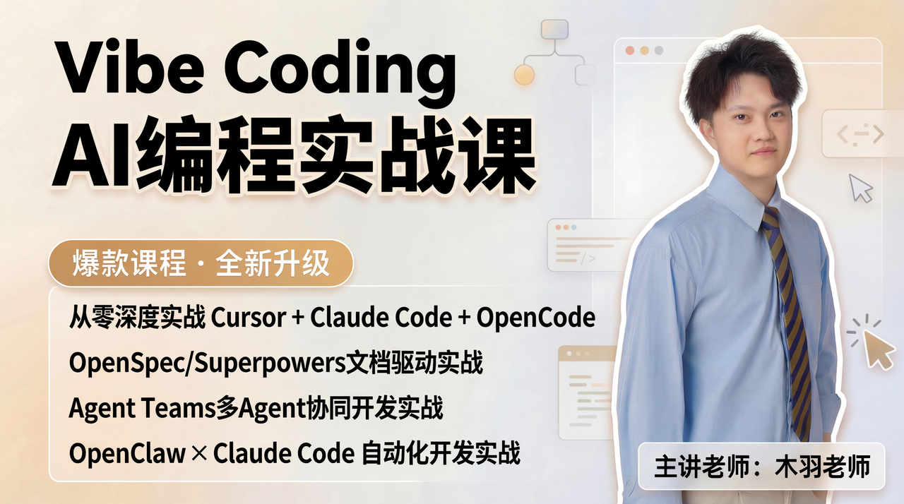

<div align="center">
  
  <p>
    <a href="./README.md">English</a> | <a href="./README_CN.md">中文</a>
  </p>
</div>

<h1 align="center">Vibe Coding: AI Programming Practice Course</h1>

<p align="center">
  <b>Hit Course · Fully Upgraded</b><br>
  Master Cursor + Claude Code + OpenCode from scratch | Become an AI-era super individual
</p>

<div align="center">
  
</div>

---

## 🎯 How to Learn This Course

> ⚠️ **Important**: Complete the **Introduction** section before starting Stage 1!

<div align="center">
  
</div>

### Step 1: Complete Introduction (Environment Setup)

**👉 [Go to Introduction →](./00_Introduction/)**

<div align="center">

| Lesson | Content | Time |
|:---:|:---:|:---:|
| [Intro-01](./00_Introduction/导学1：网络环境配置与VPN准备.html) | Network & VPN Configuration | 15-30 min |
| [Intro-02](./00_Introduction/导学2：Cursor安装部署与订阅.html) | Cursor AI IDE Setup & Subscription | 20-30 min |
| [Intro-03](./00_Introduction/导学3：Git安装与GitHub配置.html) | Git Installation & GitHub Configuration | 20-30 min |
| [Intro-04](./00_Introduction/导学4：Claude%20Code部署配置教程.html) | Claude Code Deployment & Configuration | 30-45 min |

</div>

✅ After completing Introduction, you should have:
- VPN configured (ip138.com shows overseas IP)
- Cursor installed and logged in
- Git installed with GitHub Token configured

### Step 2: Follow the Stages

<div align="center">

| Stage | Topic | Link |
|:---:|:---:|:---:|
| Stage 1 | AI Programming Fundamentals | [Start →](./Stage1_AI_Programming_Fundamentals/) |
| Stage 2 | Cursor AI IDE Deep Dive | [Start →](./Stage2_Cursor_Deep_Dive/) |
| Stage 3 | Claude Code Engineering | [Start →](./Stage3_Claude_Code_Engineering/) |
| Stage 4 | Enterprise Practice | [Start →](./Stage4_Enterprise_Practice/) |

</div>

### Stage 4 Latest Update

- **[Lesson 07: Document Review Agent](./Stage4_Enterprise_Practice/Lesson07_Document_Review_Agent/)** is now available.
- Includes complete project code in `AgentTeamProject` and teaching materials in `CourseWare`.

---

## 🚀 The Vibe Coding Development Paradigm

<div align="center">
  
</div>

**Three Phases of AI-Driven Development:**

<div align="center">

| Phase | Focus | Key Activities |
|:---:|:---:|:---:|
| **Phase 1: Define** | Requirements | Market research → Core idea → Requirements analysis → Figma prototype |
| **Phase 2: Develop** | AI-Assisted Coding | AI frontend generation → DB design → API definition → Code Review |
| **Phase 3: Deliver** | Deployment | API testing → CI pipeline → Containerization → Production release |

</div>

---

## 🏗️ Four Industrial-Grade Projects

<table>
<tr>
<td width="50%" align="center">
<h3>Project 1: Smart Data Analysis Assistant</h3>

<p><b>Stage 1</b> · Text-to-SQL Data Analysis</p>
<p><code>Cursor</code> <code>React</code> <code>FastAPI</code> <code>SQLite</code></p>
</td>
<td width="50%" align="center">
<h3>Project 2: ClawdBot Multimodal Agent</h3>

<p><b>Stage 2</b> · Frontend-Backend Data Flow</p>
<p><code>Cursor</code> <code>React</code> <code>FastAPI</code> <code>WebSocket</code></p>
</td>
</tr>
<tr>
<td width="50%" align="center">
<h3>Project 3: Multimodal RAG Knowledge Base</h3>

<p><b>Stage 3</b> · End-to-End Private Knowledge Base</p>
<p><code>Claude Code</code> <code>React</code> <code>LangChain</code> <code>FastAPI</code></p>
</td>
<td width="50%" align="center">
<h3>Project 4: Document Review Agent</h3>

<p><b>Stage 4</b> · Production-Ready Deployable System</p>
<p><code>Claude Code</code> <code>React</code> <code>LangChain</code> <code>Docker</code></p>
</td>
</tr>
</table>

---

## 📋 Course Overview

<div align="center">

| Phase | Topic | Lessons | Project |
|:---:|:---:|:---:|:---:|
| **Intro** | Environment Setup | 4 | - |
| **Stage 1** | AI Programming Fundamentals | 2 | Smart Data Assistant |
| **Stage 2** | Cursor AI IDE Deep Dive | 3 | ClawdBot |
| **Stage 3** | Claude Code Engineering | 2 | Multimodal RAG System |
| **Stage 4** | Enterprise Practice | 1 | Document Review Agent |

</div>

---

## ✅ What You'll Learn

- Vibe Coding vs Traditional Development: the essential differences
- Complete Cursor & Claude Code hands-on practice
- High-performance AI programming techniques
- Prompt engineering and context optimization
- Agent Skills and MCP tool integration
- Four industrial-grade project experiences

---

## 📦 Prerequisites

- Basic computer operation skills
- Learning enthusiasm and patience
- **No programming experience required** (we start from zero)

---

## 🚀 Get Started Now!

```bash
# 1. Clone this repository
git clone https://github.com/fufankeji/FuFan-VibeCodingCourse.git

# 2. Start with Introduction
cd VibeCodingCourse/00_Introduction
```

**👉 [Begin Your Journey: Introduction →](./00_Introduction/)**

---

## License

MIT License

---

## 📬 Contact Us

Interested in the course? Scan to connect with our teaching assistant for more resources and support:

<div align="center">
  
  <p><b>Scan to Add Teaching Assistant</b></p>
</div>

---

<p align="center">
  <b>Vibe Coding: AI Programming Practice Course</b><br>
  Hit Course from Season 1 · Fully Upgraded for Season 2<br>
  <br>
  <b>Instructor: Teacher Muyu (木羽老师)</b>
</p>
