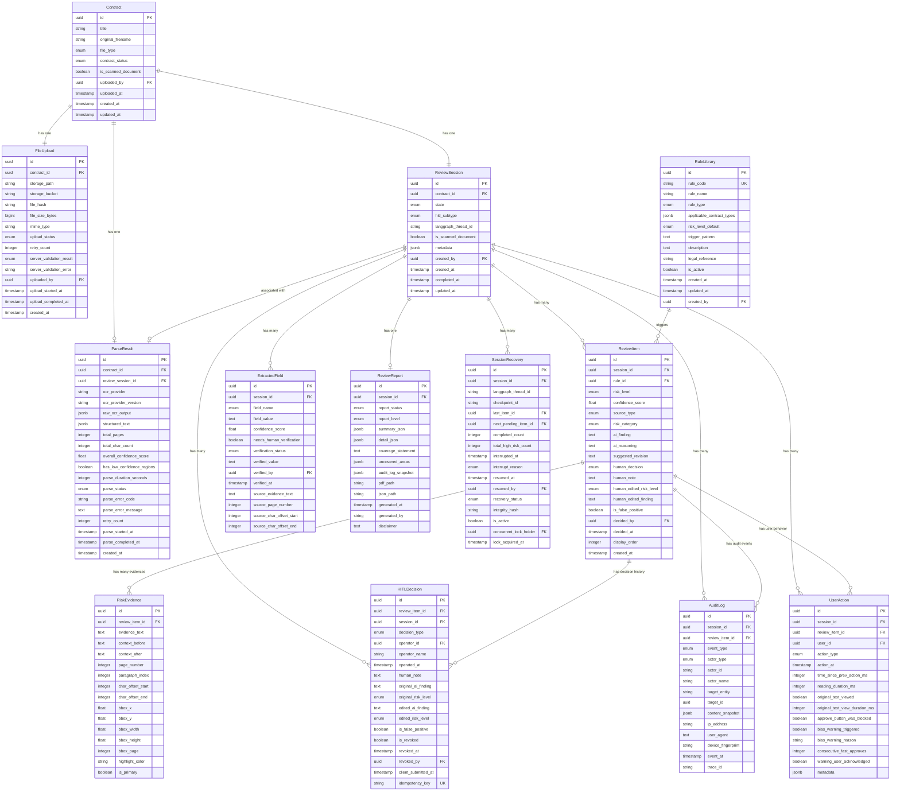

# 合同审核系统 — 数据模型全局规范

**文档编号**：06_architecture/data_model_spec-v1.0
**编写日期**：2026-03-11
**状态**：已定稿（基于 Teammate 1/2/3 三份设计文档汇总）
**输入文档**：
- `07_data_model/upload_and_task_model.md`（Teammate 1）
- `07_data_model/review_rules_model.md`（Teammate 2）
- `07_data_model/hitl_interaction_model.md`（Teammate 3）

**用途**：本文档是前后端实现的统一数据规范输入，定义了系统所有核心数据模型的字段、关系、约束和责任边界。

---

## 一、全局 ER 关系图

### 1.1 完整实体关系图（Mermaid）



### 1.2 分层 ASCII 关系图

```
┌─────────────────────────────────────────────────────────────────────────┐
│  User（用户，鉴权模块定义）                                                │
│  ├── uploaded_by / created_by ──► Contract                              │
│  ├── operator_id ──────────────► HITLDecision                           │
│  └── user_id ──────────────────► UserAction                             │
└─────────────────────────────────────────────────────────────────────────┘
                            │
                            ▼
┌─────────────────────── 层 1：上传与任务 ─────────────────────────────────┐
│  Contract（合同主体）                                                     │
│    ├── 1:1 ──► FileUpload（文件上传记录）                                  │
│    ├── 1:1 ──► ReviewSession（审核会话·状态机核心）                        │
│    └── 1:1 ──► ParseResult（解析结果）                                   │
└─────────────────────────────────────────────────────────────────────────┘
                            │
              ReviewSession（状态机中枢，向下聚合所有内容）
                            │
          ┌─────────────────┼─────────────────┐
          ▼                 ▼                 ▼
┌─── 层 2：审核规则与结果 ────────────────────────────────────────────────┐
│  ExtractedField   ReviewItem             ReviewReport                   │
│  （结构化字段）     ├── RuleLibrary（规则来源）  ├── summary_json           │
│  ├── 核验状态       ├── RiskEvidence（原文证据）  ├── detail_json            │
│  └── 原文定位       │   ├── bbox坐标（PDF）       ├── coverage_statement（必）│
│                    │   └── char_offset（文本）   ├── audit_log_snapshot   │
│                    └── human_decision           └── disclaimer（必）     │
└────────────────────────────────────────────────────────────────────────┘
                            │
          ┌─────────────────┼──────────────────┐
          ▼                 ▼                  ▼
┌─── 层 3：HITL 交互与可追溯性 ──────────────────────────────────────────┐
│  HITLDecision        AuditLog            SessionRecovery  UserAction   │
│  （操作决策历史）     （不可变事件日志）   （恢复快照）    （行为埋点）     │
│  ├── approve/edit    ├── 27种事件类型     ├── checkpoint_id  ├── 阅读时长 │
│  ├── edit diff对比   ├── content_snapshot ├── integrity_hash ├── 防偏差  │
│  └── idempotency_key └── 不可删改        └── LangGraph锚点  └── 警告记录 │
└────────────────────────────────────────────────────────────────────────┘
```

---

## 二、模型清单与职责说明

| # | 模型名 | 所属层 | 核心职责 | 设计文档来源 |
|---|--------|--------|---------|------------|
| 1 | `Contract` | 上传与任务 | 合同主体，用户可感知的入口实体 | T1 |
| 2 | `FileUpload` | 上传与任务 | 文件存储记录，与存储路径解耦 | T1 |
| 3 | `ParseResult` | 上传与任务 | OCR 解析原始结果与结构化文本 | T1 |
| 4 | `ReviewSession` | 上传与任务 | 审核会话状态机，LangGraph 锚点 | T1 |
| 5 | `RuleLibrary` | 审核规则与结果 | 企业合规规则集，规则引擎基础 | T2 |
| 6 | `ReviewItem` | 审核规则与结果 | 单条风险命中项，HITL 最小操作单元 | T2 |
| 7 | `RiskEvidence` | 审核规则与结果 | 原文定位证据，支撑双栏联动 | T2 |
| 8 | `ExtractedField` | 审核规则与结果 | 合同关键字段提取，人工核验 | T2 |
| 9 | `ReviewReport` | 审核规则与结果 | 最终审核报告，合规交付物 | T2 |
| 10 | `HITLDecision` | HITL 交互 | 操作决策历史，含撤销与 Diff | T3 |
| 11 | `AuditLog` | HITL 交互 | 不可变系统事件日志（27 种） | T3 |
| 12 | `SessionRecovery` | HITL 交互 | LangGraph interrupt/resume 应用层锚点 | T3 |
| 13 | `UserAction` | HITL 交互 | 前端行为埋点，防自动化偏见 | T3 |

---

## 三、核心枚举值统一规范

### 3.1 ReviewSession.state（状态机核心）

| 值 | 含义 | 是否终态 |
|----|------|---------|
| `parsing` | OCR 解析中 | 否 |
| `scanning` | AI 风险扫描中 | 否 |
| `hitl_pending` | 等待人工介入 | 否 |
| `completed` | 审核完成，报告生成中 | 否 |
| `report_ready` | 报告已就绪 | **是** |
| `aborted` | 已中止 | **是** |

**合法流转路径**：
```
parsing ──→ scanning ──→ hitl_pending ──→ completed ──→ report_ready
   │             │                              ↑
   │             └──── (纯低风险直通) ───────────┘
   │
   任意状态 ──→ aborted（终态，不可逆）
```

### 3.2 ReviewItem.risk_level

| 值 | 路由行为 | HITL 处理要求 |
|----|---------|-------------|
| `HIGH` | LangGraph `interrupt()`，强制中断 | 逐条处理，`human_note` ≥ 10 字，不允许批量 |
| `MEDIUM` | 进入批量复核队列 | 可批量确认，需展示来源标签 |
| `LOW` | 自动通过或批量浏览 | 只读，无需操作 |

### 3.3 ReviewItem.source_type

| 值 | 界面展示 | 信任度 |
|----|---------|-------|
| `rule_engine` | 蓝色标签"规则触发" | 高（确定性规则） |
| `ai_inference` | 紫色标签"AI 推理" | 中（概率性判断） |
| `hybrid` | 双色标签 | 规则部分高，AI 部分中 |

### 3.4 ReviewItem.human_decision

| 值 | 含义 | 约束 |
|----|------|------|
| `pending` | 待处理（初始值） | — |
| `approve` | 接受 AI 判断 | 需已阅读原文 + `human_note` ≥ 10 字（高风险） |
| `edit` | 修改 AI 判断 | 需填写 `human_edited_*` 字段 + `human_note` ≥ 10 字 |
| `reject` | 驳回 AI 判断（标记误报） | `is_false_positive = true` + `human_note` ≥ 10 字 |

### 3.5 ExtractedField.field_name（结构化提取字段）

| 值 | 中文含义 | 核验优先级 |
|----|---------|----------|
| `party_a` / `party_b` | 甲乙方主体 | 高 |
| `contract_amount` | 合同金额 | 高 |
| `effective_date` / `expiry_date` | 生效/到期日期 | 高 |
| `termination_condition` | 终止条件 | 中 |
| `jurisdiction` | 适用法域 | 中 |
| `dispute_resolution` | 争议解决方式 | 中 |
| `penalty_clause` | 违约金条款 | 中 |
| `confidentiality_scope` | 保密范围 | 低 |
| `payment_terms` | 付款条款 | 低 |
| `contract_type` | 合同类型 | 低 |

### 3.6 AuditLog.event_type（27 种事件）

**阶段一：上传与解析（8 种）**

| 事件 | 触发主体 |
|------|---------|
| `contract_uploaded` | user |
| `contract_created` | system |
| `session_created` | system |
| `parse_started` | system |
| `parse_completed` | system |
| `parse_failed` | system |
| `parse_timeout` | system |
| `session_aborted` | user / system |

**阶段二：字段核对与 AI 扫描（11 种）**

| 事件 | 触发主体 |
|------|---------|
| `field_verified` | user |
| `field_modified` | user |
| `field_verify_skipped` | user |
| `scan_triggered` | user |
| `scan_completed` | ai |
| `route_auto_passed` | system |
| `route_batch_review` | system |
| `route_interrupted` | system |
| `system_failure` | system |
| `business_failure` | system |
| `retry_triggered` | user |

**阶段三：HITL 人工审批与报告（8 种）**

| 事件 | 触发主体 |
|------|---------|
| `item_approved` | user |
| `item_edited` | user |
| `item_rejected` | user |
| `decision_revoked` | user |
| `session_resumed` | user |
| `report_generation_started` | system |
| `report_ready` | system |
| `report_downloaded` | user |

---

## 四、前端必须展示的字段清单（🖥️）

> 前端**不得**自行计算或推断这些字段的值，必须从后端 API 响应中读取。

### 4.1 合同列表页

| 字段路径 | 展示内容 |
|---------|---------|
| `Contract.title` | 合同名称 |
| `Contract.original_filename` | 原始文件名 |
| `Contract.contract_status` | 状态徽标（uploaded / processing / completed / aborted） |
| `Contract.uploaded_at` | 上传时间 |
| `ReviewSession.completed_at` | 完成时间 |
| `SessionRecovery.completed_count` / `total_high_risk_count` | 待处理进度百分比 |

### 4.2 上传与解析阶段

| 字段路径 | 展示内容 |
|---------|---------|
| `FileUpload.file_size_bytes` | 文件大小（换算为 MB） |
| `FileUpload.upload_status` | 上传状态 |
| `Contract.is_scanned_document` | 扫描件精度提示横幅 |
| `ParseResult.total_pages` | 总页数 |
| `ParseResult.overall_confidence_score` | 整体 OCR 置信度 |
| `ParseResult.parse_status` | 解析状态 |
| `ParseResult.retry_count` | 控制"重新解析"按钮禁用（≥ 3 时禁用） |

### 4.3 字段核对视图

| 字段路径 | 展示内容 |
|---------|---------|
| `ExtractedField.field_name` | 字段标签 |
| `ExtractedField.field_value` | AI 提取值 |
| `ExtractedField.confidence_score` | 置信度颜色（≥0.85 绿 / 0.60-0.84 黄 / <0.60 橙红） |
| `ExtractedField.needs_human_verification` | 橙色边框 + 核对引导提示 |
| `ExtractedField.verification_status` | 核验状态标签 |
| `ExtractedField.source_evidence_text` | 跳转原文锚点按钮 |
| `ExtractedField.source_page_number` | 来源页码 |

### 4.4 HITL 审核视图（左栏：条款卡片）

| 字段路径 | 展示内容 |
|---------|---------|
| `ReviewItem.risk_level` | 风险等级徽标（高/中/低，带颜色） |
| `ReviewItem.confidence_score` | 置信度百分比 |
| `ReviewItem.source_type` | 来源标签（蓝色规则/紫色AI/双色混合） |
| `ReviewItem.risk_category` | 风险类型标签 |
| `ReviewItem.ai_finding` | 风险一句话摘要 |
| `ReviewItem.ai_reasoning` | 风险推理详情（展开显示） |
| `ReviewItem.human_decision` | 当前处理状态 |
| `HITLDecision.decision_type` | 已处理状态图标 |
| `HITLDecision.operator_name` | 操作人 |
| `HITLDecision.operated_at` | 操作时间 |
| `HITLDecision.human_note` | 操作备注摘要 |
| `HITLDecision.edited_ai_finding` / `edited_risk_level` | Edit 操作修改后内容 |

### 4.5 HITL 审核视图（右栏：原文区）

| 字段路径 | 展示内容 |
|---------|---------|
| `RiskEvidence.evidence_text` | 高亮原文片段 |
| `RiskEvidence.context_before` / `context_after` | 前后语境 |
| `RiskEvidence.page_number` | 所在页码 |
| `RiskEvidence.highlight_color` | 高亮颜色（按风险等级） |

### 4.6 会话恢复 Banner

| 字段路径 | 展示内容 |
|---------|---------|
| `SessionRecovery.interrupted_at` | "上次保存时间：HH:mm" |
| `SessionRecovery.completed_count` | 已完成条款数 |
| `SessionRecovery.total_high_risk_count` | 总高风险条款数 |
| `SessionRecovery.next_pending_item_id` | 恢复定位锚点 |

### 4.7 审核报告页

| 字段路径 | 展示内容 |
|---------|---------|
| `ReviewReport.report_status` | 报告生成状态 |
| `ReviewReport.coverage_statement` | 覆盖范围声明（**设计红线必填**） |
| `ReviewReport.uncovered_areas` | 未覆盖条款类型 |
| `ReviewReport.disclaimer` | 免责声明（**设计红线必填**） |

---

## 五、后端必须存储的关键约束字段（💾）

> 以下字段有特殊存储约束，后端必须严格执行，不可降级为可选。

### 5.1 不可覆写字段（AI 原始判断保护）

| 字段 | 约束说明 |
|------|---------|
| `ReviewItem.risk_level` | AI 写入后不可通过 API 修改；人工修改写入 `human_edited_risk_level` |
| `ReviewItem.confidence_score` | 只读，仅创建时写入 |
| `ReviewItem.ai_finding` | 只读，仅创建时写入 |
| `ReviewItem.source_type` | 只读，仅创建时写入 |
| `ReviewReport.audit_log_snapshot` | 写入后数据库层设置不可更新 |

### 5.2 强制校验字段（业务约束）

| 字段 | 约束说明 |
|------|---------|
| `HITLDecision.human_note` | 长度 ≥ 10 字，后端 400 拒绝不满足请求 |
| `ReviewReport.disclaimer` | 不可为空，且必须包含固定免责声明文本 |
| `ReviewReport.coverage_statement` | 不可为空（设计红线） |
| `ReviewReport.uncovered_areas` | 不可为空（设计红线） |

### 5.3 幂等与并发控制字段

| 字段 | 约束说明 |
|------|---------|
| `HITLDecision.idempotency_key` | 唯一索引，重复键返回已有记录，不重复写入 |
| `SessionRecovery.integrity_hash` | resume 时重算并比对，不一致则拒绝恢复 |
| `SessionRecovery.concurrent_lock_holder` | 操作锁，超时 5 分钟自动释放 |

### 5.4 高安全敏感字段

| 字段 | 安全要求 |
|------|---------|
| `FileUpload.storage_path` | 不暴露给前端，通过预签名 URL 提供临时访问 |
| `FileUpload.storage_bucket` | 不暴露给前端 |
| `ParseResult.raw_ocr_output` | 仅后端访问，不通过 API 返回给前端 |
| `ReviewReport.pdf_path` / `json_path` | 存储 Key，不含明文内容，通过预签名 URL 下载 |

### 5.5 不可删改字段（审计合规）

| 字段 | 约束说明 |
|------|---------|
| `AuditLog.*` | 追加写入，数据库层禁止 UPDATE/DELETE（行级触发器保护） |
| `AuditLog` 保留期限 | 最短 7 年，不自动删除 |
| `UserAction` 保留期限 | 90 天后归档或删除 |

---

## 六、模型间关系与数据流转

### 6.1 数据写入时序

| 时序 | 写入内容 | ReviewSession.state |
|------|---------|---------------------|
| 1 | `Contract` + `FileUpload` + `ReviewSession`（parsing）创建 | `parsing` |
| 2 | `ParseResult` 创建，OCR 任务提交 | `parsing` |
| 3 | `ParseResult` 写入结构化结果；`ExtractedField` 批量创建 | `parsing` → `scanning` |
| 4 | `ReviewItem` + `RiskEvidence` 流式创建（AI 扫描实时写入） | `scanning` |
| 5 | LangGraph routing 节点确定路由，`ReviewSession.state` 流转 | `scanning` → `hitl_pending` / `completed` |
| 6 | 用户核对 `ExtractedField`（verification_status 更新） | `scanning` / `hitl_pending` |
| 7 | 用户执行 Approve/Edit/Reject → `ReviewItem` + `HITLDecision` + `AuditLog` + `UserAction` 写入 | `hitl_pending` |
| 8 | 所有高风险条款处理完毕，LangGraph resume → `ReviewReport` 创建 | `completed` |
| 9 | 报告异步生成完成，`ReviewReport.report_status = ready` | `completed` → `report_ready` |

### 6.2 一次 Approve 操作的完整写入链

```
用户提交 Approve（高风险条款）
        │
        ├── 后端校验：
        │     ├── UserAction: original_text_viewed = true（否则拒绝）
        │     ├── human_note 长度 ≥ 10 字（否则 400）
        │     ├── HITLDecision.idempotency_key 唯一性校验
        │     └── ReviewSession.state = hitl_pending（否则 403）
        │
        ├── ReviewItem UPDATE：
        │     human_decision = 'approve'
        │     decided_by = user.id
        │     decided_at = NOW()
        │
        ├── HITLDecision INSERT：
        │     decision_type = 'approve'
        │     original_ai_finding = ReviewItem.ai_finding（快照）
        │     original_risk_level = ReviewItem.risk_level（快照）
        │     human_note = 用户填写内容
        │     is_false_positive = false
        │
        ├── AuditLog INSERT：
        │     event_type = 'item_approved'
        │     content_snapshot = {review_item_id, risk_level, human_note, ...}
        │
        └── UserAction（批量队列，立即上报）：
              action_type = 'approve_submitted'
              original_text_viewed = true
              reading_duration_ms = 实测值
              bias_warning_triggered = false/true
```

### 6.3 跨天异步恢复数据流

```
中断（第 N 天）：
  LangGraph interrupt() ──► Checkpointer 持久化工作流状态
  后端创建 SessionRecovery：
    checkpoint_id, completed_count, integrity_hash, is_active=true
  AuditLog: route_interrupted

恢复（第 N+1 天）：
  后端查询 SessionRecovery（is_active=true）
  校验 integrity_hash（重算对比）
  调用 LangGraph resume(thread_id, checkpoint_id)
  更新 SessionRecovery（recovered, is_active=false）
  AuditLog: session_resumed
  返回前端：next_pending_item_id + 进度数据
```

### 6.4 双栏联动原文定位数据流

```
用户点击左栏 ReviewItem 卡片
        │
        ▼（本地缓存，无网络请求）
前端读取 RiskEvidence（is_primary=true）
        │
        ├── PDF 渲染：bbox_x/y/width/height → PDF.js scrollIntoView + Canvas 高亮
        └── 文本渲染：char_offset_start/end → DOM Range + scrollIntoView + mark 高亮
                目标延迟：≤ 100ms
```

---

## 七、模型与设计红线的对应关系

| 设计红线 | 对应数据模型约束 |
|---------|---------------|
| **AI 结论不可绝对化** | `ReviewItem.confidence_score`（必填）；`ReviewReport.disclaimer`（必填，固定文本） |
| **判断来源必须可区分** | `ReviewItem.source_type`（三值枚举，前端必须差异化展示） |
| **覆盖范围必须声明** | `ReviewReport.coverage_statement` + `uncovered_areas`（后端强制非空） |
| **操作全程可追溯** | `AuditLog`（27 种事件，不可变）；`ReviewReport.audit_log_snapshot`（不可变副本）；`HITLDecision`（AI 原始判断快照保留） |
| **高风险不可批量** | 后端：检测批量高风险操作请求返回 403；`ReviewItem.risk_level = HIGH` 逐条处理 |
| **人工决策不可绕过** | `HITLDecision.human_note` ≥ 10 字后端强制校验；`UserAction.original_text_viewed` 后端二次验证 |
| **数据安全** | `storage_path`/`pdf_path` 不暴露给前端；合同原文不在数据模型直接存储（由 OCR 层管理）；`AuditLog.content_snapshot` 不含合同原文 |
| **不自建 OCR** | `ParseResult.ocr_provider` 字段记录外部服务商，支持切换和审计 |

---

## 八、索引策略汇总

### 8.1 高频查询索引

| 表 | 索引 | 类型 | 用途 |
|----|------|------|------|
| `contract` | `(uploaded_by, contract_status)` | 复合 B-Tree | 用户工作台按状态筛选 |
| `review_session` | `(created_by, state)` | 复合 B-Tree | 待处理任务列表 |
| `review_session` | `langgraph_thread_id` | **唯一** B-Tree | LangGraph 工作流查询 |
| `review_item` | `(session_id, risk_level)` | 复合 B-Tree | 按会话+风险等级加载 |
| `review_item` | `(session_id, human_decision)` | 复合 B-Tree | 检测高风险是否全部处理 |
| `risk_evidence` | `(review_item_id, is_primary)` | 复合 B-Tree | 双栏联动主证据快速加载 |
| `risk_evidence` | `(char_offset_start, char_offset_end)` | B-Tree | 原文反向定位命中项 |
| `extracted_field` | `(session_id, needs_human_verification)` | 复合 B-Tree | 低置信度字段核验列表 |
| `hitl_decision` | `(review_item_id, is_revoked, operated_at DESC)` | 复合 B-Tree | 最新有效决策查询 |
| `hitl_decision` | `idempotency_key` | **唯一** B-Tree | 幂等性校验 |
| `audit_log` | `(session_id, event_at DESC)` | 复合 B-Tree | 会话完整日志（报告生成） |
| `session_recovery` | `(session_id, is_active)` | 复合 B-Tree | 当前有效恢复点 |
| `user_action` | `(session_id, action_type, action_at DESC)` | 部分索引 | 防偏差检测查询 |

---

## 九、未包含在本规范中的模型

以下模型在本阶段不做详细定义，由对应模块单独设计：

| 模型 | 归属模块 | 说明 |
|------|---------|------|
| `User` | 鉴权/权限模块 | 包含角色（admin/reviewer）、权限范围 |
| `Organization` | 多租户模块 | 企业组织信息（如有多租户需求） |
| `RuleLibraryVersion` | 规则库管理 | 规则版本历史，支持回溯 |

---

## 十、版本历史

| 版本 | 日期 | 变更说明 |
|------|------|---------|
| v1.0 | 2026-03-11 | 初稿，基于 T1/T2/T3 三份模型设计文档汇总 |

---

*本规范由 Lead 在 Teammate 1/2/3 完成各自模型设计后汇总生成，作为后续 Phase 08（API 规范）、Phase 09（前端实现计划）、Phase 10（后端实现计划）的统一数据输入。任何对模型结构的变更，需同步更新对应的 `07_data_model/` 子文档和本汇总文档。*
