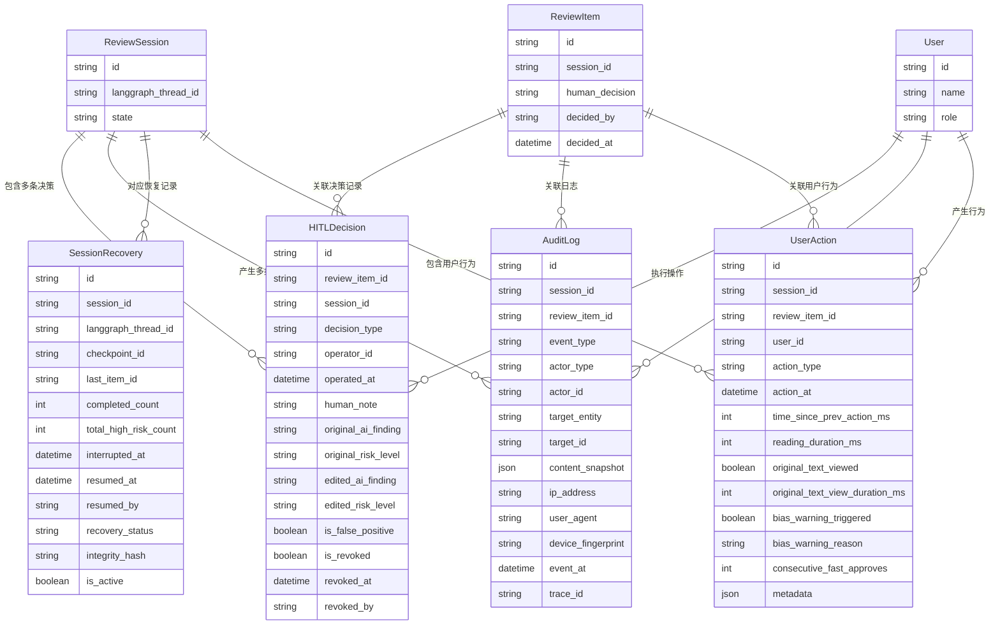

# HITL 人机交互数据模型规范

**文档编号**：07_data_model/hitl_interaction_model
**编写日期**：2026-03-11
**编写角色**：Teammate 3（HITL 人工审批交互链路数据模型）
**输入文档**：
- `04_interaction_design/t3_hitl_approval.md`
- `04_interaction_design/flow_state_spec-v1.0.md`
- `03_problem_modeling/problem_model.md`
- `06_architecture/frontend_backend_boundary_spec-v1.0.md`

---

## 一、模型总览与关系图

本文档定义与 HITL 人机交互流程相关的四个核心数据模型，它们均依附于 `03_problem_modeling` 中定义的核心领域实体（`ReviewSession`、`ReviewItem`、`User`）。

### 1.1 模型关系图（Mermaid）



### 1.2 模型间关系说明（文字版）

```
ReviewSession（审核会话）—— 顶层聚合根
    │
    ├── 1:N ──► ReviewItem（审核条款）
    │               │
    │               ├── 1:N ──► HITLDecision（每条条款的决策历史）
    │               ├── 1:N ──► AuditLog（条款级事件日志）
    │               └── 1:N ──► UserAction（条款级用户行为埋点）
    │
    ├── 1:N ──► HITLDecision（也可按会话聚合查询）
    ├── 1:N ──► AuditLog（会话级完整操作日志）
    ├── 1:N ──► SessionRecovery（会话中断恢复快照）
    └── 1:N ──► UserAction（会话级行为分析）

User（用户）
    ├── 1:N ──► HITLDecision（作为操作人）
    ├── 1:N ──► AuditLog（作为操作主体）
    └── 1:N ──► UserAction（行为归属）
```

**关键约束**：
- `HITLDecision` 保留每条 `ReviewItem` 的完整操作历史，包括撤销记录；`ReviewItem` 自身只保存最新决策状态
- `AuditLog` 是不可变追加型日志，任何情况下不允许删除或修改已写入的记录
- `SessionRecovery` 每次 interrupt 产生一条快照；同一会话可存在多条（对应多次中断），只有最新的 `is_active = true` 的记录为有效恢复点
- `UserAction` 为前端埋点数据，通过 API 批量上报至后端，后端负责存储与分析

---

## 二、HITLDecision — 人工决策记录

### 2.1 业务说明

`HITLDecision` 记录审核人员对单条 `ReviewItem` 执行的每一次 Approve / Edit / Reject 操作的完整状态快照，以及该操作被撤销时的记录。

**设计原则**：
- `HITLDecision` 是操作历史表，不随后续撤销删除记录，而是通过 `is_revoked` 标记状态
- Edit 操作必须同时记录修改前（AI 原始内容）和修改后（人工修正内容），形成 Diff 快照
- 每条决策记录与 `ReviewItem` 当前的 `human_decision` 字段保持最终一致：最新的未撤销决策即为当前有效状态
- `human_note` 的 10 字最小长度约束由后端在持久化前校验，此处不再重复

### 2.2 字段定义

| 字段名 | 类型 | 是否必填 | 前端/后端 | 说明 |
|--------|------|----------|-----------|------|
| `id` | UUID | 是 | 💾 | 主键，系统生成 |
| `review_item_id` | UUID | 是 | 💾 | 关联的 ReviewItem，外键 |
| `session_id` | UUID | 是 | 💾 | 关联的 ReviewSession，冗余存储以支持会话级聚合查询 |
| `decision_type` | ENUM | 是 | 🖥️ 💾 | 操作类型：`approve` / `edit` / `reject`；撤销操作单独用 `is_revoked` 标记，不另建枚举值 |
| `operator_id` | UUID | 是 | 💾 | 执行操作的用户 ID，关联 User 表 |
| `operator_name` | VARCHAR(100) | 是 | 🖥️ 💾 | 操作人姓名（冗余快照，防止用户信息变更后历史记录失真） |
| `operated_at` | TIMESTAMP WITH TZ | 是 | 🖥️ 💾 | 操作提交时间，由服务端写入 UTC 时间，不信任前端传入的时间戳 |
| `human_note` | TEXT | 是 | 🖥️ 💾 | 审核备注，业务规则要求 ≥ 10 字；所有操作类型均必填 |
| `original_ai_finding` | TEXT | 是 | 💾 | 操作时 AI 原始风险描述的快照（所有操作类型均记录，用于 Diff 对比） |
| `original_risk_level` | ENUM | 是 | 💾 | 操作时 AI 原始风险等级的快照：`high` / `medium` / `low` |
| `edited_ai_finding` | TEXT | 仅 edit | 🖥️ 💾 | Edit 操作时，人工修正后的风险描述；非 edit 操作时为 NULL |
| `edited_risk_level` | ENUM | 仅 edit | 🖥️ 💾 | Edit 操作时，人工调整后的风险等级；非 edit 操作时为 NULL |
| `is_false_positive` | BOOLEAN | 是 | 💾 | 是否标记为误报；Reject 操作时由用户勾选，Approve/Edit 操作时固定为 `false` |
| `is_revoked` | BOOLEAN | 是 | 💾 | 是否已被撤销；初始为 `false`；用户撤销后置为 `true` |
| `revoked_at` | TIMESTAMP WITH TZ | 否 | 💾 | 撤销操作发生的时间；未撤销时为 NULL |
| `revoked_by` | UUID | 否 | 💾 | 执行撤销操作的用户 ID；未撤销时为 NULL |
| `client_submitted_at` | TIMESTAMP WITH TZ | 否 | 💾 | 前端提交请求的时间（前端传入，仅供参考，不作为权威时间） |
| `idempotency_key` | VARCHAR(128) | 是 | 💾 | 幂等键，防止重复提交写入重复记录；由前端生成 UUID 携带，后端校验唯一性 |

### 2.3 字段业务含义详细说明

**`decision_type` — 操作类型枚举**

| 枚举值 | 业务含义 |
|--------|---------|
| `approve` | 审核人员确认 AI 的风险判断正确，接受风险标记 |
| `edit` | 审核人员认为 AI 判断有偏差，对风险等级或描述进行了人工修正 |
| `reject` | 审核人员认为 AI 判断有误，否认风险存在（标记为误报或边界情形）|

**`edited_ai_finding` / `edited_risk_level` — Edit 操作的 Diff 记录**

这两个字段仅在 `decision_type = edit` 时有值，配合 `original_ai_finding` / `original_risk_level` 形成修改前后的完整对照。报告生成时，系统以这四个字段渲染"AI 原始判断 vs 人工修正内容"对照区块。

**`operator_name` — 操作人姓名快照**

冗余存储操作人姓名，而非仅存储 `operator_id`。原因：用户离职或信息变更时，历史记录中的操作人姓名必须保持不变，以满足审计可追溯要求。

**`idempotency_key` — 幂等键**

前端在每次提交决策时生成唯一 UUID 作为幂等键。后端收到请求时，先检查该键是否已存在：若存在则直接返回已有记录，不重复写入。这解决了网络超时导致的重复提交问题。

### 2.4 有效决策的确定规则

同一 `review_item_id` 下可能存在多条 `HITLDecision` 记录（因撤销后重新提交）。**有效决策**的确定规则：

```
有效决策 = 该 review_item_id 下，is_revoked = false 的最新一条记录
```

若所有记录均 `is_revoked = true`，则该条款当前状态为 `pending`（与 `ReviewItem.human_decision` 一致）。

### 2.5 索引建议

| 索引名 | 字段组合 | 索引类型 | 用途 |
|--------|---------|---------|------|
| `idx_hitl_decision_item` | `(review_item_id, is_revoked, operated_at DESC)` | B-Tree | 查询某条款的最新有效决策 |
| `idx_hitl_decision_session` | `(session_id, operated_at DESC)` | B-Tree | 会话级决策历史查询、报告生成聚合 |
| `idx_hitl_decision_operator` | `(operator_id, operated_at DESC)` | B-Tree | 用户操作历史查询（管理员视图）|
| `idx_hitl_decision_idempotency` | `(idempotency_key)` | UNIQUE | 幂等性校验 |

---

## 三、AuditLog — 审计日志

### 3.1 业务说明

`AuditLog` 是系统级不可变操作日志，记录整个合同审核生命周期内所有具有审计意义的事件。对应 `06_architecture/frontend_backend_boundary_spec-v1.0.md` 第 3.5 节定义的全量操作事件，覆盖 27 种事件类型（阶段一 8 种 + 阶段二 11 种 + 阶段三 8 种）。

**设计原则**：
- 追加写入，禁止修改或删除任何已写入记录
- 操作主体分三类：`user`（用户操作）、`system`（系统自动触发）、`ai`（AI Agent 执行）
- 操作内容快照（`content_snapshot`）使用 JSON 格式，确保不同事件类型的内容结构差异不破坏表结构
- IP 和设备信息仅在 `actor_type = user` 时有意义；系统/AI 触发的事件此字段为 NULL

### 3.2 字段定义

| 字段名 | 类型 | 是否必填 | 前端/后端 | 说明 |
|--------|------|----------|-----------|------|
| `id` | UUID | 是 | 💾 | 主键，系统生成 |
| `session_id` | UUID | 是 | 💾 | 关联的 ReviewSession；会话级事件必填，系统级全局事件可为 NULL |
| `review_item_id` | UUID | 否 | 💾 | 关联的 ReviewItem；仅条款级操作事件填写，其余为 NULL |
| `event_type` | ENUM | 是 | 💾 | 事件类型，见第 3.4 节完整枚举 |
| `actor_type` | ENUM | 是 | 💾 | 操作主体类型：`user` / `system` / `ai` |
| `actor_id` | VARCHAR(128) | 否 | 💾 | 操作主体 ID；`user` 时为用户 UUID，`system` 时为服务名称，`ai` 时为 Agent 标识；匿名操作为 NULL |
| `actor_name` | VARCHAR(100) | 否 | 💾 | 操作主体名称快照（用户姓名或服务名）；与 `HITLDecision.operator_name` 同理冗余存储 |
| `target_entity` | VARCHAR(50) | 是 | 💾 | 操作对象的实体类型，如 `ReviewSession` / `ReviewItem` / `ExtractedField` / `ReviewReport` |
| `target_id` | UUID | 否 | 💾 | 操作对象的具体 ID；对象不确定时为 NULL |
| `content_snapshot` | JSONB | 否 | 💾 | 操作内容快照，格式因事件类型不同而异（见第 3.3 节示例）；敏感内容脱敏后存储 |
| `ip_address` | VARCHAR(45) | 否 | 💾 | 操作人 IP 地址（IPv4 或 IPv6）；`actor_type = user` 时必填，其余为 NULL |
| `user_agent` | TEXT | 否 | 💾 | 浏览器 User-Agent 字符串；`actor_type = user` 时填写 |
| `device_fingerprint` | VARCHAR(128) | 否 | 💾 | 设备指纹（可选，基于 User-Agent + 屏幕分辨率等计算）；用于跨会话关联同一设备 |
| `event_at` | TIMESTAMP WITH TZ | 是 | 💾 | 事件发生时间，服务端写入 UTC 时间 |
| `trace_id` | VARCHAR(128) | 否 | 💾 | 分布式追踪 ID，用于将单次 API 请求的多个日志记录关联到同一链路 |

### 3.3 content_snapshot 结构示例

`content_snapshot` 字段存储事件相关的关键数据快照，不同事件类型对应不同的 JSON 结构：

**`item_approved` 事件的 content_snapshot**：
```json
{
  "review_item_id": "uuid",
  "risk_level": "high",
  "human_note": "该条款已与法务确认，属于行业惯例...",
  "human_note_length": 22,
  "original_text_viewed": true,
  "original_text_view_duration_ms": 8500
}
```

**`item_edited` 事件的 content_snapshot**：
```json
{
  "review_item_id": "uuid",
  "original_risk_level": "high",
  "edited_risk_level": "medium",
  "original_ai_finding_preview": "AI 认为此处存在...",
  "edited_ai_finding_preview": "根据合同整体语境...",
  "human_note": "AI 误判了条款的适用场景..."
}
```

**`decision_revoked` 事件的 content_snapshot**：
```json
{
  "revoked_decision_id": "uuid",
  "original_decision_type": "approve",
  "revoke_reason": "用户主动撤销",
  "review_item_id": "uuid"
}
```

**`session_resumed` 事件的 content_snapshot**：
```json
{
  "recovery_id": "uuid",
  "checkpoint_id": "langgraph-checkpoint-xxx",
  "interrupted_at": "2026-03-10T17:32:00Z",
  "resumed_at": "2026-03-11T09:15:00Z",
  "is_cross_day": true,
  "completed_count_at_resume": 4,
  "total_high_risk_count": 7
}
```

### 3.4 完整事件类型枚举（27 种）

#### 阶段一：上传与解析（8 种）

| event_type | 触发主体 | 触发时机 | 关联实体 |
|------------|---------|---------|---------|
| `contract_uploaded` | `user` | 文件服务端校验通过，写入存储 | `Contract` |
| `contract_created` | `system` | `Contract` 数据库记录创建完成 | `Contract` |
| `session_created` | `system` | `ReviewSession` 创建，state = `parsing` | `ReviewSession` |
| `parse_started` | `system` | OCR 任务提交至外部服务 | `ReviewSession` |
| `parse_completed` | `system` | OCR 解析成功，结果写入 `ExtractedField` | `ReviewSession` |
| `parse_failed` | `system` | OCR 服务返回错误 | `ReviewSession` |
| `parse_timeout` | `system` | OCR 解析超时（> 15 分钟） | `ReviewSession` |
| `session_aborted` | `user` / `system` | 用户确认放弃，或系统触发不可恢复中止 | `ReviewSession` |

#### 阶段二：字段核对与 AI 扫描（11 种）

| event_type | 触发主体 | 触发时机 | 关联实体 |
|------------|---------|---------|---------|
| `field_verified` | `user` | 用户手动确认低置信度字段值 | `ExtractedField` |
| `field_modified` | `user` | 用户修改 AI 提取的字段值 | `ExtractedField` |
| `field_verify_skipped` | `user` | 用户跳过低置信度字段核对 | `ExtractedField` |
| `scan_triggered` | `user` | 用户点击"开始 AI 风险扫描"，触发 LangGraph 流程 | `ReviewSession` |
| `scan_completed` | `ai` | AI 扫描完成，所有 `ReviewItem` 创建完毕，路由结果确定 | `ReviewSession` |
| `route_auto_passed` | `system` | 路由判断为纯低风险，`ReviewSession.state → completed` | `ReviewSession` |
| `route_batch_review` | `system` | 路由判断存在中风险，进入批量复核队列 | `ReviewSession` |
| `route_interrupted` | `system` | 路由判断存在高风险，触发 LangGraph `interrupt()` | `ReviewSession` |
| `system_failure` | `system` | 系统级不可恢复故障（如 Agent 崩溃、数据库写入失败） | `ReviewSession` |
| `business_failure` | `system` | 业务规则层失败（如高风险路由检测到约束违反） | `ReviewSession` |
| `retry_triggered` | `user` | 用户在错误状态下主动触发重试 | `ReviewSession` |

#### 阶段三：HITL 人工审批与报告（8 种）

| event_type | 触发主体 | 触发时机 | 关联实体 |
|------------|---------|---------|---------|
| `item_approved` | `user` | 审核人员成功提交 Approve 操作 | `ReviewItem` |
| `item_edited` | `user` | 审核人员成功提交 Edit 操作 | `ReviewItem` |
| `item_rejected` | `user` | 审核人员成功提交 Reject 操作 | `ReviewItem` |
| `decision_revoked` | `user` | 审核人员撤销已有的 Approve / Edit / Reject 决策 | `ReviewItem` |
| `session_resumed` | `user` | 审核人员从中断点恢复审批，LangGraph 状态已加载 | `ReviewSession` |
| `report_generation_started` | `system` | 所有高风险条款处理完成，调用 LangGraph `resume()`，报告生成任务启动 | `ReviewSession` |
| `report_ready` | `system` | 报告异步生成完成，`ReviewSession.state → report_ready` | `ReviewSession` / `ReviewReport` |
| `report_downloaded` | `user` | 用户下载报告文件（PDF 或 JSON），记录下载格式 | `ReviewReport` |

### 3.5 审计日志安全约束

- **不可变性**：所有记录写入后禁止 UPDATE 或 DELETE，系统层面通过数据库行级触发器或应用层强制约束保证
- **内容脱敏**：`content_snapshot` 中不得存储合同原文（`clause_text`），仅存储必要的摘要和 ID 引用；`human_note` 可存储，因其属于操作内容本身
- **访问控制**：审计日志接口仅对 `admin` 角色和生成报告的程序账户开放；普通 `reviewer` 只能在报告中查看与自身操作相关的日志
- **保留期限**：审计日志最短保留 7 年（受监管行业合规要求），超期后由管理员手动归档，系统不自动删除

### 3.6 索引建议

| 索引名 | 字段组合 | 索引类型 | 用途 |
|--------|---------|---------|------|
| `idx_audit_session` | `(session_id, event_at DESC)` | B-Tree | 会话完整日志查询（报告生成）|
| `idx_audit_item` | `(review_item_id, event_at DESC)` | B-Tree | 条款级操作历史查询 |
| `idx_audit_event_type` | `(event_type, event_at DESC)` | B-Tree | 按事件类型过滤（统计分析）|
| `idx_audit_actor` | `(actor_id, event_at DESC)` | B-Tree | 用户操作历史查询（审计追溯）|
| `idx_audit_trace` | `(trace_id)` | B-Tree | 分布式链路追踪关联 |

---

## 四、SessionRecovery — 会话恢复快照

### 4.1 业务说明

`SessionRecovery` 记录每次 `ReviewSession` 进入中断状态时的关键状态信息，作为跨天异步恢复的锚点。它并不替代 LangGraph Checkpointer 存储的完整工作流状态，而是作为应用层的恢复元数据，为前端恢复入口提供展示所需的进度信息，并在恢复时执行状态完整性校验。

**与 LangGraph Checkpointer 的关系**：

```
LangGraph Checkpointer（底层）
    ├── 存储：完整工作流图状态（所有节点状态、已完成决策的完整数据）
    ├── 关联：通过 ReviewSession.langgraph_thread_id 绑定
    └── 由 LangGraph 框架自动管理，应用层不直接操作

SessionRecovery（应用层）
    ├── 存储：恢复元数据（进度摘要、断点位置、恢复状态校验）
    ├── 用途：为前端提供"待继续审批"入口展示数据；恢复时校验状态一致性
    └── 由应用后端在 interrupt/resume 时写入
```

### 4.2 字段定义

| 字段名 | 类型 | 是否必填 | 前端/后端 | 说明 |
|--------|------|----------|-----------|------|
| `id` | UUID | 是 | 💾 | 主键，系统生成 |
| `session_id` | UUID | 是 | 💾 | 关联的 ReviewSession，外键 |
| `langgraph_thread_id` | VARCHAR(256) | 是 | 💾 | LangGraph Checkpointer 的线程标识，与 `ReviewSession.langgraph_thread_id` 相同；冗余存储，确保恢复时无需额外查询 |
| `checkpoint_id` | VARCHAR(256) | 是 | 💾 | LangGraph Checkpoint 的具体版本 ID；用于在 resume 时向 LangGraph 指定从哪个快照点恢复 |
| `last_item_id` | UUID | 否 | 🖥️ 💾 | 中断时最后一条**正在处理**（即已激活但尚未提交决策）的 `ReviewItem` ID；恢复后前端滚动至此条款；若中断时无正在处理的条款则为 NULL |
| `next_pending_item_id` | UUID | 否 | 🖥️ 💾 | 恢复后应跳转到的第一条 `human_decision = pending` 的高风险条款 ID；前端据此定位 |
| `completed_count` | INTEGER | 是 | 🖥️ 💾 | 中断时已完成处理（`human_decision != pending`）的高风险条款数量 |
| `total_high_risk_count` | INTEGER | 是 | 🖥️ 💾 | 该会话高风险条款总数量；与 `completed_count` 一起计算进度百分比 |
| `interrupted_at` | TIMESTAMP WITH TZ | 是 | 🖥️ 💾 | 中断发生的时间（系统记录，非用户操作时间） |
| `interrupt_reason` | ENUM | 是 | 💾 | 中断原因：`user_exit`（用户主动退出）/ `session_timeout`（会话超时）/ `network_error`（网络错误）/ `system_interrupt`（系统强制中断，对应 LangGraph interrupt()）|
| `resumed_at` | TIMESTAMP WITH TZ | 否 | 🖥️ 💾 | 恢复操作发生的时间；尚未恢复时为 NULL |
| `resumed_by` | UUID | 否 | 💾 | 执行恢复操作的用户 ID；尚未恢复时为 NULL |
| `recovery_status` | ENUM | 是 | 💾 | 恢复状态：`pending`（等待恢复）/ `recovered`（已成功恢复）/ `failed`（恢复失败）/ `expired`（过期，会话已 aborted）|
| `integrity_hash` | VARCHAR(64) | 是 | 💾 | 状态完整性校验哈希，由后端在 interrupt 时计算，resume 时重新计算并比对；计算方式见第 4.4 节 |
| `is_active` | BOOLEAN | 是 | 💾 | 是否为当前有效恢复点；同一 session 同一时刻只有一条 `is_active = true` 的记录 |
| `concurrent_lock_holder` | UUID | 否 | 💾 | 当前持有该会话操作锁的用户 ID；NULL 表示未锁定；与并发保护机制（锁超时 5 分钟）配合使用 |
| `lock_acquired_at` | TIMESTAMP WITH TZ | 否 | 💾 | 锁获取时间；用于计算锁是否已超过 5 分钟有效期 |

### 4.3 SessionRecovery 如何支撑 LangGraph interrupt/resume 机制

#### 4.3.1 中断时的写入流程

```
[LangGraph routing 节点检测到高风险条款]
         │
         ▼
后端调用 LangGraph interrupt()
         │
         ▼
LangGraph Checkpointer 自动持久化完整工作流状态
（存储位置：Checkpointer 后端，如 PostgreSQL saver）
         │
         ▼
后端获取当前 checkpoint_id（从 LangGraph API 读取）
         │
         ▼
后端创建 SessionRecovery 记录：
  - langgraph_thread_id = ReviewSession.langgraph_thread_id
  - checkpoint_id       = 当前 LangGraph checkpoint 版本 ID
  - completed_count     = 当前已处理高风险条款数
  - total_high_risk_count = 总高风险条款数
  - interrupted_at      = NOW()
  - interrupt_reason    = 'system_interrupt'（LangGraph interrupt）
  - integrity_hash      = hash(completed_count, 已处理条款ID列表, checkpoint_id)
  - is_active           = true
         │
         ▼
后端推送 WebSocket/SSE 事件：session_state_changed（hitl_pending）
```

#### 4.3.2 恢复时的校验流程

```
[用户点击"继续审批"入口]
         │
         ▼
前端发起 API 请求（携带 session_id）
         │
         ▼
后端查询 SessionRecovery WHERE session_id = ? AND is_active = true
         │
         ▼
后端校验完整性：
  1. 重新计算当前状态的 integrity_hash
  2. 与 SessionRecovery.integrity_hash 比对
  3. 若不一致：返回错误"会话状态已被修改，无法从快照恢复"
  4. 若一致：继续恢复流程
         │
         ▼
后端调用 LangGraph resume(thread_id, checkpoint_id)
         │
         ▼
LangGraph 从 checkpoint_id 对应的快照恢复工作流状态
         │
         ▼
后端更新 SessionRecovery：
  - resumed_at = NOW()
  - resumed_by = 当前用户 ID
  - recovery_status = 'recovered'
  - is_active = false（已恢复的快照失效）
         │
         ▼
后端写入 AuditLog：event_type = 'session_resumed'
         │
         ▼
后端返回恢复数据给前端：
  - 当前会话所有 ReviewItem（含已处理决策状态）
  - next_pending_item_id（前端据此滚动定位）
  - interrupted_at（前端显示"上次保存时间"）
  - completed_count / total_high_risk_count（前端显示进度 banner）
```

#### 4.3.3 跨天恢复的特殊处理

当 `NOW() - interrupted_at > 24 小时` 时，前端 banner 展示"上次保存时间：昨天 HH:mm"；具体逻辑由前端根据 `interrupted_at` 时间差计算，无需后端额外字段。

#### 4.3.4 多次中断场景

同一会话允许多次中断与恢复（用户今天审批了 3 条，明天继续审批 2 条，后天审批最后 2 条）。每次中断创建新的 `SessionRecovery` 记录，将前一条的 `is_active` 置为 `false`。历史恢复记录保留，不删除。

### 4.4 integrity_hash 计算说明

完整性哈希的计算输入为：

```
hash_input = {
  session_id: 会话 UUID,
  completed_item_ids: [已处理条款 UUID 列表，按 decided_at 排序],
  completed_decisions: [对应的 human_decision 值列表],
  checkpoint_id: LangGraph checkpoint 版本 ID
}

integrity_hash = SHA256(JSON.stringify(hash_input))
```

恢复时，后端重新从数据库读取上述字段，计算哈希并与存储值比对。任何在中断期间的未授权数据修改均会导致哈希不匹配，触发恢复失败保护。

### 4.5 索引建议

| 索引名 | 字段组合 | 索引类型 | 用途 |
|--------|---------|---------|------|
| `idx_session_recovery_active` | `(session_id, is_active)` | B-Tree | 查询会话当前有效恢复点 |
| `idx_session_recovery_pending` | `(recovery_status, interrupted_at DESC)` | B-Tree | 查询所有待恢复会话（首页"待我处理"模块）|
| `idx_session_recovery_lock` | `(concurrent_lock_holder, lock_acquired_at)` | B-Tree | 并发锁状态查询与超时清理 |

---

## 五、UserAction — 前端用户行为记录

### 5.1 业务说明

`UserAction` 是前端操作埋点数据，用于支撑「防自动化偏见」（Anti-Automation Bias）的行为分析。数据由前端采集，通过 API 批量上报至后端存储。

**与其他模型的核心区别**：
- `HITLDecision` 记录**业务结果**（最终决策是什么）
- `AuditLog` 记录**系统事件**（发生了什么事）
- `UserAction` 记录**行为过程**（用户是如何操作的，操作模式是否正常）

**核心用途**：
1. 检测连续快速 Approve 模式（同会话 5 条高风险条款均在 10 秒内 Approve）
2. 验证原文阅读行为（Approve 按钮是否因原文未进入视野而被禁用时间内用户仍然提交）
3. 为审计报告提供操作行为附注，增强可追溯性
4. 长期积累数据，用于优化防偏差机制的阈值参数

### 5.2 字段定义

| 字段名 | 类型 | 是否必填 | 前端/后端 | 说明 |
|--------|------|----------|-----------|------|
| `id` | UUID | 是 | 💾 | 主键，系统生成（前端批量上报时由后端生成）|
| `session_id` | UUID | 是 | 🖥️ 💾 | 关联的 ReviewSession |
| `review_item_id` | UUID | 否 | 🖥️ 💾 | 关联的 ReviewItem；非条款级操作（如页面跳转）可为 NULL |
| `user_id` | UUID | 是 | 💾 | 操作用户 ID |
| `action_type` | ENUM | 是 | 💾 | 用户行为类型，见第 5.3 节枚举 |
| `action_at` | TIMESTAMP WITH TZ | 是 | 💾 | 行为发生时间（前端本地时间，由后端校验偏差是否过大）|
| `time_since_prev_action_ms` | INTEGER | 否 | 💾 | 与同一会话中上一条 UserAction 的时间间隔（毫秒）；由后端在存储时计算，不依赖前端上报值 |
| `reading_duration_ms` | INTEGER | 否 | 💾 | 用户在当前条款上的总停留时长（毫秒）；前端从条款卡片激活到提交操作的时间差 |
| `original_text_viewed` | BOOLEAN | 是 | 🖥️ 💾 | 提交操作前，原文对应段落是否曾进入右栏可见区域（前端通过 Intersection Observer 检测）|
| `original_text_view_duration_ms` | INTEGER | 否 | 💾 | 原文段落在视野内的累计时长（毫秒）；前端通过 Intersection Observer 计算 |
| `approve_button_was_blocked` | BOOLEAN | 否 | 💾 | 该条款在此次 Approve 提交前，Approve 按钮是否曾因前置条件未满足而处于禁用状态；用于确认强制检查确实生效 |
| `bias_warning_triggered` | BOOLEAN | 是 | 💾 | 本次操作时是否触发了连续快速操作警示弹窗 |
| `bias_warning_reason` | VARCHAR(200) | 否 | 💾 | 触发警示的具体原因描述，如"过去 5 条高风险条款平均间隔 6.2 秒"；触发时必填 |
| `consecutive_fast_approves` | INTEGER | 否 | 💾 | 触发警示时，连续快速 Approve 的条款数量；其余情况为 NULL |
| `warning_user_acknowledged` | BOOLEAN | 否 | 💾 | 用户是否在警示弹窗中点击了"确认已知晓"；触发警示时记录 |
| `metadata` | JSONB | 否 | 💾 | 扩展字段，存储前端额外采集的行为数据，如滚动深度、点击位置、键盘/鼠标操作等 |

### 5.3 action_type 枚举

| 枚举值 | 触发时机 | 防偏差用途 |
|--------|---------|----------|
| `item_card_activated` | 用户点击条款卡片，卡片进入激活状态 | 记录开始阅读时间起点 |
| `original_text_entered_viewport` | 原文对应段落进入右栏可见区域 | 证明用户看到了原文 |
| `original_text_left_viewport` | 原文对应段落离开右栏可见区域 | 计算原文阅读时长 |
| `approve_button_clicked` | 用户点击"确认通过"按钮 | 触发防偏差检查流程 |
| `approve_dialog_shown` | 高风险 Approve 二次确认弹窗弹出 | 证明二次确认机制生效 |
| `approve_dialog_confirmed` | 用户在弹窗中点击"确认接受" | 记录最终确认动作 |
| `approve_dialog_cancelled` | 用户在弹窗中点击"取消" | 记录用户反悔行为 |
| `approve_submitted` | Approve 操作成功提交（API 返回成功） | 操作完成记录 |
| `edit_mode_entered` | 用户点击"修改判断"按钮，进入编辑模式 | — |
| `edit_submitted` | Edit 操作成功提交 | — |
| `reject_mode_entered` | 用户点击"驳回判断"按钮，进入驳回模式 | — |
| `reject_submitted` | Reject 操作成功提交 | — |
| `decision_revoke_clicked` | 用户点击条款的"撤销"链接 | — |
| `decision_revoked` | 撤销操作成功 | — |
| `bias_warning_shown` | 连续快速操作警示弹窗弹出 | 核心防偏差事件 |
| `bias_warning_acknowledged` | 用户在警示弹窗中点击确认 | 记录用户知晓 |

### 5.4 防自动化偏见字段的业务逻辑说明

#### 5.4.1 连续快速操作检测逻辑

后端在收到 `approve_submitted` 类型的 `UserAction` 后，执行以下检测：

```
过去 N 条 approve_submitted 记录（同一 session_id，risk_level = high）
  → 计算相邻记录的 time_since_prev_action_ms
  → 若连续 5 条的平均间隔 < 10,000ms（10秒）
  → 返回 bias_warning 响应，前端展示警示弹窗
  → 后端将 bias_warning_triggered = true 写入该条 UserAction
```

**阈值参数**（可配置）：
- `CONSECUTIVE_FAST_APPROVE_COUNT`：默认 5，连续多少条触发警示
- `FAST_APPROVE_INTERVAL_MS`：默认 10,000ms，每条间隔低于此值视为"快速"

#### 5.4.2 原文阅读验证逻辑

`original_text_viewed` 和 `original_text_view_duration_ms` 由前端通过 `IntersectionObserver` API 采集，后端在处理 `approve_submitted` 时：

1. 检查同一 `review_item_id` 的最近一条 `UserAction` 中，`original_text_viewed` 是否为 `true`
2. 若 `original_text_viewed = false`，后端拒绝 Approve 提交（返回业务错误），与前端禁用按钮形成双重保护
3. `original_text_view_duration_ms` 仅作为统计数据，不用于拦截逻辑（避免因网络延迟导致时长误判）

#### 5.4.3 数据上报方式

前端采用**批量延迟上报**策略，不对每个用户行为实时发送 API 请求：

- 每 30 秒将本地缓存的 `UserAction` 列表批量上报一次
- 页面 `beforeunload` 事件触发时，立即上报所有未发送的记录（使用 `sendBeacon` API）
- `approve_submitted` / `edit_submitted` / `reject_submitted` 等提交类事件**立即上报**（不等待批量周期），确保后端防偏差检查的实时性

### 5.5 数据保留与隐私

- `UserAction` 数据的保留期限为 90 天（操作行为数据，非业务决策数据）；超期后按会话归档或删除
- `metadata` 字段中的鼠标轨迹、点击坐标等细粒度数据，在采集时需明确用户知情同意（隐私政策层面）
- 审核报告不包含 `UserAction` 的原始数据，仅在行为异常时附注"该条款审核期间触发了连续快速操作警示"

### 5.6 索引建议

| 索引名 | 字段组合 | 索引类型 | 用途 |
|--------|---------|---------|------|
| `idx_user_action_session` | `(session_id, action_at DESC)` | B-Tree | 会话级行为流查询 |
| `idx_user_action_item` | `(review_item_id, action_type, action_at DESC)` | B-Tree | 条款级行为分析（原文阅读检测）|
| `idx_user_action_user` | `(user_id, action_at DESC)` | B-Tree | 用户行为模式统计 |
| `idx_user_action_bias` | `(session_id, action_type, action_at DESC)` 过滤 `action_type = 'approve_submitted'` | 部分索引（Partial Index） | 连续快速操作检测查询 |

---

## 六、模型协同关系总览

### 6.1 一次完整 Approve 操作涉及的数据写入

```
用户提交高风险条款 Approve 操作
         │
         ├──► ReviewItem（更新）
         │       human_decision = 'approve'
         │       decided_by = user.id
         │       decided_at = NOW()
         │
         ├──► HITLDecision（插入）
         │       decision_type = 'approve'
         │       original_ai_finding = ReviewItem.ai_finding（快照）
         │       original_risk_level = ReviewItem.risk_level（快照）
         │       human_note = 用户填写内容
         │       is_false_positive = false
         │
         ├──► AuditLog（插入）
         │       event_type = 'item_approved'
         │       actor_type = 'user'
         │       content_snapshot = { review_item_id, risk_level, human_note, ... }
         │
         └──► UserAction（批量上报队列，立即触发上报）
                 action_type = 'approve_submitted'
                 original_text_viewed = true / false
                 reading_duration_ms = 实测值
                 bias_warning_triggered = false（或 true）
```

### 6.2 一次 Edit 操作的 Diff 记录示意

```
HITLDecision（Edit 操作）：
  original_ai_finding   = "AI 认为该条款存在违约金不对等风险..."
  original_risk_level   = "high"
  edited_ai_finding     = "该条款的违约金设置属于行业惯例，但建议..."
  edited_risk_level     = "medium"
  human_note            = "AI 误判了违约金比例，对照行业标准..."

↓ 报告生成时渲染为：

┌──────────────────────────────────────────────────────────┐
│  条款 #3：违约金不对等（已人工修正）                         │
│                                                          │
│  AI 原始判断（高风险）：                                   │
│  AI 认为该条款存在违约金不对等风险...                        │
│                                                          │
│  人工修正内容（中风险）：                                   │
│  该条款的违约金设置属于行业惯例，但建议...                   │
│                                                          │
│  修改原因：AI 误判了违约金比例，对照行业标准...              │
│  操作人：张三  操作时间：2026-03-11 14:23:05               │
└──────────────────────────────────────────────────────────┘
```

### 6.3 跨天恢复场景的完整数据流

```
第一天（2026-03-10，17:32 中断）：
  SessionRecovery 写入：
    interrupted_at = 2026-03-10T17:32:00Z
    completed_count = 4
    total_high_risk_count = 7
    checkpoint_id = "lg-chk-abc123"
    integrity_hash = "sha256-xxx"
    is_active = true

第二天（2026-03-11，09:15 恢复）：
  前端展示：
    "已恢复上次审批进度（上次保存时间：昨天 17:32）"
    "当前进度：已完成 4/7 条，继续从第 5 条开始"

  后端执行：
    1. 查询 SessionRecovery（is_active = true）
    2. 校验 integrity_hash
    3. 调用 LangGraph resume(thread_id, checkpoint_id)
    4. 更新 SessionRecovery（recovered, is_active = false）
    5. 写入 AuditLog（session_resumed）
    6. 返回恢复数据给前端
```

---

## 七、前端展示字段汇总

以下字段需在前端界面中向用户展示（标注 🖥️ 的字段汇总）：

| 展示位置 | 字段来源 | 字段 | 展示用途 |
|---------|---------|------|---------|
| 条款卡片（已处理状态） | `HITLDecision` | `decision_type` | 显示"已确认 / 已修改 / 已驳回"状态图标 |
| 条款卡片（已处理状态） | `HITLDecision` | `operator_name` | 显示"操作人：张三" |
| 条款卡片（已处理状态） | `HITLDecision` | `operated_at` | 显示"操作时间：14:23" |
| 条款卡片（已处理状态） | `HITLDecision` | `human_note` | 显示操作备注摘要 |
| 报告（Edit 条款）| `HITLDecision` | `edited_ai_finding` + `edited_risk_level` | 对照展示修改后内容 |
| 会话恢复 banner | `SessionRecovery` | `interrupted_at` + `completed_count` + `total_high_risk_count` | 显示恢复进度 banner |
| 合同列表（待处理） | `SessionRecovery` | `completed_count` / `total_high_risk_count` | 显示进度百分比 |
| 审批页面（进度条） | `SessionRecovery` | `next_pending_item_id` | 定位恢复断点 |
| 连续操作警示 | `UserAction` | `bias_warning_triggered` + `bias_warning_reason` | 在警示弹窗中显示具体原因 |

---

## 八、后端存储责任汇总

以下字段由后端负责校验和持久化（标注 💾 的核心约束字段汇总）：

| 约束类型 | 涉及字段 | 后端处理逻辑 |
|---------|---------|------------|
| 备注长度校验 | `HITLDecision.human_note` | `len(human_note) >= 10`，否则返回 400 |
| 幂等性校验 | `HITLDecision.idempotency_key` | 检查 UNIQUE 约束，重复键返回已有记录 |
| 操作人快照 | `HITLDecision.operator_name` | 在写入时从 User 表读取并冗余存储 |
| 原文阅读验证 | `UserAction.original_text_viewed` | Approve 时后端校验最近一条 UserAction 的此字段 |
| 批量操作拒绝 | `ReviewItem.risk_level = high` | 批量决策请求直接返回 403 |
| 审计日志不可变 | `AuditLog.*` | 数据库层禁止 UPDATE/DELETE（触发器或 append-only 策略）|
| 恢复完整性校验 | `SessionRecovery.integrity_hash` | resume 时重算哈希并比对 |
| 并发锁管理 | `SessionRecovery.concurrent_lock_holder` + `lock_acquired_at` | 锁超时 5 分钟自动释放（定时任务清理）|

---

*本文档基于 `04_interaction_design/t3_hitl_approval.md`、`04_interaction_design/flow_state_spec-v1.0.md`、`03_problem_modeling/problem_model.md`、`06_architecture/frontend_backend_boundary_spec-v1.0.md` 产出，严格覆盖 HITL 人机交互数据模型范围，不包含上游 AI 扫描（Teammate 2）或文件上传（Teammate 1）的数据模型设计。*
