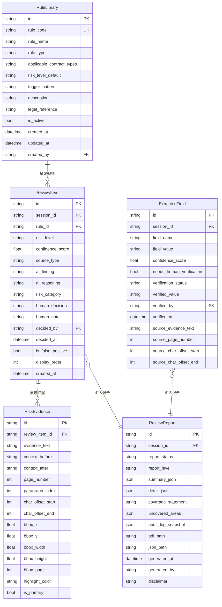

# 合同审核系统 — 审核规则与结果数据模型

**文档编号**：07_data_model/review_rules_model
**编写日期**：2026-03-11
**负责范围**：Teammate 2（审核规则、命中项、解释性字段、审核结果、原文定位）
**输入文档**：
- `03_problem_modeling/problem_model.md`
- `04_interaction_design/t2_review_states.md`
- `02_competitive_analysis/review_result_presentation_analysis.md`
- `04_interaction_design/flow_state_spec-v1.0.md`

---

## 一、模型关系总览

### 1.1 实体关系图（Mermaid）



### 1.2 文字关系说明

```
RuleLibrary（规则库）
  └── 1:N → ReviewItem（命中项）
               └── 1:N → RiskEvidence（风险证据/原文定位）

ReviewSession（来自其他模型，外键关联节点）
  ├── 1:N → ReviewItem
  ├── 1:N → ExtractedField
  └── 1:1 → ReviewReport

ReviewReport
  ├── 聚合 ReviewItem（逐条风险清单）
  └── 聚合 ExtractedField（执行摘要中的关键字段）
```

---

## 二、枚举值说明

### 2.1 risk_level（风险等级）

| 枚举值 | 中文含义 | 路由行为 | 界面处理要求 |
|--------|----------|----------|------------|
| `HIGH` | 高风险 | 触发 LangGraph `interrupt()`，强制等待人工 | 逐条展开原文确认，必须填写 `human_note` ≥ 10 字 |
| `MEDIUM` | 中风险 | 进入批量复核队列（`hitl_pending` subtype: `batch_review`） | 可批量确认，每条需展示来源标签 |
| `LOW` | 低风险 | 自动标记通过，进入批量复核队列或直接通过 | 只读浏览，无需操作 |

**约束**：`risk_level` 值在 `ReviewItem` 创建时由 AI/规则引擎写入，人工仅可通过 `human_decision = edit` 修改，不可直接覆写原始 `risk_level` 字段，需另存人工修订后的等级。

### 2.2 source_type（判断来源）

| 枚举值 | 中文含义 | 界面呈现 | 信任度说明 |
|--------|----------|----------|-----------|
| `rule_engine` | 规则引擎触发 | 蓝色标签"规则触发"，Tooltip："此风险由预设规则库匹配触发" | 确定性高，基于明确规则 |
| `ai_inference` | AI 推理 | 紫色标签"AI 推理"，Tooltip："此风险由 AI 模型推断，存在不确定性，请结合原文判断" | 概率性判断，需结合置信度评估 |
| `hybrid` | 规则 + AI 混合 | 双色标签，分别标注规则命中部分与 AI 补充推理部分 | 规则部分确定，AI 部分概率 |

### 2.3 human_decision（人工决策）

| 枚举值 | 中文含义 | 允许转入的前置状态 | 业务含义 |
|--------|----------|-------------------|---------|
| `pending` | 待处理（初始值） | 初始化；或撤销后回退 | AI 判断等待人工确认 |
| `approve` | 接受 AI 判断 | `pending` | 人工确认 AI 的风险判断有效，记录接受理由 |
| `edit` | 修改 AI 判断 | `pending` | 人工修改 AI 的风险描述或等级，记录修改内容 |
| `reject` | 拒绝 AI 判断 | `pending` | 标记 AI 判断有误（误报），作为规则库反馈数据 |

**状态转换约束（来自 `flow_state_spec-v1.0.md`）**：
- `pending → approve`（高风险）：原文必须已展开 + `human_note` ≥ 10 字
- `pending → edit`：`human_note` ≥ 10 字，风险等级或描述有修改
- `pending → reject`：`human_note` ≥ 10 字
- `approve/edit/reject → pending`：仅在报告未生成前允许撤销
- `ReviewSession.state = completed` 后，任何方向的状态变更均被严禁

### 2.4 report_status（报告状态）

| 枚举值 | 中文含义 | 说明 |
|--------|----------|------|
| `pending` | 待生成 | 报告记录已创建，等待 LangGraph resume() 触发生成 |
| `generating` | 生成中 | 异步任务执行中 |
| `ready` | 已就绪 | PDF 和 JSON 均已生成，可下载 |
| `failed` | 生成失败 | 可重试，不影响 ReviewSession 的 completed 状态 |

### 2.5 field_name（结构化提取字段名）枚举

| 枚举值 | 中文含义 | 字段类型 | 人工核验优先级 |
|--------|----------|----------|--------------|
| `party_a` | 甲方主体 | string | 高 |
| `party_b` | 乙方主体 | string | 高 |
| `contract_amount` | 合同金额 | string（含币种） | 高 |
| `effective_date` | 生效日期 | string（ISO 8601） | 高 |
| `expiry_date` | 到期/终止日期 | string（ISO 8601） | 高 |
| `termination_condition` | 终止条件 | string | 中 |
| `jurisdiction` | 适用法域/管辖 | string | 中 |
| `dispute_resolution` | 争议解决方式 | string | 中 |
| `penalty_clause` | 违约金条款摘要 | string | 中 |
| `confidentiality_scope` | 保密范围 | string | 低 |
| `payment_terms` | 付款条款摘要 | string | 低 |
| `contract_type` | 合同类型（AI 识别） | string | 低 |

### 2.6 verification_status（字段核验状态）

| 枚举值 | 中文含义 | 触发条件 |
|--------|----------|---------|
| `unverified` | 未核对（初始值） | ExtractedField 创建时 |
| `confirmed` | 已确认无误 | 用户点击"我已核对，值无误" |
| `modified` | 已修改 | 用户编辑了字段值后保存 |
| `skipped` | 用户跳过核对 | 用户选择跳过低置信度字段核对（记录"用户选择跳过核对"事件） |

### 2.7 risk_category（风险类型分类）

| 枚举值 | 中文含义 | 典型风险描述 |
|--------|----------|------------|
| `unilateral_clause` | 单边条款 | 仅约束一方的不对等义务 |
| `liability_cap` | 责任限制条款 | 责任上限低于行业惯例 |
| `penalty_asymmetry` | 违约金不对等 | 双方违约金标准明显不对等 |
| `catch_all_clause` | 兜底条款滥用 | 过于宽泛的兜底表述导致义务边界模糊 |
| `ambiguous_expression` | 弹性/模糊表述 | 条款含义不明确，存在多种解释可能 |
| `missing_clause` | 关键条款缺失 | 合同缺少必要条款（如违约责任、争议解决） |
| `compliance_risk` | 合规风险 | 与法律法规存在潜在冲突 |
| `ip_risk` | 知识产权风险 | 知识产权归属或授权条款存在争议 |
| `payment_risk` | 付款条款风险 | 付款节点、条件或金额存在不确定性 |
| `termination_risk` | 终止条款风险 | 终止权行使条件存在不对等或模糊性 |

### 2.8 report_level（报告级别）

| 枚举值 | 中文含义 | 目标受众 | 内容详细程度 |
|--------|----------|----------|------------|
| `executive_summary` | 执行摘要 | 业务负责人、管理层 | 1-2 页，整体风险评估 + 主要结论 |
| `full_analysis` | 完整分析报告 | 法务执行人员 | 全量条款级别分析 + 操作审计日志 |

---

## 三、RuleLibrary（规则库）

### 3.1 字段表格

| 字段名 | 类型 | 是否必填 | 标记 | 说明 |
|--------|------|----------|------|------|
| `id` | UUID | 是 | 💾 | 规则唯一标识符，主键 |
| `rule_code` | VARCHAR(64) | 是 | 💾 | 规则编码，唯一，格式如 `R-001`，用于界面来源引用显示 |
| `rule_name` | VARCHAR(256) | 是 | 🖥️ 💾 | 规则名称，如"违约金不对等检测规则" |
| `rule_type` | ENUM | 是 | 🖥️ 💾 | 规则类型：`pattern_match`（正则/关键词匹配）/ `semantic_match`（语义匹配）/ `structure_check`（结构合规检查）/ `missing_check`（缺失条款检查） |
| `applicable_contract_types` | JSON Array | 否 | 💾 | 适用的合同类型列表，如 `["purchase", "service", "employment"]`，空值代表通用适用 |
| `risk_level_default` | ENUM | 是 | 💾 | 规则触发时的默认风险等级：`HIGH` / `MEDIUM` / `LOW`，可被 AI 推理结果覆盖 |
| `trigger_pattern` | TEXT | 否 | 💾 | 触发规则的模式描述（正则表达式、关键词列表或语义描述），规则引擎使用 |
| `description` | TEXT | 是 | 🖥️ 💾 | 规则的业务含义说明，用于界面 Tooltip 展示（"此风险由规则 R-001 触发，该规则检测……"） |
| `legal_reference` | VARCHAR(512) | 否 | 🖥️ 💾 | 法律依据引用，如"《合同法》第 114 条"或内部合规政策编号 |
| `is_active` | BOOLEAN | 是 | 💾 | 规则是否启用，管理员可停用规则而不删除 |
| `created_at` | DATETIME | 是 | 💾 | 规则创建时间 |
| `updated_at` | DATETIME | 是 | 💾 | 规则最后更新时间 |
| `created_by` | UUID FK | 是 | 💾 | 创建规则的管理员用户 ID |

### 3.2 业务含义说明

`RuleLibrary` 是系统预置的合规检查规则集合，对应 `source_type = rule_engine` 的 ReviewItem。系统管理员维护此规则库以反映企业的合同审核标准（即"Playbook"）。规则库支持两种触发来源：

1. **正则/关键词匹配**（`pattern_match`）：直接在合同文本中匹配预定义的语言模式，如"兜底条款关键词"、"不可抗力范围过宽"等
2. **语义匹配**（`semantic_match`）：通过 Embedding 相似度比较定位语义上符合规则描述的段落，适用于模式不固定的条款类型
3. **结构合规检查**（`structure_check`）：检查合同是否包含必要章节或条款结构
4. **缺失检查**（`missing_check`）：检测关键条款缺失，如合同缺少违约责任条款

`rule_code` 在 ReviewItem 的 `ai_finding` 字段和审核报告中引用，确保来源可追溯。

---

## 四、ReviewItem（审核条款命中项）

### 4.1 字段表格

| 字段名 | 类型 | 是否必填 | 标记 | 说明 |
|--------|------|----------|------|------|
| `id` | UUID | 是 | 💾 | 命中项唯一标识符，主键 |
| `session_id` | UUID FK | 是 | 💾 | 关联的 ReviewSession ID |
| `rule_id` | UUID FK | 否 | 💾 | 触发的规则 ID，`source_type = rule_engine` 时必填；`ai_inference` 时为空 |
| `risk_level` | ENUM | 是 | 🖥️ 💾 | 风险等级：`HIGH` / `MEDIUM` / `LOW`（见枚举说明 2.1） |
| `confidence_score` | FLOAT | 是 | 🖥️ 💾 | AI/规则引擎的置信度分数，范围 0.00 - 1.00（展示时乘以 100 得百分比） |
| `source_type` | ENUM | 是 | 🖥️ 💾 | 判断来源：`rule_engine` / `ai_inference` / `hybrid`（见枚举说明 2.2），前端必须以不同颜色标签区分展示 |
| `risk_category` | ENUM | 是 | 🖥️ 💾 | 风险类型分类（见枚举说明 2.7），用于按类型过滤和报告分组 |
| `ai_finding` | TEXT | 是 | 🖥️ 💾 | AI/规则引擎对该风险的一句话摘要描述，如"该条款将违约金上限设定为合同总额的 5%，低于行业惯例的 10%-20%，可能对贵方造成保护不足" |
| `ai_reasoning` | TEXT | 否 | 🖥️ 💾 | AI 推理链条的详细说明，解释"为什么判定为风险"，包含：原文分析、对比基准、潜在法律影响；`source_type = rule_engine` 时填写规则触发的具体匹配依据 |
| `suggested_revision` | TEXT | 否 | 🖥️ 💾 | AI 生成的建议修订方向说明（非强制替换文本），如"建议将违约金上限修改为合同总额的 15% 或双方协商合理值" |
| `human_decision` | ENUM | 是 | 🖥️ 💾 | 人工决策状态：`pending` / `approve` / `edit` / `reject`（见枚举说明 2.3），初始值 `pending` |
| `human_note` | TEXT | 否 | 💾 | 人工填写的处理备注；高风险条款 Approve/Edit/Reject 时强制填写（≥ 10 字）；中低风险可选填 |
| `human_edited_risk_level` | ENUM | 否 | 💾 | 人工修改后的风险等级，仅 `human_decision = edit` 时填写，原始 `risk_level` 字段保留不变 |
| `human_edited_finding` | TEXT | 否 | 💾 | 人工修改后的风险描述，仅 `human_decision = edit` 时填写 |
| `is_false_positive` | BOOLEAN | 是 | 💾 | 是否为误报，`human_decision = reject` 时设置为 `true`，作为规则库反馈数据 |
| `decided_by` | UUID FK | 否 | 💾 | 做出人工决策的用户 ID |
| `decided_at` | DATETIME | 否 | 💾 | 人工决策时间戳 |
| `display_order` | INT | 是 | 💾 | 在审核界面的展示顺序（高风险优先，同等风险内按置信度降序） |
| `created_at` | DATETIME | 是 | 💾 | 命中项创建时间（AI 扫描发现时） |

### 4.2 业务含义说明

`ReviewItem` 是系统的核心审核单元，每条记录代表 AI 在合同文本中识别出的一个潜在风险条款。其生命周期为：

1. **创建**：LangGraph `risk_scanning` 节点执行时，每发现一条风险实时创建（流式写入，支持前端进度展示）
2. **等待**：`human_decision = pending`，等待人工处理
3. **决策**：人工执行 Approve / Edit / Reject，更新决策字段
4. **归档**：ReviewReport 生成时，所有 ReviewItem 的快照写入报告 `detail_json`

**关键设计原则**：
- `risk_level`、`confidence_score`、`ai_finding`、`source_type` 是 AI 写入的原始判断，不可被人工直接覆盖
- 人工修改只写入 `human_edited_*` 字段，保留 AI 原始判断用于对比和模型反馈
- `is_false_positive = true` 的记录会被异步推送到规则库优化队列，由管理员审核后决定是否调整规则

---

## 五、RiskEvidence（风险证据 / 原文定位）

### 5.1 字段表格

| 字段名 | 类型 | 是否必填 | 标记 | 说明 |
|--------|------|----------|------|------|
| `id` | UUID | 是 | 💾 | 证据唯一标识符，主键 |
| `review_item_id` | UUID FK | 是 | 💾 | 关联的 ReviewItem ID |
| `evidence_text` | TEXT | 是 | 🖥️ 💾 | 支撑风险判断的原文精确片段（AI 判断所依赖的核心文本） |
| `context_before` | TEXT | 否 | 🖥️ 💾 | 原文片段前 1-3 句话的上下文，用于帮助审核人员理解语境 |
| `context_after` | TEXT | 否 | 🖥️ 💾 | 原文片段后 1-3 句话的上下文 |
| `page_number` | INT | 是 | 🖥️ 💾 | 原文所在页码（从 1 开始计数） |
| `paragraph_index` | INT | 是 | 💾 | 原文所在段落在页内的顺序索引（从 0 开始） |
| `char_offset_start` | INT | 是 | 💾 | 证据文本在全文字符串中的起始字符偏移量（全文级别，用于精确定位） |
| `char_offset_end` | INT | 是 | 💾 | 证据文本在全文字符串中的结束字符偏移量（不含） |
| `bbox_x` | FLOAT | 否 | 💾 | 高亮区域左上角 X 坐标，PDF 坐标系（单位：pt），用于 PDF 渲染高亮叠加 |
| `bbox_y` | FLOAT | 否 | 💾 | 高亮区域左上角 Y 坐标 |
| `bbox_width` | FLOAT | 否 | 💾 | 高亮区域宽度 |
| `bbox_height` | FLOAT | 否 | 💾 | 高亮区域高度 |
| `bbox_page` | INT | 否 | 💾 | 高亮区域所在页码（与 `page_number` 通常相同，跨页段落可能不同） |
| `highlight_color` | VARCHAR(16) | 是 | 🖥️ 💾 | 前端高亮颜色，十六进制或 CSS 颜色名，根据 `risk_level` 决定：HIGH → `#FFEBEE`；MEDIUM → `#FFF3E0`；LOW → `#F3F4F6` |
| `is_primary` | BOOLEAN | 是 | 💾 | 是否为主要证据，当一条 ReviewItem 对应多条 RiskEvidence 时，标记最核心的证据片段（用于列表摘要展示） |

### 5.2 业务含义说明

`RiskEvidence` 是 `ReviewItem` 的证据支撑层，解决"AI 说有风险，但审核人员看不到依据原文"的信息损失问题（对应竞品分析中的核心设计原则"原文关联是审核体验的核心"）。

一条 `ReviewItem` 可对应多条 `RiskEvidence`（如跨条款组合风险），系统通过 `is_primary = true` 标记主要证据用于列表摘要展示，其他证据在展开详情时显示。

### 5.3 原文定位字段如何支撑前端「双栏联动」功能

**性能目标**：左右栏联动延迟 ≤ 100ms（来自 `flow_state_spec-v1.0.md` 第 7.1 节规范）

**实现机制**：

```
前端双栏联动调用链：

① 用户点击左栏 ReviewItem 卡片
        │
        ▼
② 前端从已缓存的 RiskEvidence 列表中取 is_primary=true 的证据
        │
        ├─── 如果文档渲染格式为 PDF（有 bbox 坐标）：
        │         直接调用 PDF.js scrollIntoView(page=bbox_page, rect=[bbox_x, bbox_y, ...])
        │         + 叠加高亮层（Canvas 或 SVG 覆盖）
        │         → 无网络请求，纯前端操作，延迟约 10-30ms
        │
        └─── 如果文档渲染格式为 HTML/纯文本（有字符偏移）：
                  通过 char_offset_start / char_offset_end 定位 DOM Range
                  调用 element.scrollIntoView({behavior: 'smooth'})
                  + 使用 CSS ::selection 或 mark 元素高亮
                  → 无网络请求，延迟约 5-20ms
```

**关键设计决策**：

1. **数据预加载**：ReviewSession 进入 `hitl_pending` 状态时，前端一次性拉取该 Session 下所有 ReviewItem 及其关联的 RiskEvidence，本地缓存。联动操作不触发额外 API 请求，从根本上保证 ≤ 100ms 延迟。

2. **双坐标体系并存**：`bbox_*` 坐标用于 PDF 渲染场景（精确像素级高亮），`char_offset_*` 用于纯文本/HTML 场景。两套坐标均在 AI 扫描阶段写入，前端根据文档渲染模式选择使用。

3. **反向联动**：用户在右栏合同原文中选中文本时，前端通过选区的字符偏移与 RiskEvidence 的 `char_offset_start / char_offset_end` 进行区间匹配，定位对应的 ReviewItem 并在左栏激活高亮。

4. **多条证据的高亮顺序**：一条 ReviewItem 对应多条 RiskEvidence 时，激活时高亮所有证据位置，并通过动画依次滚动展示。

---

## 六、ExtractedField（结构化提取字段）

### 6.1 字段表格

| 字段名 | 类型 | 是否必填 | 标记 | 说明 |
|--------|------|----------|------|------|
| `id` | UUID | 是 | 💾 | 字段唯一标识符，主键 |
| `session_id` | UUID FK | 是 | 💾 | 关联的 ReviewSession ID |
| `field_name` | ENUM | 是 | 🖥️ 💾 | 字段名称（见枚举说明 2.5），如 `party_a`、`contract_amount` |
| `field_value` | TEXT | 是 | 🖥️ 💾 | AI 提取的字段值文本，如"甲方：北京科技有限公司" |
| `confidence_score` | FLOAT | 是 | 🖥️ 💾 | 提取置信度，范围 0.00 - 1.00。前端展示规则：≥ 0.85 绿色；0.60-0.84 黄色；< 0.60 橙红色 |
| `needs_human_verification` | BOOLEAN | 是 | 🖥️ 💾 | 是否需要人工核验，`confidence_score < 0.70` 时系统自动设置为 `true`（阈值来自 `flow_state_spec-v1.0.md` 4.1 节） |
| `verification_status` | ENUM | 是 | 🖥️ 💾 | 核验状态：`unverified` / `confirmed` / `modified` / `skipped`（见枚举说明 2.6），初始值 `unverified` |
| `verified_value` | TEXT | 否 | 💾 | 人工核验并修改后的字段值，仅 `verification_status = modified` 时填写，原始 `field_value` 保留 |
| `verified_by` | UUID FK | 否 | 💾 | 执行核验操作的用户 ID |
| `verified_at` | DATETIME | 否 | 💾 | 核验操作时间戳 |
| `source_evidence_text` | TEXT | 否 | 🖥️ 💾 | 字段提取依据的原文片段，用于前端"跳转原文"锚点按钮，显示字段来源 |
| `source_page_number` | INT | 否 | 🖥️ 💾 | 来源原文所在页码 |
| `source_char_offset_start` | INT | 否 | 💾 | 来源原文起始字符偏移，支撑双栏联动（点击字段卡片 → 右栏原文定位） |
| `source_char_offset_end` | INT | 否 | 💾 | 来源原文结束字符偏移 |

### 6.2 业务含义说明

`ExtractedField` 记录 AI Agent 从合同文本中结构化提取的关键信息字段，在工作流阶段一完成后写入（`ReviewSession.state: parsing → scanning` 的过渡阶段）。

**数据流向**：
- 在字段核对视图（`t2_review_states.md` 第 2.1 节）中呈现给审核人员核对
- 字段值（或 `verified_value`）汇入 `ReviewReport.summary_json`，构成报告执行摘要的合同基本信息部分
- 低置信度字段（`needs_human_verification = true`）在界面展示橙色边框和核对引导提示

**人工核验与原始值保留原则**：与 `ReviewItem` 相同，人工修改只写入 `verified_value`，不覆盖 AI 提取的原始 `field_value`，确保可追溯。

---

## 七、ReviewReport（审核报告）

### 7.1 字段表格

| 字段名 | 类型 | 是否必填 | 标记 | 说明 |
|--------|------|----------|------|------|
| `id` | UUID | 是 | 💾 | 报告唯一标识符，主键 |
| `session_id` | UUID FK | 是 | 💾 | 关联的 ReviewSession ID，唯一（1:1） |
| `report_status` | ENUM | 是 | 🖥️ 💾 | 报告状态：`pending` / `generating` / `ready` / `failed`（见枚举说明 2.4） |
| `report_level` | ENUM | 是 | 💾 | 报告级别：`executive_summary` / `full_analysis`（见枚举说明 2.8） |
| `summary_json` | JSONB | 否 | 💾 | 执行摘要 JSON，结构见下方 summary_json 说明 |
| `detail_json` | JSONB | 否 | 💾 | 详细分析 JSON，包含所有 ReviewItem 的快照，结构见下方说明 |
| `coverage_statement` | TEXT | 是 | 🖥️ 💾 | 覆盖范围声明，明确标注"本次审核覆盖的条款类型"和"未覆盖的条款类型"，**设计红线要求必须包含此字段** |
| `uncovered_areas` | JSON Array | 是 | 🖥️ 💾 | 未覆盖的条款类型列表，格式：`["cross_border_clauses", "financial_derivatives", ...]` |
| `audit_log_snapshot` | JSONB | 是 | 💾 | 操作审计日志快照，包含 ReviewSession 生命周期内所有操作事件（event_type、操作人、时间戳）的不可变副本 |
| `pdf_path` | VARCHAR(512) | 否 | 💾 | 生成的 PDF 报告文件的存储路径（对象存储 Key 或本地路径） |
| `json_path` | VARCHAR(512) | 否 | 💾 | 生成的 JSON 报告文件的存储路径，用于系统集成 |
| `generated_at` | DATETIME | 否 | 💾 | 报告生成完成时间 |
| `generated_by` | VARCHAR(64) | 是 | 💾 | 报告生成触发来源，通常为 `system`（自动生成），或用户 ID（手动重新生成） |
| `disclaimer` | TEXT | 是 | 🖥️ 💾 | 免责声明，**设计红线要求必须包含**，固定内容："本报告为 AI 辅助分析，最终法律判断由人工审核人员负责，本报告不构成法律意见" |

### 7.2 summary_json 结构说明

```json
{
  "contract_basic_info": {
    "party_a": "北京科技有限公司",
    "party_b": "上海贸易有限公司",
    "contract_amount": "人民币 500 万元",
    "effective_date": "2026-04-01",
    "expiry_date": "2027-03-31",
    "contract_type": "服务合同"
  },
  "overall_risk_assessment": {
    "high_count": 3,
    "medium_count": 5,
    "low_count": 12,
    "overall_level": "HIGH",
    "review_conclusion": "合同存在 3 处高风险条款，建议在签署前与对方协商修改，详见详细分析部分"
  },
  "review_metadata": {
    "session_id": "uuid",
    "reviewed_by": "张法务",
    "review_start_at": "2026-03-11T09:00:00Z",
    "review_completed_at": "2026-03-11T11:30:00Z",
    "langgraph_thread_id": "thread_xxx"
  }
}
```

### 7.3 detail_json 结构说明

```json
{
  "review_items": [
    {
      "item_id": "uuid",
      "risk_level": "HIGH",
      "risk_category": "penalty_asymmetry",
      "source_type": "rule_engine",
      "rule_code": "R-023",
      "confidence_score": 0.91,
      "ai_finding": "违约金条款存在明显不对等...",
      "ai_reasoning": "...",
      "evidence_text": "若乙方违约，赔偿金额不超过合同金额的 5%...",
      "page_number": 8,
      "human_decision": "approve",
      "human_note": "已与对方协商，对方同意在补充协议中调整",
      "decided_by": "张法务",
      "decided_at": "2026-03-11T10:15:00Z"
    }
  ],
  "extracted_fields_snapshot": [
    {
      "field_name": "party_a",
      "field_value": "北京科技有限公司",
      "confidence_score": 0.97,
      "verification_status": "confirmed"
    }
  ]
}
```

### 7.4 业务含义说明

`ReviewReport` 是审核流程的最终交付物，在所有高风险 `ReviewItem` 处理完成后由 LangGraph `report_generation` 节点异步生成。

**关键约束**：
- `coverage_statement` 和 `disclaimer` 为设计红线必填字段，生成前校验不为空
- `audit_log_snapshot` 为不可变副本（写入后不可修改），即使操作日志表后续数据被清理，报告中的审计链路永久保留
- 报告生成后，关联 ReviewSession 中的所有 `ReviewItem.human_decision` 不得再变更（后端强制校验）
- PDF 报告包含二维码或验证码，用于验证报告未被篡改

---

## 八、模型间关系速查

### 8.1 ASCII 关系图

```
ReviewSession（1）
     │
     ├──────────── ExtractedField（N）
     │                    │
     │              [字段核对视图展示]
     │
     ├──────────── ReviewItem（N）
     │                    │
     │              ├── RuleLibrary（规则来源，0..1）
     │              │
     │              └── RiskEvidence（N）
     │                       │
     │                 [双栏联动定位，bbox / char_offset]
     │
     └──────────── ReviewReport（1）
                        │
                    ├── summary_json（聚合 ExtractedField）
                    ├── detail_json（聚合 ReviewItem + RiskEvidence 快照）
                    ├── coverage_statement（必填）
                    ├── audit_log_snapshot（不可变）
                    └── disclaimer（必填）
```

### 8.2 数据写入时序

| 时序 | 写入操作 | ReviewSession.state |
|------|----------|---------------------|
| 1 | `ExtractedField` 批量写入 | `parsing` → `scanning` |
| 2 | `ReviewItem` 流式写入（扫描中实时） | `scanning` |
| 3 | `RiskEvidence` 随 `ReviewItem` 同步写入 | `scanning` |
| 4 | 用户核对触发 `ExtractedField.verification_status` 更新 | `scanning`（字段核对阶段） |
| 5 | 用户决策触发 `ReviewItem.human_decision` 更新 | `hitl_pending` |
| 6 | `ReviewReport` 创建，`summary_json` / `detail_json` 写入 | `completed` → `report_ready` |

---

## 九、索引建议

| 表 | 索引字段 | 索引类型 | 理由 |
|----|----------|----------|------|
| `review_item` | `session_id` | 普通索引 | 按会话查询所有命中项（最高频查询） |
| `review_item` | `session_id, risk_level` | 复合索引 | 按会话 + 风险等级过滤（分级路由、HITL 界面加载） |
| `review_item` | `session_id, human_decision` | 复合索引 | 检查所有高风险条款是否处理完毕（触发 resume 的判断条件） |
| `review_item` | `rule_id` | 普通索引 | 规则被误报统计查询（is_false_positive = true 的 rule_id 统计） |
| `risk_evidence` | `review_item_id` | 普通索引 | 按命中项查询证据（双栏联动数据加载） |
| `risk_evidence` | `review_item_id, is_primary` | 复合索引 | 快速取主要证据（列表摘要展示） |
| `risk_evidence` | `char_offset_start, char_offset_end` | 普通索引 | 按字符偏移反向查找证据（用户在原文中选中文本 → 定位命中项） |
| `extracted_field` | `session_id` | 普通索引 | 按会话查询所有提取字段 |
| `extracted_field` | `session_id, needs_human_verification` | 复合索引 | 快速定位需要核验的低置信度字段 |
| `review_report` | `session_id` | 唯一索引 | 确保每个会话最多一份报告（1:1 关系约束） |
| `rule_library` | `rule_code` | 唯一索引 | 规则编码唯一性约束 |
| `rule_library` | `is_active` | 普通索引 | 规则引擎加载时只取 is_active = true 的规则 |

---

## 十、前后端责任边界速查

### 10.1 前端必须展示（🖥️）字段汇总

| 模型 | 字段 | 展示场景 |
|------|------|----------|
| `RuleLibrary` | `rule_name`, `description` | 命中项的来源 Tooltip |
| `ReviewItem` | `risk_level`, `confidence_score`, `source_type`, `risk_category`, `ai_finding`, `ai_reasoning`, `human_decision` | HITL 审核视图核心内容 |
| `RiskEvidence` | `evidence_text`, `context_before`, `context_after`, `page_number`, `highlight_color` | 双栏对照原文展示 |
| `ExtractedField` | `field_name`, `field_value`, `confidence_score`, `needs_human_verification`, `verification_status`, `source_evidence_text`, `source_page_number` | 字段核对视图 |
| `ReviewReport` | `report_status`, `coverage_statement`, `uncovered_areas`, `disclaimer` | 报告生成状态和报告展示页 |

### 10.2 后端必须存储（💾）字段汇总

所有字段均标注 💾，以下强调后端特有的存储约束：

- `ReviewItem.human_note`：高风险条款 Approve/Edit/Reject 时后端强制校验 ≥ 10 字，拒绝空值请求
- `ReviewItem.risk_level`、`ai_finding`、`source_type`：写入后不可通过 API 修改（人工修改写入 `human_edited_*` 字段）
- `ReviewReport.audit_log_snapshot`：写入后设置数据库级别不可更新（`GENERATED ALWAYS AS` 或应用层校验）
- `ReviewReport.disclaimer`：写入时后端校验不为空且包含固定声明文本
- `RiskEvidence.bbox_*`：OCR 为扫描件时必须写入；纯文本文件时可为 NULL

---

## 十一、设计红线合规性自查

| 设计红线（来自 `problem_model.md`） | 数据模型对应设计 |
|-----------------------------------|--------------------|
| **AI 结论不可绝对化** | `confidence_score` 为必填字段；`ReviewReport.disclaimer` 为必填字段且内容固定含免责声明 |
| **判断来源必须可区分** | `source_type` 枚举区分 `rule_engine` / `ai_inference` / `hybrid`，前端🖥️必须展示 |
| **覆盖范围必须声明** | `ReviewReport.coverage_statement` 和 `uncovered_areas` 为必填字段，设计红线约束 |
| **操作全程可追溯** | `ReviewReport.audit_log_snapshot` 不可变副本；`ReviewItem` 保留 AI 原始判断 + 人工修改分离存储 |
| **人工决策不可绕过（高风险）** | `human_note` ≥ 10 字后端强制校验；`human_edited_*` 字段分离，避免低摩擦批量修改 |
| **数据安全** | 所有文件路径（`pdf_path`, `json_path`）存储对象存储 Key，不含明文文件内容；合同文本不在数据模型中直接存储（由 OCR 层管理） |

---

*本文档由 Teammate 2 负责，覆盖 RuleLibrary、ReviewItem、RiskEvidence、ExtractedField、ReviewReport 五个数据模型。ReviewSession、Contract、User 等其他模型由其他 Teammate 负责。*
