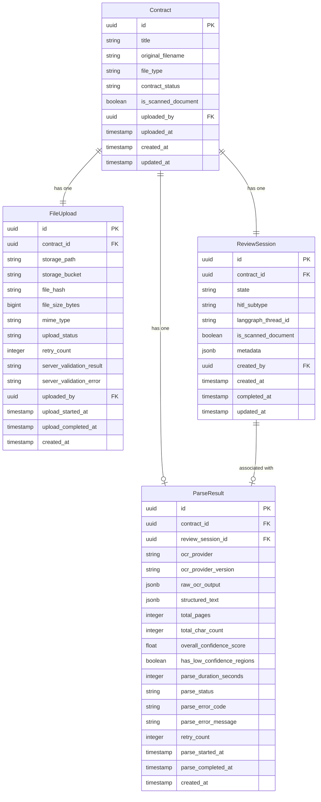

# 数据模型规范：文档上传与任务状态

**文档编号**：07_data_model/upload_and_task_model
**编写日期**：2026-03-11
**负责范围**：Teammate 1（文档上传、任务状态核心模型）
**输入文档**：
- `03_problem_modeling/problem_model.md`
- `04_interaction_design/t1_upload_and_parse.md`
- `04_interaction_design/t2_review_states.md`
- `04_interaction_design/flow_state_spec-v1.0.md`

**覆盖模型**：`Contract`、`FileUpload`、`ParseResult`、`ReviewSession`

---

## 一、模型关系总览

### 1.1 实体关系图（Mermaid）



### 1.2 文本关系图（ASCII）

```
User
 │
 │ uploaded_by / created_by
 ▼
Contract ──────────────────────────────────────────────────┐
 │                                                         │
 │ 1:1                                                     │ 1:1
 ▼                                                         ▼
FileUpload                                           ReviewSession
 │                                                         │
 │ 文件上传完成 + 服务端校验通过后                           │ 1:1
 │ 系统创建 ParseResult                                     │
 │                                                         ▼
 └────────────────────► ParseResult ◄─────────────────────┘
                         │
                         │ 解析成功后，数据传递给
                         ▼
                    ExtractedField（1:N）
                    ReviewItem（1:N，由 scanning 阶段创建）
```

**关系说明**：

| 关系 | 类型 | 说明 |
|------|------|------|
| Contract → FileUpload | 一对一（必须） | 每份合同对应一条文件上传记录；合同复用时创建新 Contract |
| Contract → ReviewSession | 一对一（必须） | 每份合同对应一个审核会话；如需重新审核则废弃旧会话、创建新会话 |
| Contract → ParseResult | 一对一（可选） | 解析完成后才创建；解析失败时可能存在失败记录 |
| ReviewSession → ParseResult | 一对一（可选） | ReviewSession 通过外键关联到其对应的 ParseResult |

---

## 二、Contract 模型

### 2.1 字段定义

| 字段名 | 类型 | 是否必填 | 标注 | 说明 |
|--------|------|----------|------|------|
| `id` | UUID | 是 | 💾 | 主键，系统生成，全局唯一 |
| `title` | VARCHAR(500) | 否 | 🖥️ 💾 | 合同名称；若用户未填写，后端以 `original_filename` 去除扩展名作为默认值 |
| `original_filename` | VARCHAR(500) | 是 | 🖥️ 💾 | 用户上传时的原始文件名，含扩展名（如 `销售合同-2026.pdf`）；仅作展示和记录，不用于存储路径 |
| `file_type` | ENUM | 是 | 💾 | 合同文件格式，枚举值：`pdf`、`docx` |
| `contract_status` | ENUM | 是 | 🖥️ 💾 | 合同整体状态，见 2.2 节枚举说明 |
| `is_scanned_document` | BOOLEAN | 是 | 🖥️ 💾 | 是否为扫描件 PDF（无文本层）；服务端内容可读性预检结果写入，默认 `false`；影响后续 OCR 置信度预期展示 |
| `uploaded_by` | UUID FK → User | 是 | 💾 | 上传操作人的用户 ID；前端读取当前登录用户，后端验证后写入 |
| `uploaded_at` | TIMESTAMP WITH TIME ZONE | 是 | 🖥️ 💾 | 文件服务端校验通过、Contract 记录创建时的时间戳（非文件传输开始时间） |
| `created_at` | TIMESTAMP WITH TIME ZONE | 是 | 💾 | 数据库记录创建时间，由数据库自动写入 |
| `updated_at` | TIMESTAMP WITH TIME ZONE | 是 | 💾 | 记录最后更新时间，由 ORM 自动维护 |

### 2.2 contract_status 枚举值

| 枚举值 | 含义 | 触发条件 |
|--------|------|----------|
| `uploaded` | 文件已上传，等待创建审核会话 | 服务端文件校验通过，Contract 记录创建完成 |
| `processing` | 正在进行解析或扫描 | ReviewSession 创建后，直到审核完成前 |
| `completed` | 审核流程已完成 | ReviewSession.state = `completed` 或 `report_ready` |
| `aborted` | 流程已中止 | ReviewSession.state = `aborted` |

**注**：`contract_status` 是 ReviewSession 状态的高层摘要，便于合同列表页快速展示，不替代 ReviewSession.state 的精确语义。前端合同列表以此字段为主过滤和排序依据。

### 2.3 业务含义补充

- `original_filename` 与存储路径解耦：存储路径由 FileUpload.storage_path 管理，Contract 层只保留用户可感知的原始文件名，避免存储路径结构暴露给前端。
- `is_scanned_document` 在阶段二（Teammate 2 范围）的字段核对视图中，用于决定是否显示 OCR 精度警告横幅。

---

## 三、FileUpload 模型

### 3.1 字段定义

| 字段名 | 类型 | 是否必填 | 标注 | 说明 |
|--------|------|----------|------|------|
| `id` | UUID | 是 | 💾 | 主键 |
| `contract_id` | UUID FK → Contract | 是 | 💾 | 关联的合同 ID；与 Contract 一对一 |
| `storage_path` | VARCHAR(1000) | 是 | 💾 | 文件在对象存储（如 S3 / MinIO）中的完整路径；不暴露给前端，后端通过此路径生成预签名 URL |
| `storage_bucket` | VARCHAR(200) | 是 | 💾 | 对象存储的 Bucket 名称；支持多 Bucket 部署时区分数据分区 |
| `file_hash` | VARCHAR(64) | 是 | 💾 | 文件 SHA-256 哈希值；用于完整性校验和去重检测；上传完成后服务端计算并写入 |
| `file_size_bytes` | BIGINT | 是 | 🖥️ 💾 | 文件字节数；前端展示时换算为 MB，最大允许值 52,428,800（50MB） |
| `mime_type` | VARCHAR(200) | 是 | 💾 | 服务端校验后确认的真实 MIME 类型（通过 Magic Bytes 检测，非客户端声称值）；合法值：`application/pdf`、`application/vnd.openxmlformats-officedocument.wordprocessingml.document` |
| `upload_status` | ENUM | 是 | 🖥️ 💾 | 上传与服务端校验的状态，见 3.2 节枚举说明 |
| `retry_count` | INTEGER | 是 | 💾 | 上传重试次数，默认 0；用于限制重试（上传阶段不限制，OCR 阶段最多 3 次）|
| `server_validation_result` | ENUM | 否 | 💾 | 服务端校验的最终结论：`passed`、`passed_with_warning`（扫描件）、`failed` |
| `server_validation_error` | VARCHAR(200) | 否 | 💾 | 服务端校验失败时的错误原因代码，如 `encrypted`、`corrupted`、`empty`、`format_mismatch` |
| `uploaded_by` | UUID FK → User | 是 | 💾 | 执行上传操作的用户 ID（与 Contract.uploaded_by 一致，冗余存储便于查询） |
| `upload_started_at` | TIMESTAMP WITH TIME ZONE | 是 | 💾 | 服务端开始接收文件传输的时间戳 |
| `upload_completed_at` | TIMESTAMP WITH TIME ZONE | 否 | 💾 | 文件传输完成（100%）且服务端完整接收的时间戳；上传失败时为 NULL |
| `created_at` | TIMESTAMP WITH TIME ZONE | 是 | 💾 | 记录创建时间 |

### 3.2 upload_status 枚举值

| 枚举值 | 含义 | 触发条件 |
|--------|------|----------|
| `uploading` | 文件传输进行中 | 服务端开始接收文件时写入 |
| `upload_failed` | 文件传输失败 | 网络中断、请求超时（>30 秒）、服务端 5xx |
| `validating` | 服务端校验进行中 | 文件传输 100% 完成后 |
| `validation_failed` | 服务端校验未通过 | 文件格式伪造、损坏、加密、空文档等 |
| `ready` | 校验通过，文件可用 | 服务端校验通过（含扫描件警告情形） |

### 3.3 业务含义补充

- `storage_path` 不直接对外暴露：API 层通过预签名 URL（有时效限制）向前端提供临时访问链接，避免存储路径泄露带来的安全隐患。
- `file_hash` 双重用途：一是上传完整性验证（服务端计算后与客户端提供的校验值比对，若客户端提供的话）；二是后续去重检测（相同 hash 的文件可复用存储，但仍创建独立的 FileUpload 记录以保留可追溯性）。
- `server_validation_error` 使用代码而非自由文本：便于前端根据错误代码渲染对应的本地化错误提示文案，与 t1 交互规范中定义的 S_ERR_3 错误类型对应。

---

## 四、ParseResult 模型

### 4.1 字段定义

| 字段名 | 类型 | 是否必填 | 标注 | 说明 |
|--------|------|----------|------|------|
| `id` | UUID | 是 | 💾 | 主键 |
| `contract_id` | UUID FK → Contract | 是 | 💾 | 关联合同 ID |
| `review_session_id` | UUID FK → ReviewSession | 是 | 💾 | 关联审核会话 ID；便于通过 session 直接查询解析结果 |
| `ocr_provider` | VARCHAR(100) | 是 | 💾 | 使用的外部 OCR 服务商名称，如 `textin`；用于审计和服务切换时的数据溯源 |
| `ocr_provider_version` | VARCHAR(50) | 是 | 💾 | OCR 服务版本号；用于分析不同版本的识别质量差异 |
| `raw_ocr_output` | JSONB | 是 | 💾 | OCR 服务返回的原始 JSON 输出，完整保留不裁剪；用于后续调试、重处理和审计 |
| `structured_text` | JSONB | 是 | 💾 | 系统对 OCR 输出进行标准化处理后的结构化文本，按页/段落组织，含每段置信度；ExtractedField 和 ReviewItem 的原始数据来源 |
| `total_pages` | INTEGER | 是 | 🖥️ 💾 | 合同文件总页数；前端在解析详情页展示 |
| `total_char_count` | INTEGER | 是 | 💾 | 可识别的总字符数；业务级失败判断依据之一（t2 规范：有效文本字数 < 200 判为业务级失败） |
| `overall_confidence_score` | FLOAT | 是 | 🖥️ 💾 | 全文整体置信度评分（0-100），由 OCR 服务各段落置信度加权平均计算；前端在解析完成摘要中展示 |
| `has_low_confidence_regions` | BOOLEAN | 是 | 💾 | 是否存在低置信度段落（任一段落 confidence < 60）；用于在字段核对视图顶部触发橙色警示横幅 |
| `parse_duration_seconds` | INTEGER | 否 | 💾 | OCR 解析耗时（秒），解析完成后写入；失败时为 NULL；用于服务性能监控 |
| `parse_status` | ENUM | 是 | 🖥️ 💾 | 解析任务状态，见 4.2 节枚举说明 |
| `parse_error_code` | VARCHAR(100) | 否 | 💾 | 解析失败时的错误代码，来自 OCR 服务返回或系统超时判断；失败时必填 |
| `parse_error_message` | TEXT | 否 | 💾 | 解析失败的详细错误描述；存储 OCR 服务原始错误信息，不直接展示给普通用户（前端按 error_code 显示本地化文案） |
| `retry_count` | INTEGER | 是 | 🖥️ 💾 | OCR 解析的手动重试次数，默认 0；最大允许值 3（超过后"重新解析"按钮禁用）；前端据此控制重试按钮状态 |
| `parse_started_at` | TIMESTAMP WITH TIME ZONE | 否 | 💾 | OCR 任务提交至外部服务的时间戳 |
| `parse_completed_at` | TIMESTAMP WITH TIME ZONE | 否 | 💾 | OCR 服务返回最终结果（成功或失败）的时间戳 |
| `created_at` | TIMESTAMP WITH TIME ZONE | 是 | 💾 | 记录创建时间 |

### 4.2 parse_status 枚举值

| 枚举值 | 含义 | 触发条件 |
|--------|------|----------|
| `pending` | 解析任务已创建，等待提交 | ParseResult 记录初始化时 |
| `processing` | OCR 任务已提交，等待外部服务返回 | OCR 任务成功提交至外部服务后 |
| `succeeded` | 解析成功，结果已写入 | OCR 服务返回成功结果并完成写入 |
| `failed` | 解析失败（OCR 服务返回错误） | OCR 服务返回非成功状态码 |
| `timeout` | 解析超时（超过 15 分钟未返回结果） | 系统定时器检测到超时阈值触发 |

### 4.3 业务含义补充

- `raw_ocr_output` 保留完整原始输出的目的：一是满足审计合规要求（可追溯 AI 判断的原始输入）；二是当 OCR 服务升级或切换时，可基于历史原始数据重新处理，无需重新调用外部服务。该字段数据量可能较大，建议评估是否独立存储到对象存储并在数据库中仅保留引用路径。
- `structured_text` 与 `raw_ocr_output` 的关系：前者是后端对 OCR 原始输出进行标准化转换的结果（统一结构、清洗噪音），后续的 `ExtractedField` 字段提取和 `ReviewItem` 风险扫描均基于 `structured_text`，而非直接消费 `raw_ocr_output`。
- `retry_count` 在 ParseResult 层维护而非 ReviewSession 层：允许在同一会话中精确统计解析阶段的重试次数，不与后续扫描阶段的重试混淆。

---

## 五、ReviewSession 模型

### 5.1 字段定义

| 字段名 | 类型 | 是否必填 | 标注 | 说明 |
|--------|------|----------|------|------|
| `id` | UUID | 是 | 💾 | 主键；同时作为前端 URL 路由参数（如 `/sessions/{id}/review`） |
| `contract_id` | UUID FK → Contract | 是 | 💾 | 关联合同 ID；外键约束保证 Contract 存在后才可创建 ReviewSession |
| `state` | ENUM | 是 | 🖥️ 💾 | 审核会话当前状态，是核心状态机字段；完整枚举见 5.2 节 |
| `hitl_subtype` | ENUM | 否 | 💾 | 仅在 `state = hitl_pending` 时有意义，区分两种 HITL 模式；枚举值：`batch_review`（中风险批量复核）、`interrupt`（高风险强制中断）；其他状态下为 NULL |
| `langgraph_thread_id` | VARCHAR(200) | 是 | 💾 | LangGraph Checkpointer 的线程标识符，由系统在创建 ReviewSession 时生成并写入；用于跨天异步恢复和工作流状态查询 |
| `is_scanned_document` | BOOLEAN | 是 | 🖥️ 💾 | 合同文件是否为扫描件（来自服务端内容可读性预检），与 Contract.is_scanned_document 同步；前端在字段核对视图中据此展示 OCR 精度说明 |
| `metadata` | JSONB | 否 | 💾 | 扩展元数据，存储不适合独立列的结构化辅助信息；参考内容：`{"scan_triggered_by": "auto", "route_result": "interrupt", "high_risk_count": 3, "medium_risk_count": 2}` |
| `created_by` | UUID FK → User | 是 | 💾 | 创建会话的用户 ID（文件上传人） |
| `created_at` | TIMESTAMP WITH TIME ZONE | 是 | 🖥️ 💾 | 会话创建时间；前端工作流步骤条的"上传解析"节点 Tooltip 显示此时间 |
| `completed_at` | TIMESTAMP WITH TIME ZONE | 否 | 🖥️ 💾 | 审核流程完成时间（state 首次流转至 `completed` 时写入）；前端报告页和合同列表展示 |
| `updated_at` | TIMESTAMP WITH TIME ZONE | 是 | 💾 | 状态最后变更时间，由 ORM 自动维护；用于检测会话活跃性和超时 |

### 5.2 state 完整枚举值及流转规则

#### 枚举值定义

| 状态值 | 中文含义 | 是否终态 | 前端工作流步骤条对应 |
|--------|----------|----------|---------------------|
| `parsing` | OCR 解析中 | 否 | 上传解析节点（进行中） |
| `scanning` | AI 风险扫描中 | 否 | AI 扫描节点（进行中） |
| `hitl_pending` | 等待人工介入 | 否 | 人工审核节点（暂停中 / 进行中） |
| `completed` | 审核流程已完成 | 否（→ report_ready） | 报告生成节点（进行中） |
| `report_ready` | 报告已生成就绪 | 是 | 报告生成节点（已完成） |
| `aborted` | 流程已中止 | 是 | 任意节点（失败态） |

#### 合法状态流转规则

| 起始状态 | 可流转至 | 触发主体 | 触发条件 |
|----------|----------|----------|----------|
| `parsing` | `scanning` | 系统 | OCR 解析成功，`ParseResult.parse_status = succeeded` |
| `parsing` | `aborted` | 用户 / 系统 | 用户确认放弃，或解析失败达上限（retry_count = 3）且系统判定不可恢复 |
| `scanning` | `hitl_pending` | 系统（LangGraph routing 节点） | 扫描完成，存在中风险或高风险条款 |
| `scanning` | `completed` | 系统（LangGraph routing 节点） | 扫描完成，无高风险条款且低风险数量在阈值内（低风险直通路径） |
| `scanning` | `aborted` | 系统 | LLM API 调用失败达上限，系统判定不可恢复 |
| `hitl_pending` | `completed` | 用户 + 系统 | 所有 `risk_level = high` 的 ReviewItem 的 `human_decision` 均不为 `pending` |
| `hitl_pending` | `aborted` | 用户 | 用户在 HITL 阶段主动放弃 |
| `completed` | `report_ready` | 系统 | 审核报告异步生成任务完成 |

**严禁的状态流转**：

| 禁止的转换 | 禁止原因 |
|------------|----------|
| `completed` → 任意非 `report_ready` 状态 | 审核完成后状态锁定，防止误操作回退 |
| `report_ready` → 任意状态 | 终态，不可逆 |
| `aborted` → 任意状态 | 终态；用户如需继续，必须创建新的 ReviewSession |
| `parsing` → `hitl_pending` | 跳过解析直接进入 HITL，业务上不合法 |
| `parsing` → `completed` | 跳过扫描直接完成，业务上不合法 |

#### hitl_subtype 与 state 的关系

```
state = hitl_pending
    │
    ├── hitl_subtype = batch_review
    │     含义：中风险条款存在，无高风险
    │     界面：复核列表视图，允许批量确认
    │     退出：所有中风险条款处理完毕 → completed
    │
    └── hitl_subtype = interrupt
          含义：存在至少一条高风险条款，LangGraph interrupt() 已触发
          界面：流程暂停视图，强制逐条处理
          退出：所有高风险 ReviewItem.human_decision ≠ pending → completed
```

#### 完整状态流转图

```
                    (初始化)
                       │
                       │ 文件上传成功 + Contract/ReviewSession 创建
                       ▼
                   ┌─────────┐
                   │ parsing │◄──────────────────────────────┐
                   └─────────┘                               │
                       │                              OCR 重试 (≤3次)
              OCR 解析成功                                    │
                       │                         parse_failed │ parse_timeout
                       ▼                                      │
                   ┌─────────┐                               │
        ┌──────────│scanning │────────────────────────────────┘
        │          └─────────┘
        │               │ LangGraph routing 完成
        │               │
        │    ┌──────────┼──────────────────────┐
        │    │          │                      │
        │  低风险    中风险                  高风险
        │    │    (batch_review)          (interrupt)
        │    │          │                      │
        │    │          ▼                      ▼
        │    │    ┌─────────────────────────────────┐
        │    │    │       hitl_pending              │
        │    │    └─────────────────────────────────┘
        │    │                   │
        │    │      所有高风险条款 human_decision ≠ pending
        │    │                   │
        │    ▼                   ▼
        │ ┌─────────────────────────┐
        └►│        completed        │
          └─────────────────────────┘
                       │
                 报告异步生成完成
                       │
                       ▼
              ┌──────────────────┐
              │   report_ready   │ ← 终态
              └──────────────────┘

    任意状态 ─── 用户放弃 / 系统不可恢复故障 ───► aborted（终态）
```

### 5.3 业务含义补充

- `langgraph_thread_id` 的重要性：这是工作流持久化的锚定键。前端通过此 ID 调用 LangGraph API 查询工作流当前检查点（checkpoint），实现跨天异步恢复。该字段在 ReviewSession 创建时由系统生成，一旦写入不得修改。
- `hitl_subtype` 设计为 ReviewSession 字段而非 ReviewItem 字段：子类型反映的是整个会话的路由决策结果，而非单条条款的属性；相同的会话中所有条款共享同一个路由决策结果。
- `metadata` JSONB 字段用途：存储与主状态机无关但需持久化的辅助信息，如路由决策的统计摘要（高/中/低风险条款数量）、扫描触发方式等；后续如需新增字段，优先考虑放入 metadata 而非增加列，降低 schema 迁移频率。

---

## 六、字段标注汇总

### 6.1 前端必须展示的字段（🖥️）

| 模型 | 字段 | 展示场景 |
|------|------|----------|
| Contract | `title` | 合同列表、合同详情页标题 |
| Contract | `original_filename` | 上传结果确认、文件信息卡片 |
| Contract | `contract_status` | 合同列表状态徽标 |
| Contract | `is_scanned_document` | 字段核对视图的扫描件精度提示横幅 |
| FileUpload | `file_size_bytes` | 上传过程文件信息展示（换算为 MB） |
| FileUpload | `upload_status` | 上传进度页的状态展示 |
| ParseResult | `total_pages` | 解析完成摘要 |
| ParseResult | `overall_confidence_score` | 解析完成摘要的整体置信度 |
| ParseResult | `parse_status` | 解析进度页状态 |
| ParseResult | `retry_count` | 解析失败页"重新解析"按钮的可用状态控制（≥3 时禁用） |
| ReviewSession | `state` | 工作流步骤条的节点状态 |
| ReviewSession | `is_scanned_document` | 字段核对视图扫描件提示 |
| ReviewSession | `created_at` | 工作流步骤条 Tooltip 的时间信息 |
| ReviewSession | `completed_at` | 报告页、合同列表的完成时间展示 |

### 6.2 后端必须存储的字段（💾）

所有字段均须后端持久化存储，以满足操作可追溯的设计红线。以下为特别说明必须完整保留、不可裁剪的字段：

| 模型 | 字段 | 不可裁剪原因 |
|------|------|-------------|
| FileUpload | `file_hash` | 完整性验证与去重 |
| FileUpload | `server_validation_error` | 审计溯源 |
| ParseResult | `raw_ocr_output` | 原始数据保留，支持重处理和审计 |
| ParseResult | `parse_error_code` / `parse_error_message` | 支持技术排查和用户反馈处理 |
| ReviewSession | `langgraph_thread_id` | LangGraph 工作流恢复的唯一依据，丢失则无法恢复跨天审核 |
| ReviewSession | `state` 变更历史 | 建议通过操作日志（AuditLog）保留每次状态变更记录，而非仅保留当前状态 |

---

## 七、索引建议

### 7.1 Contract 表

| 索引 | 类型 | 索引列 | 用途 |
|------|------|--------|------|
| `idx_contract_uploaded_by` | B-tree | `uploaded_by` | 按用户查询其上传的合同列表 |
| `idx_contract_status` | B-tree | `contract_status` | 合同列表按状态过滤 |
| `idx_contract_uploaded_at` | B-tree | `uploaded_at DESC` | 合同列表按上传时间倒序排列 |
| `idx_contract_uploaded_by_status` | 复合 B-tree | `(uploaded_by, contract_status)` | 用户工作台"我的合同"按状态筛选 |

### 7.2 FileUpload 表

| 索引 | 类型 | 索引列 | 用途 |
|------|------|--------|------|
| `idx_fileupload_contract_id` | B-tree（唯一） | `contract_id` | 通过 contract_id 查询对应的上传记录（唯一约束） |
| `idx_fileupload_file_hash` | B-tree | `file_hash` | 文件去重检测 |
| `idx_fileupload_upload_status` | B-tree | `upload_status` | 查询待处理/失败的上传记录（后台监控任务使用） |

### 7.3 ParseResult 表

| 索引 | 类型 | 索引列 | 用途 |
|------|------|--------|------|
| `idx_parseresult_contract_id` | B-tree（唯一） | `contract_id` | 通过 contract_id 查询解析结果 |
| `idx_parseresult_review_session_id` | B-tree（唯一） | `review_session_id` | 通过 session_id 查询解析结果 |
| `idx_parseresult_parse_status` | B-tree | `parse_status` | 查询进行中/失败的解析任务（定时任务轮询超时检测使用） |

### 7.4 ReviewSession 表

| 索引 | 类型 | 索引列 | 用途 |
|------|------|--------|------|
| `idx_reviewsession_contract_id` | B-tree（唯一） | `contract_id` | 通过 contract_id 查询会话（唯一约束） |
| `idx_reviewsession_state` | B-tree | `state` | 按状态查询会话（工作台"待我处理"模块） |
| `idx_reviewsession_langgraph_thread_id` | B-tree（唯一） | `langgraph_thread_id` | LangGraph 通过 thread_id 查询会话（唯一约束） |
| `idx_reviewsession_created_by_state` | 复合 B-tree | `(created_by, state)` | 用户工作台"我的待处理"按状态聚合 |
| `idx_reviewsession_updated_at` | B-tree | `updated_at DESC` | 后台监控任务检测长时间未更新的会话（如检测卡在 parsing/scanning 超时的会话） |

---

## 八、与其他模型的边界说明

本文档设计的四个模型（Contract、FileUpload、ParseResult、ReviewSession）属于**上传与任务状态层**，与以下模型的边界如下：

| 相邻模型 | 关系 | 边界 |
|----------|------|------|
| `ExtractedField` | ParseResult 解析成功后，由系统创建 ExtractedField 记录，关联 ReviewSession | ExtractedField 的设计属于字段提取层，不在本文档范围 |
| `ReviewItem` | ReviewSession 进入 `scanning` 后，由 AI 风险扫描节点创建 ReviewItem | ReviewItem 的设计属于风险扫描层，不在本文档范围 |
| `ReviewReport` | ReviewSession 进入 `completed` 后，系统异步创建 ReviewReport | ReviewReport 的设计属于报告生成层，不在本文档范围 |
| `User` | Contract、FileUpload、ReviewSession 均通过外键引用 User | User 模型由鉴权/权限模块统一定义，不在本文档范围 |
| `AuditLog`（操作日志） | 所有状态变更和关键操作应写入操作日志 | AuditLog 模型独立设计；本文档在各模型中标注了关键状态字段，供 AuditLog 模块按需引用 |

---

*本文档严格基于 `03_problem_modeling/problem_model.md` 的领域模型，以及 `04_interaction_design` 三份交互规范文档产出，覆盖范围限于 Contract、FileUpload、ParseResult、ReviewSession 四个核心模型，不涉及 ExtractedField、ReviewItem、ReviewReport 等下游模型的详细设计。*
