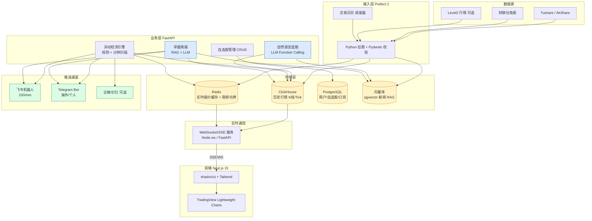

# 04 - 实现方案 / 技术栈调研

> 维度：A 股自动盯盘 AI 助手的端到端技术选型
> 调研方式：Claude Code WebSearch + muyu-search MCP（grok-4.3:online）双路核实
> 调研日期：2026-05-20

## TL;DR

| 模块 | 推荐选型 | 一句话理由 |
|---|---|---|
| 数据接入 | **Python + Prefect 2 + Tushare/AkShare**（启动期 cron + APScheduler） | Python 原生、动态工作流、监控/重试内置、轻量 |
| 存储层 | **ClickHouse（历史行情）+ Redis（实时缓存）+ PostgreSQL（用户/自选股）** | 列存压缩 10-30x，OLAP 快，事务库分担用户态 |
| 业务逻辑 | **规则引擎（异动检测）+ LLM Function Calling（自然语言选股）+ RAG（早盘简报）** | 三类任务三种解法，不一把梭 |
| 前端 UI | **Next.js 15 (App Router) + shadcn/ui + TradingView Lightweight Charts + SSE/WebSocket** | React 全栈、组件可控、原生 K 线、SSE 简单稳定 |
| 推送通道 | **飞书自定义机器人（首选）+ Telegram（海外/个人版）** | 100 次/分钟最高限频 + 卡片能力最强 |
| 部署运维 | **腾讯云轻量 4C8G（约 60 元/月）+ Docker Compose**，前端 Vercel 免费层 | 自营 WebSocket + 简报任务，月成本 60-120 元 |

---

## 1. 数据接入

A 股行情数据接入需要兼顾：交易时段调度（9:30-11:30 / 13:00-15:00）、API 限频与重试、节假日跳过、新闻源拉取（财联社电报）。

### 业内主流方案

| 方案 | 上手 | 监控/重试 | 适合 | 不适合 |
|---|---|---|---|---|
| **cron + Python 脚本** | 极简 | 全靠自己写 | 单任务 PoC | 多源依赖、失败排查 |
| **APScheduler（进程内）** | 简单 | 内置 retry，无 UI | 单机部署、轻量调度 | 多机扩展、可视化运维 |
| **Apache Airflow** | 陡峭 | DAG + Web UI + SLA + backfill | 企业级、多 DAG、专职运维 | 个人项目，重资源（Scheduler+DB+Workers） |
| **Prefect 2** | 中等（Python 原生 `@flow/@task`） | 现代仪表盘、动态任务映射、状态缓存 | 中小团队、迭代快、Python 栈 | 极简定时（杀鸡用牛刀） |
| **自研 daemon** | 难 | 全部自己实现 | 极致定制 | 长期维护，技术债重 |

### 量化对比

- **Airflow**：调度器 + Worker + Metadata DB（PG/MySQL）三件套，最低 2-3 GB 内存基线。生产案例 Airbnb 上万 DAG。
- **Prefect 2**：单 `prefect server start` 即可跑通，内存约 500 MB；社区报告"开发速度快 5 倍、成本降 60-70%"。
- **APScheduler**：纯库，无独立进程开销；缺点是没 Web UI，故障排查靠日志。
- **cron**：周末/节假日会空跑，必须自己读交易日历过滤。

### 推荐 + 为什么不用 X

**推荐**：**Prefect 2**（生产期）+ APScheduler/cron（MVP 启动期）

- 为什么不用 **Airflow**：个人/小团队项目无专职数据工程师，Airflow 的 Scheduler+DB+Worker 三件套是过度工程；2026 年社区共识 "Greenfield Airflow is rarely the right call"。
- 为什么不用 **自研 daemon**：监控/重试/补数（backfill）这些功能 Prefect 已经免费给你了，重新造轮子产生纯技术债。
- 为什么不用 **Dagster**：资产化（asset-based）的心智模型主要解决 dbt 数仓血缘问题，盯盘场景的"行情拉取 → 异动检测 → 推送"是事件流而非资产 DAG，Prefect 的 flow 抽象更贴合。

### 数据清洗管线

```
Tushare/AkShare API → Pydantic schema 校验 → 异常值过滤（涨跌停 ±10%/±20%/±5% 边界） → 写 ClickHouse
财联社电报 / 公告 → 去重（URL+timestamp hash） → 向量化（bge-small-zh）→ 写向量库（Qdrant/PG+pgvector）
```

### 工作量预估
- MVP（cron + Python + Tushare 拉日线）：**2-3 人天**
- 生产（Prefect + 多源 + 交易日历 + 重试）：**8-12 人天**

---

## 2. 存储层

A 股盯盘场景的数据有三类，必须分开存：
1. **历史行情**（K 线、Tick、Level2）—— 海量、时序、OLAP 查询
2. **实时行情缓存**（最新报价、自选股快照）—— 低延迟、读多写多
3. **用户数据**（账户、自选股列表、订阅、推送日志）—— 事务、关系

### 时序数据库对比（2026 基准）

| 数据库 | 压缩比 | 写入性能 | A 股适配 | 备注 |
|---|---|---|---|---|
| **ClickHouse** | **10:1 ~ 30:1**（最优） | 100 万 ~ 300 万行/秒 | ★★★★★ | Longbridge 实测存储省 5x、写入快 10x |
| **TimescaleDB** | 3:1 ~ 15:1（Hypercore 后） | 10 万 ~ 50 万行/秒 | ★★★★ | PostgreSQL 兼容，运维门槛低 |
| **DuckDB + Parquet** | 5:1 ~ 20:1（ZSTD） | 100 万 ~ 1800 万行/秒（批量） | ★★★ | 嵌入式单文件，适合本地回测 |
| **InfluxDB 3.0** | 10:1 ~ 20:1（Parquet） | 20 万 ~ 100 万行/秒 | ★★★ | 监控级流式 OK，高基数（5400+ 股票）略弱 |

### 推荐 + 为什么不用 X

**推荐组合**：
- **历史行情归档 + OLAP**：ClickHouse（独立部署 or 内置 chDB 嵌入）
- **实时缓存**：Redis 7（最新报价 hash、自选股 set、限频令牌桶）
- **用户/业务数据**：PostgreSQL 16（账户、订阅、推送日志、自选股表）

为什么不用 X：
- **不用 InfluxDB**：A 股 5400+ 股票 × 多周期标签 = 高基数（high cardinality），InfluxDB 2.x TSM 引擎已知短板；3.0 改 Parquet 后追上但生态弱于 ClickHouse。
- **不用 TimescaleDB（单独）**：Hypercore 转列存有延迟，写入吞吐仅 ClickHouse 的 1/3-1/6；若团队已有重度 PG 栈可考虑，否则压缩比和查询速度都不划算。
- **不用 DuckDB（线上主存）**：单进程嵌入式，没法多服务并发写；适合数据科学家本地跑回测，不适合 7×24 服务。
- **不用 MongoDB**：文档库做行情时序是反模式，存储膨胀 5-10x，聚合查询慢。
- **不用纯 Parquet + S3**：缺索引、缺更新能力，"早盘异动"需要近实时（秒级）扫描，对象存储扫一次成本太高。

### 容量估算

| 数据类型 | 单条体积 | 日增量 | 一年 | 压缩后（CH） |
|---|---|---|---|---|
| 日 K（5400 股） | ~50 B | ~270 KB | ~100 MB | ~10 MB |
| 分钟 K（5400 股 × 240 根） | ~50 B | ~65 MB | ~16 GB | ~1-2 GB |
| Tick / 逐笔（如接入 L2） | ~80 B | ~50-200 GB | TB 级 | 100-300 GB |

### 工作量预估
- ClickHouse + Redis + PG Docker Compose 起步：**2 人天**
- Schema 设计 + 分区 + TTL + 备份：**3-5 人天**

---

## 3. 业务逻辑

四个核心子系统，**每个用最贴合的范式**，不一把梭丢给 LLM。

### 3.1 自选股管理
- 纯 CRUD：PostgreSQL + REST/tRPC。
- 工作量：**1 人天**

### 3.2 选股引擎（自然语言 → 股票列表）

| 方案 | 思路 | 优劣 |
|---|---|---|
| **Text2SQL** | LLM 把"市盈率<20 且 ROE>15%"翻译成 SQL 跑 ClickHouse | 准、可解释；但需固化 schema 提示词 |
| **LLM Function Calling** | 预定义工具（`filter_by_pe`、`filter_by_industry`），LLM 选工具组合 | 安全、可控；对复杂条件需多轮 |
| **RAG + Embedding** | 把研报/新闻向量化，按语义检索 | 适合"找受益于 AI 算力的股票"这类语义；纯财务因子用 SQL 更准 |

**推荐**：**Function Calling 为主 + Text2SQL 兜底**
- 为什么不用纯 RAG：财务因子（PE/ROE/营收增速）是结构化数值，向量检索误差大，硬走 SQL。
- 为什么不用纯 Text2SQL：LLM 生成 SQL 容易踩列名错误、注入风险；Function Calling 用白名单工具最安全。
- 工作量：**5-8 人天**

### 3.3 异动检测（盘中实时）

**规则引擎为主**（不要用 LLM 实时跑，太贵太慢）：

```python
# 规则示例
rules = [
    Rule("limit_up", lambda d: d.pct_chg >= 9.95),
    Rule("limit_down", lambda d: d.pct_chg <= -9.95),
    Rule("volume_surge", lambda d: d.volume > d.ma5_volume * 3),
    Rule("price_break_60d_high", lambda d: d.close > d.high_60d),
    Rule("intraday_amplitude", lambda d: d.high/d.low - 1 > 0.08),
]
```

调度：每分钟扫一次全市场，命中规则 → 入 Redis 异动队列 → 推送服务消费。
- 工作量：**3-5 人天**

### 3.4 早盘简报生成（每日 9:00）

**RAG + LLM**：
1. 拉昨日收盘数据 + 隔夜外盘 + 财联社电报 + 板块异动统计 → 结构化 prompt
2. LLM（Claude/DeepSeek/Qwen）按模板生成：市场概览 / 板块异动 / 个股聚焦 / 风险提示
3. 渲染成飞书卡片 → 推送

- 模型选择：DeepSeek V3 / Qwen-max（中文好、价格低，每篇简报 ~0.05 元）；离线可用 Qwen-32B 自托管
- 工作量：**4-6 人天**

---

## 4. 前端 UI

### 框架选型

| 框架 | 实时 Dashboard 适配 | 优劣 |
|---|---|---|
| **Next.js 15（App Router）** | 中等，原生不擅长长连接 WebSocket | React 生态最大、Server Components、Vercel 部署一键；WS 需独立服务 |
| **Vite + React SPA** | 高（纯客户端长连接） | 启动快、控制力强；需自己搭 BFF |
| **Nuxt 3 / Vue** | Nitro 原生支持 WebSocket | Vue 生态相对小、AI/Streaming UI 库少 |

**推荐**：**Next.js 15 + 独立 WebSocket 服务（Node ws / FastAPI WebSocket）**
- 为什么不用 Nuxt：团队 React 经验更普遍，shadcn/TradingView 主战场在 React；Nuxt 的 Nitro WS 优势我们用独立 WS 服务也能拿到。
- 为什么不用纯 Vite SPA：早盘简报、SEO 落地页、用户登录走 Next.js SSR 更省事。
- Next.js 长连接已知短板：用独立 Node ws 服务（同域 + Nginx 反代）规避，**前端只做 client 端连接**。

### 组件库

| 组件库 | 体积 | 表格能力 | 风格 | 适配 |
|---|---|---|---|---|
| **shadcn/ui + TanStack Table** | ~50 KB gzipped | 强（虚拟滚动、Headless） | 现代极简 | ★★★★★ |
| **Ant Design 5** | ~500 KB+ | 最强（企业级 Table） | 蚂蚁规范 | ★★★★ |
| **Naive UI** | 轻 | 强 | Vue 3 | 仅 Vue |

**推荐**：**shadcn/ui + TanStack Table + Tailwind**
- 为什么不用 Ant Design：开箱即用但风格千篇一律，做"Bloomberg / Robinhood 感"的金融界面要大量覆盖样式；shadcn 复制即改，定制成本低。
- 为什么不用 Naive UI：只为 Vue，与 Next.js 不兼容。

### 实时行情图表

| 库 | 体积 | K 线性能 | 适配 |
|---|---|---|---|
| **TradingView Lightweight Charts** | **35-45 KB** | 50,000+ K 线 sub-16ms，原生 `series.update()` | ★★★★★（专业金融） |
| ECharts | ~200 KB+ | 一般，高频更新有掉帧风险 | ★★★（综合仪表盘） |
| AntV G2 | ~300 KB+ | 一般 | ★★★（数据分析向） |

**推荐**：**TradingView Lightweight Charts**（K 线）+ **Recharts/ECharts**（资金流、热力图等辅助图）
- 为什么不用 ECharts 主战场：体积大 5 倍，高频 setOption 有掉帧；只在非主图（资金流向饼图、行业热力）用 ECharts。

### 实时数据通信

| 协议 | 优劣 |
|---|---|
| **WebSocket** | 双向、低延迟；需自己处理重连、心跳、鉴权 |
| **SSE（Server-Sent Events）** | 单向（服务器 → 浏览器），HTTP/1.1 原生，自动重连，简单 |
| HTTP 长轮询 | 兼容性最好，但浪费连接 |

**推荐**：**SSE 主、WebSocket 备**
- 盯盘场景 95% 是"服务器推给前端"，SSE 一行 `EventSource(url)` 搞定，自动重连。
- 何时上 WS：用户做交互式订阅（动态加自选）时切 WS。
- 为什么不用纯轮询：5 秒一次轮询 5400 股 × N 用户，带宽炸。

### 工作量预估
- Next.js + shadcn 脚手架 + 自选股 Dashboard + K 线页：**8-12 人天**
- SSE 推送接入 + 实时刷新优化：**3-5 人天**

---

## 5. 推送通道

### 主流通道对比

| 通道 | 限频 | 卡片能力 | 国内可达 | 接入难度 | 成本 |
|---|---|---|---|---|---|
| **飞书自定义机器人** | **100 次/分钟、5 次/秒**（最高） | 飞书卡片：Markdown + 按钮 + 多列布局，强 | ✓ | 极简（Webhook） | 免费 |
| 企业微信群机器人 | 20 条/分钟 | Markdown / template_card | ✓ | 极简 | 免费 |
| 钉钉机器人 | 20 次/分钟 | actionCard、feedCard | ✓ | 极简（需加签或关键词） | 免费 |
| Telegram Bot | 单聊 1/s，全局 30/s | InlineKeyboard / HTML / Markdown | 需代理 ✗ | 极简 | 免费 |

### 推荐 + 为什么不用 X

**推荐**：**飞书（国内主力）+ Telegram（海外/个人订阅）**

- 为什么不用 **企微/钉钉做主力**：20 次/分钟限频太低。一次盘中异动批量推送可能 50+ 股，会被限流；飞书 100/min 是 5 倍冗余。
- 为什么不用 **微信公众号模板消息**：模板必须预审、有调用次数限制（10w/月对个人号严苛）、推送只能 follower。机器人方案更灵活。
- 为什么不用 **App Push 自建**：iOS APNs + Android FCM/小米/华为推送各家适配成本高，自有 App 才考虑，MVP 阶段直接 IM 机器人。
- 钉钉作为可选通道保留，企微仅在 B 端客户要求时启用。

### 限频/降级策略
- Redis 令牌桶：每个机器人独立配额。
- 超阈值时：批量合并卡片（一张卡 10 股）而不是逐条发。

### 工作量预估
- 飞书 + Telegram 双通道封装：**2-3 人天**

---

## 6. 部署运维

### 主流方案对比

| 方案 | 月成本 | 实时长连接 | 冷启动 | 适合 |
|---|---|---|---|---|
| **本地 NAS / 自宅服务器** | 0（电费 + 宽带） | ✓ | 无 | 个人玩 |
| **腾讯云轻量 4C8G 12M** | **~59 元/月**（880/15 个月） | ✓ | 无 | MVP-中小规模 |
| **阿里云 ECS 经济型 4C8G** | ~107 元/月 | ✓ | 无 | 偏好阿里生态 |
| **Vercel（前端）** | 免费 ~ Pro 20 美元/月 | **✗ 不支持原生 WebSocket** | 200ms-2s | 仅前端 / 无状态 API |
| **Cloudflare Workers + Durable Objects** | 5 美元/月起 | ✓（DO + Hibernation） | 近零 | 边缘 WS、分布式 |
| AWS / 海外云 | 20-80 美元/月 | ✓ | 无 | 海外用户 |

### 推荐 + 为什么不用 X

**推荐组合（MVP 阶段）**：
- **应用主机**：腾讯云轻量 4C8G 12M，约 **60 元/月**
- **前端**：Vercel Hobby 免费层（Next.js 静态/SSR 部分）
- **数据库**：自建 ClickHouse + PG + Redis（Docker Compose 在同台机器）
- **域名 + CDN**：Cloudflare 免费 + DNSPod 域名（~50 元/年）

**总月成本估算：60-120 元/月**（含轻量服务器 + Vercel 免费 + 域名分摊）

为什么不用 X：
- **不用纯 Vercel 全栈**：Vercel **不支持原生 WebSocket**（2026 Fluid Compute 也没解决），盯盘必须自营 WS。可用 Pusher/Ably 第三方但成本高（Pusher 49 美元/月起）。
- **不用 Cloudflare Workers + DO 作为主栈**：DO 适合边缘 IM，但 ClickHouse/Python 业务逻辑跑 Workers 受限（CPU 时间 30s）；可以做 BFF 但不能托管整个后端。
- **不用 AWS**：A 股用户在国内，海外节点延迟 80-200ms 影响盯盘体验；价格也贵 3-5x。
- **不用 Serverless 跑定时任务**：早盘简报每天就跑 1 次，包月主机已经在跑，再丢函数计算反而割裂部署。

### 升级路径
- 用户 < 100：单台轻量服务器 60 元/月 全栈
- 用户 100-1000：升 8C16G + 独立 Redis 实例 → 200-400 元/月
- 用户 > 1000：ClickHouse 独立云数据库 + 多机部署 → 800-2000 元/月

### 工作量预估
- Docker Compose + Nginx + HTTPS + 监控（Prometheus + Grafana）：**3-5 人天**
- CI/CD（GitHub Actions → 远端 docker pull）：**1-2 人天**

---

## 总工作量预估

| 模块 | MVP（人天） | 生产化（人天） |
|---|---|---|
| 数据接入 | 3 | 12 |
| 存储层 | 2 | 5 |
| 业务逻辑（4 子系统合计） | 10 | 18 |
| 前端 UI | 10 | 17 |
| 推送通道 | 2 | 3 |
| 部署运维 | 3 | 7 |
| **合计** | **30 人天**（1 人 1.5 个月） | **62 人天**（1 人 3 个月） |

---

## 端到端架构图



---

## 关键参考来源

### 时序数据库
- [ClickHouse vs TimescaleDB vs InfluxDB 2026 Benchmarks - sanj.dev](https://sanj.dev/post/clickhouse-timescaledb-influxdb-time-series-comparison)
- [Longbridge 用 ClickHouse 10x 性能提升](https://clickhouse.com/blog/longbridge-technology-simplifies-their-architecture-and-achieves-10x-performance-boost-with-clickhouse)
- [KX TSBS Benchmark KDB vs QuestDB/ClickHouse/Timescale/Influx](https://kx.com/blog/benchmarking-kdb-x-vs-questdb-clickhouse-timescaledb-and-influxdb-with-tsbs/)

### 调度编排
- [Prefect vs Airflow Official Compare](https://www.prefect.io/compare/airflow)
- [Best Data Pipeline Tools 2026 - Bruin](https://getbruin.com/blog/best-data-pipeline-tools-2026/)

### Serverless / 部署
- [Cloudflare Workers WebSocket Runtime API](https://developers.cloudflare.com/workers/runtime-apis/websockets/)
- [Vercel WebSocket 限制讨论](https://community.vercel.com/t/does-vercel-support-websockets-now-that-we-have-fluid-compute/27205)
- [腾讯云 2026 价格表](https://cloud.tencent.com/developer/article/2659273)
- [阿里云 4C8G 服务器价格 2026](https://developer.aliyun.com/ask/702496)

### 前端 / UI
- [Nuxt vs Next.js 2026 - DebugBear](https://www.debugbear.com/blog/nuxt-vs-next)
- [Vite vs Next.js Complete Comparison 2026 - DesignRevision](https://designrevision.com/blog/vite-vs-nextjs)
- [shadcn/ui Dashboard Tutorial - DesignRevision](https://designrevision.com/blog/shadcn-dashboard-tutorial)
- [TradingView Lightweight Charts](https://tradingview.github.io/lightweight-charts/)

### IM 推送
- [飞书自定义机器人接入](https://open.feishu.cn/document/client-docs/bot-v3/add-custom-bot)
- [企业微信群机器人](https://developer.work.weixin.qq.com/document/path/91770)

### 底料文件
- `/tmp/research-raw/sq7-推送通道.md`
- `/tmp/research-raw/sq9-前端图表.md`
- `/tmp/research-raw/sq10-LLM简报异动.md`
