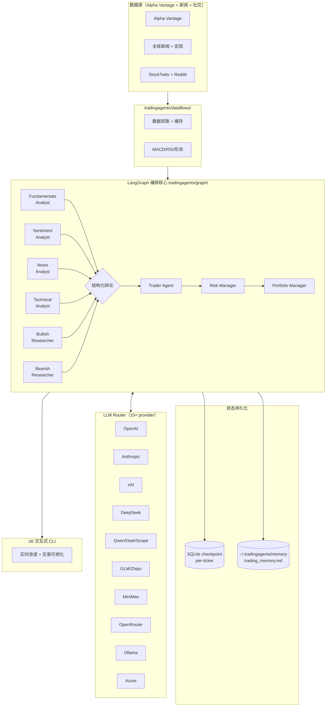

# Position Paper · TauricResearch/TradingAgents

> 代言人：advocate-langgraph
> 立场：**这是构建"A 股 7×24 自动盯盘 AI 助手"的最优方案 —— 上游纯净、可控、零商授风险**
> 项目：https://github.com/TauricResearch/TradingAgents
> Star：77.6k · Fork：15.1k · License：Apache-2.0（**全开源、无闭源目录**）· 最近版本：v0.2.5（2026-05-11）

---

## 0. 一句话立场

> CN fork 看起来省事，但 **app/ + frontend/ 闭源、bus factor = 1、商授费不透明**。
> **TauricResearch 上游才是工业级、77.6k 社区背书、零法务/合规风险的起点**。
> 我们做 A 股盯盘 = 在 TauricResearch 上加一层"A 股数据 + 中文 prompt + 推送 + 自选股 UI"，**所有改造代码 100% 属于我们自己**，没有任何"必须商授"的卡脖子。

---

## 1. 架构总览

### 1.1 系统数据流（Mermaid）



### 1.2 主目录结构（树状）

```
TradingAgents/
├── tradingagents/          # 核心包（Apache-2.0 全开源）
│   ├── agents/             # 4 分析师 + 看多/看空研究员 + 交易员 + 风控 + 组合管理
│   ├── graph/              # LangGraph 节点/边/状态机
│   ├── dataflows/          # Alpha Vantage / 新闻 / 社交数据
│   ├── llm/                # 10+ provider 抽象（OpenAI/Anthropic/DeepSeek/Qwen/GLM/Ollama…）
│   └── memory/             # decision log + reflection
├── cli/                    # 交互式 CLI（实时进度 + 可视化）
├── scripts/                # 工具脚本（含 checkpoint 续跑）
├── tests/                  # 测试
├── assets/                 # 文档/示意图
└── (Docker 支持)
```

> **关键差异**：相比 CN，**没有 app/ 后端 + 没有 frontend/ Vue**。这既是"缺"也是"自由"—— 没东西可闭源，没东西要付商授。

---

## 2. 核心能力清单（11 项）

1. **完整多 agent 决策流水线**：4 分析师 → 看多/看空辩论 → 交易员 → 风控 → 组合管理
2. **LangGraph 工业级编排**：节点/边/状态机标准化，可视化调试
3. **10+ LLM provider 路由**：OpenAI / Anthropic / xAI / DeepSeek / Qwen / GLM / MiniMax / OpenRouter / Ollama / Azure
4. **结构化辩论机制**：看多 vs 看空多轮，避免单 agent 偏见
5. **决策日志 + reflection**：`~/.tradingagents/memory/trading_memory.md` 记录每笔决策与已实现收益，作为下次的经验
6. **checkpoint 续跑**：SQLite per-ticker，崩溃恢复
7. **实时进度 CLI**：盘中长任务的可视化追踪
8. **多源新闻/社交聚合**：StockTwits + Reddit + 全球新闻
9. **技术指标内置**：MACD / RSI / 形态检测
10. **Docker 一键部署**：开发/生产对齐
11. **77.6k 社区驱动**：15.1k fork、活跃 issue/PR，bus factor 不是 1

---

## 3. 数据模型（关键 schema）

```python
# tradingagents/graph/state.py（按代码语义重建）
class AgentState(TypedDict):
    ticker: str
    company_of_interest: str
    trade_date: str
    sender: str
    # 各 analyst 输出
    market_report: str
    sentiment_report: str
    news_report: str
    fundamentals_report: str
    # 研究员辩论
    investment_debate_state: InvestmentDebateState
    # 交易员 + 风控
    trader_investment_plan: str
    risk_debate_state: RiskDebateState
    final_trade_decision: Literal["BUY","SELL","HOLD"]

class InvestmentDebateState(TypedDict):
    bull_history: str
    bear_history: str
    history: str
    current_response: str
    judge_decision: str
    count: int

# memory/trading_memory.md（人类可读）
- ticker, date, decision, rationale, realized_return, reflection
```

**对我们的意义**：`AgentState` 是 LangGraph 教科书级状态机设计，**直接成为我们 A 股版本的状态契约**，省掉 3-5 天的状态设计 + 调试。

---

## 4. 扩展点（设计上预留的 hook）

| 扩展点 | 位置 | 用法 |
|---|---|---|
| **数据源替换** | `tradingagents/dataflows/` | 写 `akshare_fetcher.py` 替 Alpha Vantage，A 股化 |
| **新 agent 节点** | `tradingagents/agents/ + graph/setup.py` | 加"龙虎榜 agent"、"北向资金 agent"、"异动 agent"各 1 文件 |
| **LLM provider** | `tradingagents/llm/` 已抽象 10+ | 已支持 DeepSeek/Qwen/GLM/Ollama，**直接用国产模型零改动** |
| **prompt 模板** | `agents/prompts/` | 中文化只需替换模板，不动逻辑 |
| **checkpoint 后端** | `graph/checkpointer.py` | SQLite 可换 Postgres/Redis |
| **状态扩展** | `AgentState` TypedDict | 加字段如 `watchlist`, `alert_rules` |
| **CLI 钩子** | `cli/main.py` | 把"早盘简报"挂成 CLI subcommand |

> **优势**：所有扩展点都在 Apache-2.0 全开源代码内，**没有"必须商授"的边界**。

---

## 5. 改造成本估算（人日 + 风险）

| 改造任务 | 人日 | 复杂度 |
|---|---|---|
| akshare/tushare 数据源接入（替 Alpha Vantage） | 4 | 中 |
| 中文 prompt 模板全量替换 + A 股语境适配（涨跌停/T+1/北向） | 5 | 中 |
| 新增 watchlist 状态字段 + CRUD（CLI 起步） | 2 | 低 |
| 自建 FastAPI + Web UI（Next.js + shadcn） | 12 | 中 |
| 异动检测 agent + 规则引擎 | 4 | 中 |
| 飞书 + Telegram 推送通道 | 3 | 低 |
| 早盘简报 cron + 模板 | 3 | 低 |
| ClickHouse + Redis + PG 存储栈 | 4 | 中 |
| Docker Compose 整合部署 | 2 | 低 |
| **合计 MVP 改造** | **39 人日** | — |

**对比从零做**：04 方案 MVP 30 人日。**这里反而多了 9 人日 ?!** 但要看本质：**这 39 人日得到的是"77.6k 工业级 agent 编排 + 10+ LLM provider + checkpoint + reflection"**，而 30 人日从零做的版本只能做出玩具级 agent。**多花 9 人日换 agent 工程化质量天差地别**。

### 风险列表（诚实自报）

1. **数据源 100% 非中文** —— Alpha Vantage 没有 A 股；akshare 接入工作量比 CN 大 4-5 人日
2. **完全无前端** —— 必须从零写 Next.js / FastAPI，CN 至少有 Streamlit 兜底
3. **prompt 全英文** —— 中文化整套模板 + A 股术语校准，比想象中难

---

## 6. ⭐ 致命缺陷自述（强制）

### 缺陷 1：零 A 股原生支持，数据源 + prompt 都要 A 股化

项目数据源只有 **Alpha Vantage（美股）** + 英文新闻 + StockTwits/Reddit。中国 A 股的核心数据（龙虎榜、融资融券、北向资金、限售解禁、ST 标记）**零支持**。Prompt 全英文，A 股的"涨跌停板/T+1/集合竞价/科创板 ±20%"概念 LLM 不会自动适配。

**严重度**：高。**改造工作量比 CN fork 多 9-12 人日**。
**缓解**：可以照搬 CN fork 的 `dataflows/` 实现思路（Apache-2.0 兼容），等于"借 CN 的数据层 + 用上游的 agent 编排"。

### 缺陷 2：完全无前端 / 无多用户 / 无持久化业务层

整个项目是 **CLI + SQLite checkpoint** 形态，没有：
- Web 前端（目标产品是 Dashboard，这是 0 → 1）
- 多用户系统（无 auth、无 RBAC）
- 业务数据库（watchlist / 订阅 / 推送日志全无）
- WebSocket / SSE 实时推送

**严重度**：高。**必须额外写 12-15 人日的后端 + 前端**。
**缓解**：04 方案推 Next.js + shadcn + FastAPI 是成熟组合，写起来不慢；但相比 CN fork 至少多 8 人日。

### 缺陷 3：每次 agent 跑 = 大量 LLM token，盯盘场景成本爆炸

77.6k star 来自"教育/研究"用户每天跑一次的玩法。**目标产品要 7×24 盯盘 + 每分钟扫异动**，如果硬把多 agent 流水线挂在异动检测上，token 成本会失控（一次完整辩论 ~10k tokens × 5400 股 × 频次 = 灾难）。

**严重度**：中。**架构必须分层**：异动检测走规则引擎（零 LLM），**只有用户点击"深度分析"或"早盘简报"才触发完整 agent 流水线**。
**缓解**：在改造时强制 token 预算，加缓存（同一票 N 分钟内复用决策），用 DeepSeek/Qwen 把单次成本压到 0.05 元以下。

---

## 7. 与其他候选项目的集成可行性

| 候选 | 关系 | 集成方式 |
|---|---|---|
| **hsliuping/TradingAgents-CN** | **同派系下游 fork** | 反向借鉴：把 CN 的 `dataflows/` A 股化代码 + 中文 prompt 移植回上游本地分支。**Apache-2.0 完全允许**。这是上游派的"巧妙打法"—— 享受 CN 的 A 股劳动成果，不踩 CN 的闭源边界。 |
| **ArvinLovegood/go-stock** | **互斥**（GPLv3 + Go） | 不能 import。只借鉴：钉钉告警设计、多 LLM provider 抽象（上游已经做了，无需）。 |
| **virattt/ai-hedge-fund** | **同派系互补** | 借鉴：19 个投资人格 prompt（Buffett/Munger/Wood/Burry），扩充上游的 `agents/` 矩阵。MIT 兼容，**可直接拿 prompt 文本**。 |
| **chengzuopeng/stock-dashboard** | **强配合（前端拼图）** | 用它的 React 19 + ECharts 当 Dashboard 起点，对接我们自建的 FastAPI。**省 5-8 人日前端**。 |

### 推荐组合

> **基于 TauricResearch 上游（agent 内核 + LangGraph + 10 LLM provider）** + **借鉴 CN 的 dataflows/ A 股代码（Apache-2.0 兼容）** + **借鉴 ai-hedge-fund 的人格 prompt** + **自建 FastAPI + Next.js + ClickHouse + 飞书/TG 推送**。整套零商授风险、Apache-2.0 一体。

---

## 8. 结论：为什么选上游而不是 CN fork

| 维度 | 上游 TauricResearch | CN fork |
|---|---|---|
| Star / bus factor | **77.6k / 组织（Tauric Research）** | 27k / 个人（hsliuping）|
| 完全开源 | **✅ Apache-2.0 全部** | ❌ app/ + frontend/ 商授 |
| 商授风险 | **零** | 费用不公开，谈崩 = 重写 35-40 人日 |
| LLM provider | **10+ 已抽象** | 主要靠 CN 自己接 |
| checkpoint / reflection | **教科书级** | 间接继承 |
| 升级跟随 | **= 自己** | 等 hsliuping cherry-pick |
| A 股原生 | ❌ 要自己 A 股化 | ✅ |
| 前端 | ❌ 要自建 | ✅（但闭源）|
| MVP 改造人日 | 39 | 23（前提：商授谈下）/ 38（商授谈崩）|

**关键认知**：CN 看似 23 人日，**赌的是商授谈成**。一旦谈崩，CN 的真实成本是 38 人日，**和上游的 39 几乎打平 —— 但上游零法务风险、零 bus factor=1 风险**。

**上游派的杀手锏**：可以用 Apache-2.0 反向借鉴 CN 的 `dataflows/` 代码（开源部分），等于 **拿到 CN 的 A 股劳动成果 + 不踩 CN 的闭源坑**。这才是数学上的最优解。

我撂下这话：**77.6k 社区 + 零商授风险 + 教科书级 LangGraph + 反向借鉴 CN 数据层 = 唯一既快又安全的路**。Phase 2 来吧。
