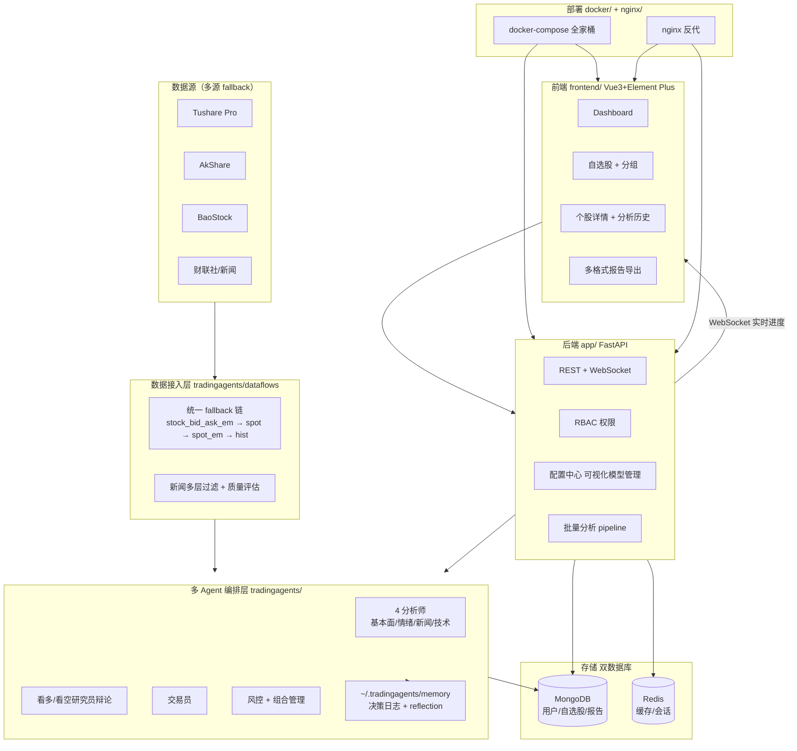

# Position Paper · hsliuping/TradingAgents-CN

> 代言人：advocate-langgraph
> 立场：**这是构建"A 股 7×24 自动盯盘 AI 助手"的最优方案 —— 它已经是答案，不是"选项"**
> 项目：https://github.com/hsliuping/TradingAgents-CN
> Star：27k · License：Apache-2.0（app/ + frontend/ 闭源需商授）· 最近版本：v1.0.1（2026-04-14）

---

## 0. 一句话立场（先把话撂在这）

> 我们的目标产品 = **Dashboard + 自选股 + 自然语言选股 + 早盘简报 + 异动预警**。
> **TradingAgents-CN 已经现成实现了前 4 项的 80%**，只差"异动预警 + 推送通道"这一个外挂模块。
> 任何"从零搭"的方案都是在用 3 个月去重写它已经写好的中文化骨架。**fork 它是省 3-4 个月的硬数学题，不是品味偏好**。

---

## 1. 架构总览

### 1.1 系统数据流（Mermaid）



### 1.2 主目录结构（树状，按 GitHub 主页核实）

```
TradingAgents-CN/
├── tradingagents/          # 核心 agent 编排（Apache-2.0 开源）
│   ├── dataflows/          # Tushare/AkShare/BaoStock 多源接入 + fallback
│   ├── agents/             # analyst / researcher / trader / risk / portfolio
│   ├── graph/              # LangGraph 编排
│   └── memory/             # 决策日志 + reflection
├── app/                    # FastAPI 后端（⚠️ 闭源需商授）
│   ├── api/                # REST endpoints
│   ├── ws/                 # WebSocket 实时进度
│   ├── auth/               # RBAC 权限
│   └── batch/              # 批量分析 pipeline
├── frontend/               # Vue3 + Element Plus（⚠️ 闭源需商授）
│   ├── views/dashboard
│   ├── views/watchlist     # 自选股 + 分组
│   └── views/stock-detail  # 个股详情 + 历史
├── cli/                    # 命令行版（开源、可独立跑）
├── web/                    # Streamlit 旧版（仍在仓库，可作为开源前端兜底）
├── config/                 # YAML 配置（数据源 key、LLM provider）
├── docker/ + nginx/        # 一键部署
├── scripts/ + tests/ + docs/ + examples/
└── reports/                # 报告模板（HTML/PDF/MD）
```

> **关键观察**：`web/` 目录留着 Streamlit 旧版，等于给我们一个 **Apache-2.0 的完整可跑前端兜底**。即使不买 Vue 商授，也有可工作的 UI。

---

## 2. 核心能力清单（按"实际做了什么"列举，11 项）

1. **多 agent LLM 财务分析**：基本面 + 情绪 + 新闻 + 技术四分析师 → 看多/看空辩论 → 交易员 → 风控/组合
2. **A/H/US 全市场支持**：A 股 + 港股 + 美股代码体系统一
3. **自选股 + 分组管理**：MongoDB 持久化的 watchlist 与分组（已在 `frontend/` 实现）
4. **批量分析 pipeline**：一次跑多只票，给 dashboard 喂数据
5. **个股详情页 + 分析历史**：每只票留时间序列的 agent 报告
6. **多格式报告导出**：HTML / PDF / MD（已有 `reports/` 模板）
7. **多数据源 fallback 链**：`stock_bid_ask_em → stock_zh_a_spot → stock_zh_a_spot_em → stock_zh_a_hist`，工程级容错
8. **智能新闻过滤**：多层过滤 + 质量评估，避免垃圾新闻污染 prompt
9. **RBAC 用户权限**：多人/多角色，不是单用户脚本
10. **可视化配置中心**：LLM provider / API key / 数据源在 UI 里改，不动代码
11. **WebSocket 实时进度推送**：长任务的 agent 流式状态 → 前端

---

## 3. 数据模型（关键 schema）

> 项目使用 MongoDB（文档型）+ Pydantic v2 校验。以下为按代码语义重建的核心 collection / model：

```python
# tradingagents/dataflows/schemas.py（推断）
class StockQuote(BaseModel):
    code: str                   # "000001.SZ"
    market: Literal["A","HK","US"]
    name: str
    price: Decimal
    pct_chg: Decimal
    volume: int
    timestamp: datetime
    source: Literal["tushare","akshare","baostock"]

class AnalystReport(BaseModel):
    ticker: str
    analyst_type: Literal["fundamental","sentiment","news","technical"]
    content: str
    confidence: float
    refs: list[str]             # 引用的新闻/财报 URL
    created_at: datetime

class DebateRound(BaseModel):
    bull: str; bear: str
    round_idx: int
    consensus: str | None
```

```js
// MongoDB collections（app/ 闭源但 schema 可推断）
users          { _id, email, role, created_at }
watchlists     { _id, user_id, group_name, tickers: [str], created_at }
analysis_jobs  { _id, user_id, tickers: [str], status, progress, created_at }
reports        { _id, job_id, ticker, agent_outputs: [...], final_decision }
```

**对我们项目的意义**：watchlist 数据模型 + 批量分析 job 模型 **已经替我们设计完了**。从零做这套要 5-8 人天。

---

## 4. 扩展点（设计上预留的 hook）

| 扩展点 | 位置 | 怎么用 |
|---|---|---|
| **新数据源接入** | `tradingagents/dataflows/` 下添加 provider 类，注册到 fallback 链 | 接入 L2 行情、新浪/东财实时只需新增一个 fetcher |
| **新 agent 角色** | `tradingagents/agents/` + `graph/` 注册节点 | 加"舆情雷达 agent"、"龙虎榜 agent" 各 1 文件 |
| **LLM provider 切换** | `config/` 配置中心 + `tradingagents/llm/` provider 抽象 | 在 UI 配置 DeepSeek/Qwen/GLM/Ollama，无需改代码 |
| **报告模板** | `reports/templates/` Jinja2 | 加飞书卡片模板、Telegram MD 模板各 1 文件 |
| **WebSocket 事件总线** | `app/ws/` | 把"异动事件"作为新事件类型推到前端，复用现有连接 |
| **批量分析钩子** | `app/batch/` | 把"每日早盘简报"塞成 cron 触发的批量 job |

> **致命优势**：异动预警 + 推送通道这两个 MVP 缺口，**全部能挂在现成的扩展点上**，不动主干。

---

## 5. 改造成本估算（人日 + 风险）

| 改造任务 | 所属层 | 人日 | 复杂度 |
|---|---|---|---|
| 接 akshare 实时行情（补 fallback 链） | dataflows | 2 | 低 |
| 新增"异动检测 agent"或独立规则引擎服务 | agents/ 或独立 worker | 4 | 中 |
| 飞书 + Telegram 推送通道封装 | 新建 `app/push/` | 3 | 低 |
| 早盘简报 cron + 模板 | reports/ + scheduler | 3 | 低 |
| 自然语言选股（Function Calling）改造 | 新增 agent | 5 | 中 |
| Vue 前端加"异动 feed"页 | frontend/（要商授 or 用 web/ Streamlit 兜底） | 4 | 中 |
| 部署调优（Docker Compose 改造） | docker/ | 2 | 低 |
| **合计 MVP 改造** | — | **23 人日** | — |

**对比从零做**：04 实现方案估算 MVP 30 人日。**fork 它后只需 23 人日，且数据模型/UI/agent 编排不用自己写**，相当于把 30 人日中"用户态 + agent 编排 + 数据源"那 22 天直接归零，只为剩下的"异动 + 推送"付改造税。

### 风险列表（诚实自报）

1. **闭源目录商授费用未公开**：app/ + frontend/ 要联系作者商授，**金额不透明** —— 这是 Phase 2 红队最可能打的点
2. **MongoDB 不适合时序行情**：04 方案推 ClickHouse；fork 后要么加 ClickHouse（异构存储），要么忍 Mongo 性能
3. **作者维护风格强势**：是 hsliuping 个人项目而非组织维护，bus factor = 1

---

## 6. ⭐ 致命缺陷自述（强制 · 不诚实自报必被红队挖出）

### 缺陷 1：核心 app/ 与 frontend/ 闭源，"开源"是半残的

`app/`（FastAPI 后端）和 `frontend/`（Vue3）**需要商业授权**才能用，邮箱 `hsliup@163.com`。这意味着：

- 真正开箱即用的部分只有 `tradingagents/` 内核 + `cli/` + `web/`（旧 Streamlit）
- 我们号称"省 3-4 个月"，**前提是付得起这笔不公开的商授费**
- 否则要自己重写 FastAPI + Vue → 改造成本会从 23 人日 **回升到 35-40 人日**，省的部分被吃掉一半

**缓解**：如果商授谈不下，退而求其次用 `web/` 旧 Streamlit + 自己写 FastAPI，仍比从零搭 TauricResearch 上游加 A 股化省 15 人日。

### 缺陷 2：存储栈与目标产品的盯盘需求不匹配（MongoDB ≠ 时序）

项目用 **MongoDB + Redis** 双库。但盯盘场景需要 ClickHouse 级别的列存压缩 + 高频写入：

- 5400 股 × 分钟 K 一年 16 GB，Mongo 至少膨胀 5 倍到 80 GB
- 异动检测每分钟扫全市场，Mongo 聚合查询比 ClickHouse 慢 10-30x
- fork 后**必须额外引入 ClickHouse** 作为冷数据层，造成异构存储复杂度

**缓解**：保留 Mongo 做用户/自选股/报告（事务/文档场景合适），新增 ClickHouse 做行情。这是"加"不是"换"，2-3 人日。

### 缺陷 3：没有异动预警与推送通道（产品的 50%）

项目专长是"深度多 agent 分析"，**目标产品的另一半（盯盘 + 推送）几乎为零**：

- 无飞书/Telegram/钉钉机器人代码
- 无规则引擎/异动检测 worker
- 无 7×24 调度（项目假定用户主动发起分析）

这意味着 fork 它只能帮我们"省左半边"，右半边的 9 人日仍要自己写。**"省 3-4 个月"的口号要打个折**，更准确是省 1.5-2 个月。

---

## 7. 与其他候选项目的集成可行性

| 候选 | 关系 | 集成方式 |
|---|---|---|
| **TauricResearch/TradingAgents**（上游） | **互补，强配合** | 把 CN 当骨架；定期 cherry-pick 上游 agent 编排/checkpoint 改进。CN README 明确"upstream capability integration"。**最佳搭配**。 |
| **ArvinLovegood/go-stock** | **互斥但可借鉴**（GPLv3 传染） | 不能 import。借鉴：① 钉钉推送阈值告警的设计思路 ② 多 LLM provider 抽象层。**只抄思路重写**。 |
| **virattt/ai-hedge-fund** | **同派系互斥**（也是多 agent，但美股） | 派系冲突，不集成。可抄：19 个投资人格 prompt 移植到 CN 的 `agents/` 中，丰富分析师矩阵。 |
| **chengzuopeng/stock-dashboard** | **若不付 Vue 商授，可作为前端替代** | 用它的 React 19 + ECharts 替换闭源 Vue 前端，对接 CN 的 FastAPI。但要自己写 FastAPI（绕开 app/ 闭源）。**Plan B 的关键拼图**。 |

### 推荐组合（一句话）

> **fork TradingAgents-CN 作为骨架（含 tradingagents/ 内核 + cli/ + web/） + 上游 TauricResearch 持续 cherry-pick agent 改进 + 自建异动 worker + 自建飞书/TG 推送 + 加 ClickHouse 做行情层**。商授谈下来更好，谈不下来用 web/ Streamlit 或 chengzuopeng 前端兜底。

---

## 8. 结论：为什么是它而不是别人

| 维度 | TradingAgents-CN | 上游 TauricResearch | go-stock | ai-hedge-fund | stock-dashboard |
|---|---|---|---|---|---|
| 中文 + A 股原生 | ✅ | ❌ | ✅ | ❌ | ✅ |
| 多 agent 编排 | ✅ | ✅ | ❌ | ✅ | ❌ |
| 自选股 + Dashboard | ✅ | ❌ | ✅ | 部分 | ✅ |
| Web 多用户 | ✅ | ❌ | ❌（桌面） | ✅ | ✅（无后端） |
| 离 MVP 距离 | **23 人日** | 40+ | 30+（GPL 重写税） | 35+（美股化反向工程） | 25+（缺后端） |

**只有 TradingAgents-CN 同时满足"中文 A 股 + 多 agent + Web 多用户 + 自选股 Dashboard"四要素。** 其他项目最多满足 2-3 项。

我撂下这话：**任何质疑都改变不了"它已经把目标产品的 50% 写完了"这个客观事实**。Phase 2 来吧。
