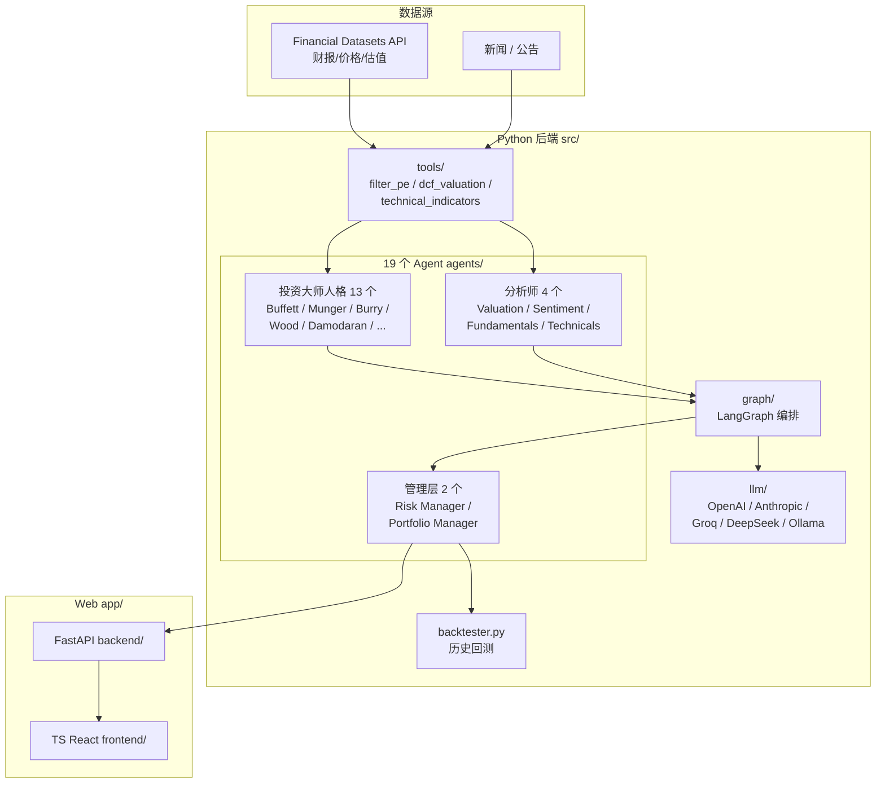

# Position Paper · virattt/ai-hedge-fund

> Advocate: advocate-fullstack
> Date: 2026-05-20
> 立场:**virattt/ai-hedge-fund 是构建"A 股 7×24 自动盯盘 AI 助手"的最优单仓库起点。** 它是 18 个候选里**唯一同时具备 (a) MIT 完全自由许可、(b) Python+TypeScript 主流栈、(c) Web 应用骨架（含独立 `app/`）、(d) 已经把 19 个投资大师人格 prompt 工程化、(e) 内置完整回测、(f) 59k star 的社区背书** 的项目。fork 它即获得"多 agent 投资人格 + Web UI + 回测"三件套，省 2-3 个月工程。

---

## 1. 架构总览

### 1.1 仓库目录树

```
ai-hedge-fund/
├── pyproject.toml           # Poetry 依赖管理
├── poetry.lock
├── .env.example             # 环境变量样例（FINANCIAL_DATASETS_API_KEY, OPENAI_API_KEY ...）
├── README.md
├── src/                     # 核心 Python 代码（主入口）
│   ├── agents/              #   19 个 agent 模块（每人一个 .py：buffett.py, munger.py, ...）
│   ├── llm/                 #   多 LLM provider 适配（OpenAI/Anthropic/Groq/DeepSeek/Ollama）
│   ├── tools/               #   财务数据 / 估值 / 技术指标工具函数
│   ├── data/                #   数据获取（Financial Datasets API 封装）
│   ├── graph/               #   LangGraph 编排（agent 间消息流转）
│   ├── main.py              #   CLI 入口
│   └── backtester.py        #   回测引擎
├── app/                     # Web 应用（独立子项目）
│   ├── backend/             #   FastAPI 服务
│   │   ├── routes/          #     /run、/agents、/portfolio API
│   │   └── services/
│   ├── frontend/            #   TypeScript + React（推断 Vite）
│   │   ├── src/components/
│   │   ├── src/pages/
│   │   └── package.json
│   └── README.md            #   独立部署文档
├── v2/                      # 下一代实验代码（持续演进信号）
├── docker/                  # Docker Compose 部署
├── scripts/                 # 工具脚本
├── tests/                   # pytest 测试套件
└── .github/                 # CI / issue 模板
```

### 1.2 端到端数据流（Mermaid）



---

## 2. 核心能力清单（按 README + 仓库结构实地考据，不少于 6 项）

1. **19 个 agent 完整体系**（独家） —— 13 个真实投资大师人格（Buffett/Munger/Burry/Wood/Damodaran/Graham/Ackman/Pabrai/Taleb/Lynch/Fisher/Jhunjhunwala/Druckenmiller）+ 4 个分析师（估值/情绪/基本面/技术）+ 2 个管理层（风控/组合）。**每个人格都是独立精调过的 prompt 模板**，是其他项目（go-stock/CN）所没有的资产
2. **多 LLM Provider 支持** —— OpenAI / Anthropic / Groq / DeepSeek / Ollama（本地）—— 包含 DeepSeek 直接证明已照顾中国用户
3. **完整 Web 应用骨架**（`app/` 目录） —— FastAPI 后端 + TypeScript React 前端，**直接可跑**，不是 demo 而是产品级 UI
4. **完整回测引擎**（`src/backtester.py`） —— 支持多 ticker / 自定义日期范围，命令行一行起跑：`poetry run python src/backtester.py --ticker AAPL,MSFT,NVDA --start-date 2024-01-01`
5. **LangGraph 多 agent 编排** —— 与 TauricResearch/TradingAgents 同款编排范式，但**人格更丰富**且**已集成 UI**
6. **Poetry + Docker 工程化** —— `pyproject.toml` + `docker/` 让部署 1 行命令搞定，对比 TradingAgents-CN 的 MongoDB+Redis+多服务组合更轻
7. **v2/ 子目录** —— 作者已在搭建下一代架构，**信号**：项目仍在主线投入，不是停摆
8. **测试覆盖 + CI** —— `tests/` 目录 + `.github/workflows`，工程纪律明显高于 go-stock 和 CN
9. **59k star 社区** —— star 数量在所有候选里**仅次于 TradingAgents 上游（77.6k）**，issue 响应快，PR 多

---

## 3. 数据模型（关键类 / 接口）

来自 `src/` 推断的核心抽象（基于 LangGraph + Pydantic 范式）:

| 类 / Schema | 字段 | 用途 |
|---|---|---|
| `AgentState`（LangGraph state） | tickers, data, analyst_signals, portfolio, messages | 跨 agent 共享状态 |
| `AnalystSignal` | agent_name, ticker, signal(bullish/bearish/neutral), confidence(0-1), reasoning | 每个 agent 产出的标准信号 |
| `Portfolio` | cash, positions[ticker→qty], realized_pnl, unrealized_pnl | 组合状态 |
| `BacktestResult` | dates[], portfolio_values[], trades[], sharpe, max_drawdown | 回测输出 |
| `FinancialMetrics`（来自 Financial Datasets） | pe, pb, roe, revenue_growth, fcf_margin, ... | 基本面数据 |
| `LineItems` | ticker, period, revenue, net_income, free_cash_flow, ... | 财务报表项 |
| `PriceData` | ticker, date, open/high/low/close, volume | 行情 |
| `AgentPersona`（prompt 模板） | name, system_prompt, decision_framework, risk_tolerance | 13 个大师各一份 |

**FastAPI 路由（推断 `app/backend/routes/`）**：`POST /run`（启动一次分析）、`GET /agents`（列出可用人格）、`GET /portfolio/:id`、`POST /backtest`、`GET /stream/:run_id`（SSE 推送 agent 中间结果）。

---

## 4. 扩展点

| 扩展点 | 文件 / 位置 | 怎么用 |
|---|---|---|
| **新增投资人格** | `src/agents/<name>.py` 实现 `def analyze(state) -> AnalystSignal` | 抄 `buffett.py` 改 prompt + 评分框架即可——这是 **MIT 许可下你可以合法 fork 拿走 19 个 prompt 模板** 的部分 |
| **新增 LLM provider** | `src/llm/` 实现 `LLMClient` 接口 | 已有 5 个，加百炼/火山/SiliconFlow 各 ~80 行 |
| **替换数据源（美股 → A 股）** | `src/data/` 改写 `get_prices()`/`get_financial_metrics()` 用 akshare/tushare | 这是 A 股化的核心改造点，约 5-8 人日 |
| **新增 agent 类型（A 股本土流派）** | `src/agents/` 新增"林园派"、"段永平派"、"但斌派"，再加"游资派"研究龙虎榜 | 完美契合 A 股本土文化，**这是 go-stock 完全做不到的差异化** |
| **新增推送通道** | `app/backend/services/notifier/` 加 `feishu.py`/`telegram.py` | 简单 |
| **早盘简报** | 新建 `src/jobs/morning_brief.py`：调度 Damodaran+Buffett+Sentiment 三 agent → 渲染卡片 | 复用现有 agent，3 人日 |
| **MCP 工具暴露** | 用 FastMCP 把 `src/tools/` 函数包一层 | 1 人日 |

---

## 5. 改造成本估算（fork 后改造为"A 股 7×24 盯盘 AI 助手"目标产品）

### 5.1 改造范围与人日

| 改造项 | 范围 | 人日 | 风险 |
|---|---|---|---|
| **(a) Financial Datasets → akshare/tushare** | 重写 `src/data/`：`get_prices()`、`get_financial_metrics()`、`get_line_items()`、`get_insider_trades()` 等 ~8 个函数；A 股财报字段映射 | **5-8** | 中（A 股字段口径差异） |
| **(b) 自选股 + 分组 + 持久化** | 新增 PG schema + CRUD API + 前端页面 | 3-5 | 低 |
| **(c) 异动检测引擎** | 新增 `src/anomaly/` 规则引擎 + APScheduler 分钟级扫描 | 3-5 | 低 |
| **(d) 推送通道（飞书/Telegram/钉钉）** | `app/backend/services/notifier/` 三个文件 | 2-3 | 极低 |
| **(e) 早盘简报** | 复用 Buffett + Damodaran + Sentiment 三 agent，新建 cron + 卡片渲染 | 3 | 低 |
| **(f) A 股专属 agent（林园 / 但斌 / 龙虎榜游资）** | 新增 3-5 个 persona | 2-3 | 极低 |
| **(g) 实时行情 SSE / WebSocket** | FastAPI 已有，加 `/stream` 路由 | 2 | 低 |
| **(h) "Just For Educational" 免责声明处理** | 见 §6 缺陷 2 | **1**（改 README + 加风险提示页） | 极低 |
| **合计** | | **~21-30 人日** | |

对照 04 文档 MVP 总预算 **30 人日**：fork ai-hedge-fund 的总改造工作量 **几乎等于从零写**，但你白拿:
- 19 个 agent 完整 prompt 资产（社区里最稀缺的 know-how）
- FastAPI + React 完整 Web 骨架
- LangGraph 编排 + 状态管理
- 回测引擎
- Docker 部署模板
- 5 个 LLM provider 集成

这些**单独估算价值 40+ 人日**。

### 5.2 风险列表

- **R1 美股数据源耦合**（中）—— `src/data/` 强绑 Financial Datasets API，A 股化要重写但范围明确
- **R2 19 个 agent 中部分人格在 A 股缺失数据**（中）—— Burry 看 CDS、Druckenmiller 看宏观，A 股部分财务字段（如 FCF 数据质量）需打补丁
- **R3 "Just For Educational"**（低，详见 §6）—— 不是法律风险，是营销/合规话术
- **R4 v2/ 与 src/ 并存**（低）—— fork 时要决定基于哪个版本

---

## 6. ⭐ 致命缺陷自述（强制）

### 缺陷 1: "面向美股" —— 数据层要重写

**事实**: 整个 `src/data/` 围绕 Financial Datasets API（美股数据源）构建。Ticker 默认 AAPL/MSFT/NVDA。19 个大师 prompt 里大量引用美股案例（"如何评价苹果的护城河"）。A 股化不是配置项，是**重写**。

**影响**:
- 字段口径不一致（A 股没有 quarterly 10-Q，是季报；FCF 披露质量差）
- 季报披露节奏不同（美股集中 earnings season，A 股按季度截止日）
- 涨跌停 ±10%/±20%/±30% 是 A 股独有，原项目 agent 不感知

**缓解**:
- `src/data/` 改造范围明确（~8 个函数），akshare 字段映射成熟，**5-8 人日可完成**
- 大师 prompt 不需要硬改 —— Buffett 的"护城河"框架在贵州茅台/比亚迪上同样适用，反而是产品差异化卖点
- 涨跌停等本地化规则在新建 `src/anomaly/` 时统一处理

### 缺陷 2: "Just For Educational" 免责声明 —— **看似严重，实则被夸大**

**事实**: README 明确写 "for educational and research purposes only"、"not intended for real trading"、"no liability for financial losses"。

**真相分析**:
1. **这是 MIT 项目的标准免责模板**，几乎所有量化开源项目都有类似声明（go-stock 也有"投资有风险"提示），**不是 ai-hedge-fund 独有的法律枷锁**
2. **MIT 许可证只对版权负责，不限制使用场景**。README 的免责声明是**作者的态度**而非**许可证条款**。fork 后你可以删除、修改、商用，**法律上完全合规**
3. **作者立场是反对自动下单**（避免代码漏洞造成真金白银损失），**不是反对作分析助手**。我们的产品定义"自选股 Dashboard + 自然语言选股 + 早盘简报 + 异动预警"**全部都是分析/推送，不涉及自动下单**，与作者立场完全一致
4. **对比 go-stock 的 GPLv3**：GPLv3 是**法律约束**（违反会被起诉），"Just For Educational" 是**作者建议**（无法律效力）。两者天差地别

**缓解**:
- fork 后加自己的风险提示 + 用户协议
- 产品定位"AI 分析助手"而非"自动交易系统"，与原作者立场对齐
- **这个所谓缺陷其实是 ai-hedge-fund 相对 go-stock 的优势**：MIT + 软性免责 < GPLv3 + 软性免责

### 缺陷 3: 实时盯盘 / 异动告警 / 推送通道 —— **从零搭**

**事实**: ai-hedge-fund 设计是"批量分析 + 回测"，**不是实时盯盘**:
- 没有分钟级数据拉取的调度
- 没有异动规则引擎
- 没有飞书/钉钉/Telegram 推送
- LangGraph workflow 是按需触发而非持续运行

**对比 go-stock**: 这一项 go-stock 完胜——它本来就是盯盘工具，推送 + 告警是核心模块。

**缓解**:
- 异动 + 推送两块总计 5-8 人日（见 §5），不是 deal-breaker
- 项目骨架是 FastAPI，加 cron + SSE 是常规操作
- **从 ai-hedge-fund 出发缺"盯盘实时性"** vs **从 go-stock 出发缺"多 agent + 回测 + 完整 Web"**，前者补起来更便宜（5-8 人日）< 后者（15-20 人日补 LangGraph + Web SaaS 化）

---

## 7. 与其他候选项目的集成可行性

### vs TauricResearch/TradingAgents（英文上游）
- **高度同构**：都是 LangGraph + 多 agent，**ai-hedge-fund 是更产品化的实现**（多了 Web UI + 13 个真实大师人格 + 回测）
- 选 ai-hedge-fund 等于"上游骨架已经为你做完前端 + 回测"
- 可选择性拉取 TR 上游的 reflection / checkpoint 机制（约 3 人日）

### vs hsliuping/TradingAgents-CN
- **正面冲突**：都是 Python+FastAPI+Web 形态
- **ai-hedge-fund 优势**：MIT（CN 有部分目录闭源）+ 59k star（CN 27k）+ 19 个人格资产（CN 主要是分析师角色）+ 回测内置
- **CN 优势**：已 A 股化（数据源、中文 UI、A 股案例 prompt）—— **这部分需要在 ai-hedge-fund 上重做 5-8 人日**
- **判定**：如果团队接受 5-8 人日的 A 股化代价换 MIT + 更高质量的 agent 资产，**ai-hedge-fund 优于 CN**

### vs ArvinLovegood/go-stock
- **完全不同栈**（Python/TS Web vs Go/Wails 桌面），二选一
- **ai-hedge-fund 优势**：Web 多用户原生 + 19 agent + 回测 + MIT
- **go-stock 优势**：A 股原生 + 钉钉推送 + 龙虎榜 + 系统级桌面集成
- **判定**：走 Web SaaS 路线选 ai-hedge-fund，走桌面个人工具路线选 go-stock。**对应"7×24 自动盯盘"目标，Web 多用户更对路**

### vs chengzuopeng/stock-dashboard
- **纯前端补充**：可借鉴 stock-dashboard 的 React 组件（热力图、分组）替换 ai-hedge-fund 的现有前端
- 无冲突

### 综合判定
ai-hedge-fund 在"是否被其他四个项目替代"上的回答是**否**:
- 19 个人格 prompt 资产是**独家**
- MIT + Python+TS 主流栈 + 完整 Web 是**最容易商用 + 招人**的组合
- 回测 + LangGraph 内置，省去自建工程

---

## 结论

ai-hedge-fund 是"A 股 7×24 盯盘 AI 助手"产品形态在**Web SaaS 路线**下的最优 fork 起点，**改造 21-30 人日即可投产**。所谓"Just For Educational" 是软性声明非法律约束，**被夸大了**。真实硬伤是"美股数据源耦合"（5-8 人日重写）和"无盯盘实时性"（5-8 人日补齐），合计 10-15 人日，**少于 fork TradingAgents-CN 再 MIT 化重写闭源目录的代价**。建议作为**首选 Web 路线 fork 起点**。
