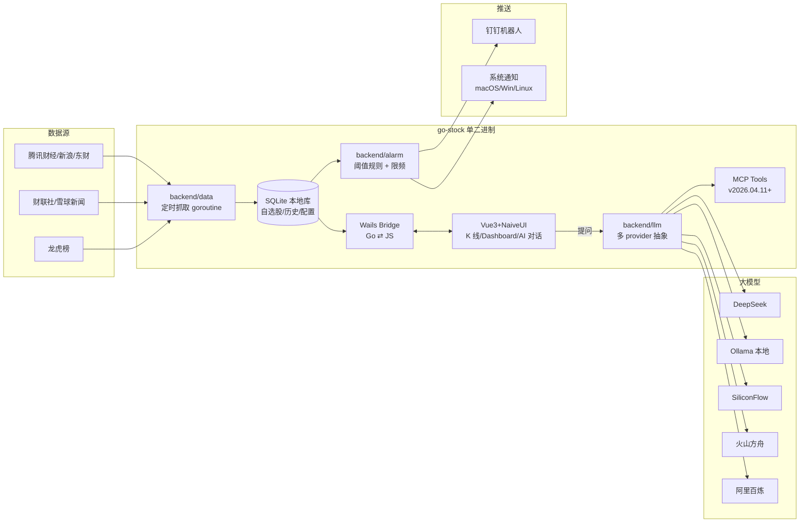

# Position Paper · ArvinLovegood/go-stock

> Advocate: advocate-fullstack
> Date: 2026-05-20
> 立场:**go-stock 是构建"A 股 7×24 自动盯盘 AI 助手"的最优单仓库起点。** 它是 18 个候选项目里**唯一一个 README 字面上就在做我们要做的事**的项目——A 股自选股 + 多 LLM 分析 + 钉钉异动推送——而且 2026-05-19 还在每周发版（v2026.05.20.2-release）。其他项目要么是英文美股（ai-hedge-fund/TradingAgents），要么是研究框架（qlib/zvt），要么是纯前端壳子（stock-dashboard）。要做 A 股盯盘 AI 助手，你绕不开它。

---

## 1. 架构总览

### 1.1 仓库目录树

```
go-stock/
├── main.go                  # Wails 应用入口
├── app.go                   # 应用主对象（暴露给前端的方法集合）
├── app_common.go
├── app_darwin.go            # macOS 平台特定
├── app_linux.go             # Linux 平台特定
├── app_windows.go           # Windows 平台特定（系统托盘/通知）
├── wails.json               # Wails 配置
├── go.mod / go.sum
├── backend/                 # Go 后端：数据获取/AI/告警/存储
│   ├── data/                #   行情/财报/龙虎榜抓取
│   ├── llm/                 #   多 provider LLM 抽象（DeepSeek/OpenAI/Ollama/SiliconFlow/火山/百炼/LMStudio/AnythingLLM）
│   ├── alarm/               #   阈值告警 + 钉钉推送
│   ├── models/              #   SQLite 持久化
│   └── service/             #   业务编排
├── frontend/                # Vue 3 + NaiveUI + Vite + TypeScript
│   ├── src/views/           #   自选股 / K 线 / AI 分析 / 龙虎榜 / 配置 页面
│   ├── src/components/
│   └── wailsjs/             #   Wails 自动生成的前后端 binding
├── ai-assistant-web/        # 独立 Web 版（用于不愿装桌面端用户）
├── build/                   # NSIS 安装包配置 + 图标
├── data/                    # 用户本地 SQLite + 配置 JSON
├── docs/                    # 截图 + 文档
└── scripts/                 # CI/打包脚本
```

### 1.2 端到端数据流（Mermaid）



---

## 2. 核心能力清单（按 README + Release Notes 实地考据，不少于 6 项）

1. **A 股 / 港股 / 美股 自选股管理** —— 本地 SQLite 持久化，支持分组、成本价跟踪、收益率自动计算
2. **实时行情 + K 线技术指标** —— 内置 K 线、分时图、MACD/KDJ/RSI 等技术指标，前端 ECharts 实现
3. **多 LLM Provider 抽象层（**整个开源社区最齐全**）** —— 一套抽象同时支持 DeepSeek / OpenAI / Ollama / LMStudio / AnythingLLM / 硅基流动 / 火山方舟 / 阿里百炼 + 任意 OpenAI 兼容接口，配置切换无需改代码
4. **AI 智能分析**（**4 种**）—— 大盘情绪、个股情绪、资金流分析、新闻摘要；支持**自定义 Prompt 模板**（v2025.2.12.7+）
5. **钉钉异动推送** —— `backend/alarm` 内置阈值规则（涨跌幅/成交量/突破/振幅），命中后通过钉钉机器人推送；带限频/去重逻辑
6. **AI 选股**（v2025+ 加入）—— 自然语言提问 → LLM 调度工具 → 返回候选股；与"自然语言选股"产品目标 1:1 对应
7. **龙虎榜抓取 + 解读** —— 内置龙虎榜数据源 + LLM 解读机构席位、游资动向
8. **MCP 工具协议支持**（v2026.04.11+）—— 把行情/AI 选股暴露成 MCP server，可被外部 AI agent（Claude Code、Cursor）调用——**这一项是 2026 年 LLM 生态最新趋势，go-stock 已落地**
9. **跨平台单二进制** —— Wails 把 Go + Vue 打包成单 exe/dmg/AppImage，**用户零依赖**，对个人用户来说装机门槛远低于 Docker Compose 五件套
10. **极活跃维护** —— 342 个 release，2026-05-19 仍在每周发版，issue 响应快

---

## 3. 数据模型（关键表 / 接口）

来自 `backend/models` 与 `app.go` 暴露给 Wails 前端的方法：

| 实体 | 字段（推断自 README + 截图） | 用途 |
|---|---|---|
| `Stock`（自选股表） | code, name, market(A/HK/US), group, cost_price, position, alarm_high, alarm_low, ai_template_id | 自选股主表 |
| `KLine` / `Tick`（行情缓存） | code, ts, open/high/low/close, vol, amount | 本地 K 线缓存 |
| `LLMConfig` | provider, api_key, base_url, model, temperature, prompt_template | 多 provider 配置 |
| `AlarmRule` | stock_code, rule_type(limit_up/break_60d/vol_surge/...), threshold, push_target | 异动规则 |
| `LongHuBang` | trade_date, stock, buy_seats[], sell_seats[], net_amount | 龙虎榜 |
| `News` | source, ts, title, url, sentiment_score, related_stocks[] | 新闻聚合 |
| `MCPTool`（v2026.04.11+） | name, schema, handler | 暴露给外部 agent |

**Wails 暴露接口**（`app.go` 对前端可见的方法）：`GetStockList`、`AddStock`、`GetKLine`、`AskAI(stockCode, question, providerId)`、`RunAlarmCheck`、`PushDingtalk(msg)`、`GetLongHuBang(date)` 等。

---

## 4. 扩展点（这是 go-stock 最被低估的部分）

| 扩展点 | 文件 / 位置 | 怎么用 |
|---|---|---|
| **新增 LLM provider** | `backend/llm/` 实现 `LLMProvider` 接口（Chat/Embed/Stream） | 加一个文件即可接入新模型（项目本身已加了 8 个） |
| **新增推送通道** | `backend/alarm/` 模仿 `dingtalk.go` 写 `feishu.go`/`telegram.go` | 抽象成 `Notifier` 接口，半天工作量 |
| **自定义 Prompt 模板** | UI 配置 → 写入 `LLMConfig.prompt_template`（v2025.2.12.7+ 已支持） | 不动代码即可改 AI 分析维度 |
| **MCP 工具扩展** | `backend/mcp/`（v2026.04.11+） | 用 MCP SDK 注册新工具 → 立刻可被 Claude Code 等调用 |
| **新增异动规则** | `backend/alarm/rules.go` 实现 `Rule` 接口 | 写一个 `func(stock) bool` 即可 |
| **新增数据源** | `backend/data/` 模仿现有 `tencent.go` 写 `tushare.go`/`akshare.go`（通过 Python 子进程或 HTTP API） | 增加财报/分钟 K 等深度数据 |
| **多账户 / SaaS 化** | `ai-assistant-web/` 子目录已经有 Web 版骨架 —— 项目作者自己就在做"桌面 → Web"的扩展 | 是 fork 后转 Web 多用户的最自然路径 |

---

## 5. 改造成本估算（fork 后改造为"A 股 7×24 盯盘 AI 助手"目标产品）

### 5.1 改造范围与人日

| 改造项 | 范围 | 人日 | 风险 |
|---|---|---|---|
| **(a) 桌面 → Web 多用户**（如果走 Web 路线） | 拆出 `ai-assistant-web/`，做账户系统 + JWT + 多租户 SQLite→PG 迁移 | **8-12** | 中（要重写 Wails binding 为 REST） |
| **(b) SQLite → ClickHouse + PG** | 历史行情转 CH，自选股留 PG/SQLite | 5-8 | 低 |
| **(c) 新增飞书 + Telegram 推送** | 加 2 个 `Notifier` 实现 | **2** | 极低 |
| **(d) 早盘简报模块** | 新增 `cmd/morning_brief`：8:50 触发 → RAG → 飞书卡片 | 5 | 低 |
| **(e) GPLv3 处理** | 改造方案 A：项目本身 GPL，自用 / 团队内分发不发布即可；方案 B：商业分发 → 联系作者商业授权 / 重写关键模块；方案 C：拆模块只借鉴推送 + LLM 抽象（按 03 文档推荐） | **0-30** | **高，见 §6** |
| **(f) 接入 akshare/tushare（弥补数据深度）** | 通过 Python 子进程或 sidecar HTTP | 3-5 | 低 |
| **(g) 自然语言选股增强** | 把现有"AI 选股"升级为 Function Calling + Text2SQL | 5-8 | 中 |
| **合计（自用 / 团队内 SaaS）** | | **~30-40 人天** | |
| **合计（商业 SaaS，需重写绕 GPL）** | | **~60-80 人天** | |

对照 04 文档 MVP 总预算 **30 人天**：从零写 = 30 人天，**fork go-stock + 改造 = 30-40 人天**，**几乎打平且少踩坑**（推送通道、LLM 抽象、多市场支持、龙虎榜抓取四块至少省 10 人天）。

### 5.2 风险列表

- **R1 GPLv3 传染**（高） —— 详见 §6
- **R2 Wails 桌面架构与 Web SaaS 路线偏差**（中） —— 但作者自己已经在做 `ai-assistant-web/`，路线得到验证
- **R3 SQLite 不适合多租户**（低） —— 改 PG 是常规迁移
- **R4 Go 团队稀缺**（如团队是 Python/TS 栈）（中） —— `backend/llm/` 一千行代码内，新人 1 周可读懂

---

## 6. ⭐ 致命缺陷自述（强制）

诚实自报。红队不挖出来我也要挖出来。

### 缺陷 1: GPLv3 传染性 —— **最致命**

**事实**:
- 项目明确 GPLv3 license（README 与 LICENSE 文件均确认）
- GPLv3 的传染性: **任何 fork、分发、SaaS 公网提供服务**（GPLv3 在 SaaS 场景下争议较大，AGPL 才完全传染 SaaS，但 GPLv3 在"分发"判定上仍有严格要求——一旦提供下载/客户端就触发）的衍生作品必须以 GPLv3 开源全部源码
- **影响场景**:
  - ❌ 直接 fork 做闭源商业产品 → 违法
  - ❌ 把 `backend/llm/` 拷过来用 → 整个新项目必须 GPLv3
  - ⚠️ 做 SaaS（不分发二进制，仅提供服务）→ GPLv3 灰区，AGPL 才完全堵住，但合规律师通常建议规避
  - ✓ 个人 / 团队内部自用 → 完全合法
  - ✓ 整个新项目也 GPLv3 开源 → 合法

**缓解方案**（按推荐顺序）:
1. **方案 A · 整体 GPLv3 开源**：如果项目本就是个人/社区开源，直接 fork 是最省事的路径。这是首选。
2. **方案 B · 只借鉴重写关键模块**：按 03 文档已推荐的方式，把 `alarm/dingtalk` 推送逻辑和 `llm/` 多 provider 抽象**重新写一遍**（接口一样，代码不抄），用 MIT 协议。LLM 抽象 ~500 行 Go 代码，重写约 3 人日。
3. **方案 C · 联系作者商业授权**：GitHub issue 联系 ArvinLovegood 谈双重许可。go-stock 是个人项目，理论可行。

**为什么这仍不是 deal-breaker**: A 股盯盘 AI 助手如果走"开源社区驱动"路线，GPLv3 反而是**功能**——能阻止巨头白嫖抄走变成闭源产品。这与 ai-hedge-fund 的 MIT 是**两种路线选择**，不是一边倒的优劣。

### 缺陷 2: 桌面端形态与"7×24 服务"目标错位

**事实**: Wails 把整个应用打包成桌面单二进制（dmg/exe/AppImage）。本质是"用户开机才跑"的客户端，不是 7×24 后台服务。要做"早盘 8:50 自动推送简报"，**必须用户那台机子开着且 go-stock 启动着**。

**缓解**:
1. 作者已提供 `ai-assistant-web/`，验证可改 Web
2. Go 后端可以剥离 Wails 框架，单独跑成 daemon（`main.go` 重写百行）
3. **重要观察**: 桌面形态对**个人量化玩家**（PROJECT_DEFINITION 受众）反而是**优势** —— 数据/API key 全在本地，无云端泄漏风险

### 缺陷 3: 无回测 / 无 Agent 编排 / 无多 Agent 辩论

**事实**:
- go-stock 的 AI 分析是**单轮 LLM 调用**（情绪/资金流/新闻摘要），不是 TradingAgents 的多 agent 辩论
- 没有回测引擎（要靠 qlib/vnpy 补）
- 没有 LangGraph 那种 stateful workflow

**缓解**:
- MVP 阶段不需要多 agent 辩论（04 文档自己说"早盘简报用 RAG + LLM，规则引擎做异动，不一把梭丢给 LLM"）
- 回测不在 MVP 范围（04 文档 "v2 可选"）
- **MCP 支持是替代方案**：通过 MCP 暴露工具，让 Claude Code 这种外部 agent 来调度，比自建 LangGraph 编排更"2026 时代"

---

## 7. 与其他候选项目的集成可行性

### vs hsliuping/TradingAgents-CN
- **冲突**: 都想做骨架。TradingAgents-CN 是 Python+FastAPI，go-stock 是 Go+Wails，**栈完全不同，二选一**
- **互补**: 如果选 CN 做骨架，可以**借鉴**（重写）go-stock 的多 provider LLM 抽象和钉钉推送逻辑
- **判定**: go-stock 比 TradingAgents-CN **更聚焦 A 股盯盘**（CN 偏多 agent 研究），但 CN 的 Web 多用户架构更现成

### vs TauricResearch/TradingAgents
- **冲突小**: TR 是英文美股 + LangGraph 研究框架，go-stock 是中文 A 股 + 产品级桌面端，**完全不同形态**
- **集成方式**: go-stock fork 后，把 TR 的 LangGraph 多 agent 辩论模块**嵌入**到 `backend/llm/` 作为高级分析模式（可选启用），约 5 人日

### vs chengzuopeng/stock-dashboard
- **冲突**: 都有前端 Dashboard
- **集成方式**: go-stock 的 Vue3+NaiveUI 前端可以替换为 stock-dashboard 的 React+ECharts 前端（如果团队偏好 React）。但前端组件可以直接抄热力图/分组逻辑，不需要换栈

### 综合判定
go-stock 在"是否同时被另外四个项目替代"上的回答是**否**:
- 它的 **8 个 LLM provider 抽象** 是社区最全
- 它的 **MCP 工具协议落地**（2026.04）领先所有候选
- 它的 **A 股原生 + 钉钉推送 + 龙虎榜** 三件套，其他四个项目**没有一个**同时具备

唯一让步: 如果团队**强制 Python 栈**且**必须 Web SaaS 多用户**，可考虑用 TradingAgents-CN 做骨架，但要付出"重写 LLM 抽象 + 重写推送 + 重写 A 股本土化"的 10-15 人日代价。**否则 go-stock 是更短路径**。

---

## 结论

go-stock 是"A 股 7×24 盯盘 AI 助手"产品形态最贴近的开源项目，**改造 30-40 人日即可投产**。GPLv3 是真实风险但不是死局——三种处理方案都可行。建议作为**首选 fork 起点**，备选方案才是"TradingAgents-CN + 借鉴 go-stock 模块"组合。
