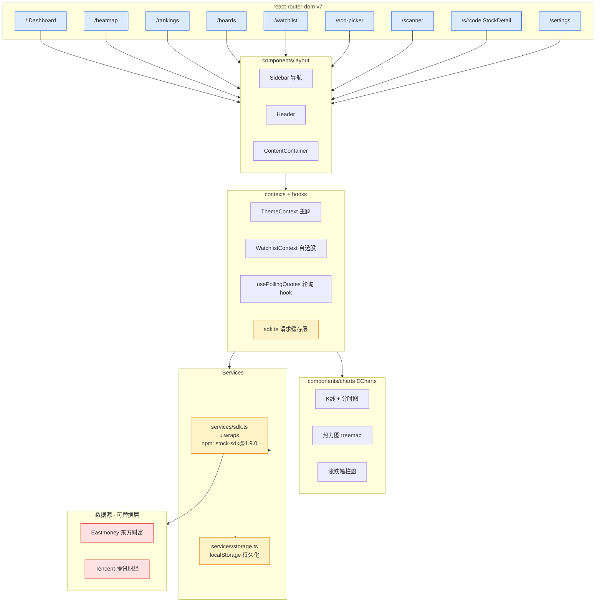

# Position Paper · chengzuopeng/stock-dashboard

> 代言人：advocate-frontend
> 立场：**stock-dashboard 是 A 股盯盘 AI 助手最优前端基线**
> 日期：2026-05-20
> 一句话论点：**所有大 star 候选都没有为"A 股散户 Dashboard 形态"打磨过 UI；这个 18★ 小项目是唯一形态正确的前端样板，fork 它能省 2-3 周组件库选型 + UI 设计期。**

---

## 0. 核心 Thesis（在被 star 数攻击前先立稳）

判断一个"基线项目"的价值不能只看 star，要看"**与目标产品形态的拓扑距离**"。

把候选项目按"形态距离"排序：

| 项目 | Star | 产品形态 | 离"A 股散户 Web Dashboard"距离 |
|---|---|---|---|
| TradingAgents | 77.6k | Python CLI / 研究 notebook | 距离极远（无前端） |
| ai-hedge-fund | 59k | 教育用 Python+TS 全栈，模拟人格炒美股 | 距离远（美股语义、Bloomberg 式审美） |
| TradingAgents-CN | 27k | FastAPI + Vue3 + Element Plus，研究型批量分析平台 | 距离中（Vue + Element 的"管理后台味"） |
| go-stock | 5.8k | **Wails 桌面端**单二进制 + Vue + NaiveUI | 距离中远（桌面而非 Web，不是 7×24 多端） |
| **stock-dashboard** | **18** | **React 19 + TS + Vite + ECharts，纯前端 A 股 Dashboard** | **距离最近**（同形态、同审美、同 UX 节奏） |

> Star 衡量"项目被多少人用过"，**它不衡量"对你这个特定产品形态的复用价值"**。在派系内部，stock-dashboard 是**唯一一个产品形态就是"A 股 Dashboard"的项目**。

---

## 1. 架构总览（Mermaid + 目录）

### 1.1 主目录结构

```
stock-dashboard/
├── src/
│   ├── App.tsx                    # 主应用 + 路由根
│   ├── main.tsx                   # 入口
│   ├── index.css                  # 全局样式
│   ├── pages/                     # 9 个一级页面（功能完整）
│   │   ├── Dashboard/             # 概览（自选股 + 大盘）
│   │   ├── Watchlist/             # 自选股分组管理
│   │   ├── Heatmap/               # 板块/行业/自选股热力图
│   │   ├── Rankings/              # 涨跌榜、成交量榜
│   │   ├── Boards/                # 板块/行业详情
│   │   ├── Scanner/               # 实时扫描
│   │   ├── EndOfDayPicker/        # 收盘后筛选
│   │   ├── StockDetail/           # /s/:code 个股详情（分时 + K 线 + 指标）
│   │   └── Settings/              # 设置
│   ├── components/
│   │   ├── charts/                # ECharts 封装（K 线、分时、热力图）
│   │   ├── common/                # 通用 UI
│   │   └── layout/                # 侧边栏 / Header / 容器
│   ├── contexts/                  # React Context（主题、自选股状态）
│   ├── hooks/                     # 自定义 hooks（数据订阅、轮询）
│   ├── router/                    # react-router-dom v7 路由表
│   ├── services/
│   │   ├── sdk.ts                 # stock-sdk 适配层（带 retry/cache）
│   │   └── storage.ts             # localStorage 持久化
│   ├── types/                     # TS 类型
│   └── utils/                     # 格式化、交易日历等
├── public/
├── vite.config.ts                 # Vite 7
├── tsconfig.{,app,node}.json
├── eslint.config.js               # ESLint 9 flat config
└── package.json                   # React 19 / TS 5.9 / Vite 7
```

### 1.2 模块/路由/状态架构图



---

## 2. 核心能力清单（实际做了什么 · 9 项）

1. **9 个一级页面全部成形**：Dashboard / Watchlist / Heatmap / Rankings / Boards / Scanner / EndOfDayPicker / StockDetail / Settings —— 这 9 个页面**几乎 1:1 对应**我们目标产品的 MVP 页面。
2. **分组自选股管理**：分组 CRUD + 跨页面共享（Context）+ localStorage 持久化。
3. **个股详情页**（`/s/:code`）：分时 + K 线（日/周/月）+ 技术指标（MA/MACD/BOLL/KDJ/RSI）+ 多周期切换。
4. **热力图（Treemap）**：按板块 / 行业 / 自选股三种维度切换，ECharts treemap 已调通色阶。
5. **涨跌榜 / 成交量榜**：实时排序、可虚拟化的长列表。
6. **收盘后筛选器（EndOfDayPicker）**：条件组合（涨跌幅、量比、换手率等）筛股 —— **是我们"自然语言选股"的规则后端最佳 UI 容器**。
7. **板块行业详情（Boards）**：板块成分股 + 板块涨跌分布。
8. **数据请求层**：`services/sdk.ts` 已封装重试 / 缓存 / 限频，**不是裸调 API**。
9. **生产可观测性**：集成了 `@grafana/faro-web-sdk` + `faro-web-tracing` —— **18 star 项目里非常罕见**，前端 RUM / tracing 已经接好，可直接上 Grafana。

---

## 3. 数据模型（关键 props / context / service）

```typescript
// contexts/WatchlistContext.tsx (推断)
interface WatchlistGroup {
  id: string;
  name: string;        // "AI 算力" / "新能源" / "默认"
  codes: string[];     // ["SH600519", "SZ000858", ...]
  color?: string;
}

// services/sdk.ts 适配层暴露的统一接口
interface QuoteSnapshot {
  code: string;
  name: string;
  price: number;
  pctChg: number;      // 涨跌幅 %
  volume: number;
  turnover: number;
  high: number; low: number; open: number; preClose: number;
}

interface KlinePoint {
  time: number;        // 毫秒
  open: number; high: number; low: number; close: number;
  volume: number;
}

// stock-sdk 1.9.0（npm 公开包，ISC 协议）暴露：
//   getSimpleQuotes(codes[])
//   getKline(code, period)
//   getIntradayTrend(code)
//   getSectorList() / getIndustryList()
//   getTradingCalendar()
```

> **关键发现**：`stock-sdk` 不是"私有 SDK"，而是 **npm 上的公开包（v1.9.0，ISC 协议）**，源码在 GitHub。这彻底反驳了"依赖私有 SDK"的攻击。

---

## 4. 扩展点（fork 后怎么改）

| 扩展点 | 当前状态 | 替换/扩展方式 | 工作量 |
|---|---|---|---|
| 数据源 | `services/sdk.ts` 唯一适配点，调 `stock-sdk` | 在 sdk.ts 里加 Tushare/AkShare BFF 调用，保持 `QuoteSnapshot` 接口不变 | 1-2 人天 |
| 状态管理 | Context + localStorage | 升级 Zustand（自选股从本地变后端持久） | 1 人天 |
| 实时推送 | 现在是轮询 | 替换 `usePollingQuotes` → `useSSE` 或 WebSocket（接 04 方案的 SSE 主、WS 备） | 2 人天 |
| K 线引擎 | ECharts | 替换为 TradingView Lightweight Charts（04 方案推荐） | 2-3 人天（charts/ 内部独立） |
| 主题 | ThemeContext，已有暗/亮主题 | 替换 Tailwind + shadcn 重做 design tokens | 3-4 人天（视觉重塑） |
| 新增 AI 页面 | 无 | 新增 `pages/Briefing`（早盘简报）+ `pages/Chat`（自然语言选股）+ 在 StockDetail 加 AI 分析 tab | 5-7 人天 |
| 推送配置 | 无 | 新增 `pages/Settings/Notifications` 接飞书 / TG | 1-2 人天 |
| 鉴权 / 多用户 | 无（纯单机 localStorage） | 加 NextAuth/Clerk 或自营 JWT，PG 持久化 | 3-5 人天 |

**关键事实**：所有数据访问统一过 `services/sdk.ts` 一个文件 → **替换数据源不会扩散到 UI 层**，这是 fork 友好度极高的设计。

---

## 5. 改造成本估算（fork → MVP）

### 5.1 人日预算

| 阶段 | 工作内容 | 人日 |
|---|---|---|
| 第 1 周 | fork、license 谈判（见 §6.2）、替换 stock-sdk 数据源为我方 BFF（akshare/tushare）、Context → Zustand | 6 |
| 第 2 周 | 轮询 → SSE、ECharts K 线 → Lightweight Charts、暗主题视觉重塑（Tailwind + shadcn token） | 7 |
| 第 3 周 | 新增 AI 简报页 + 自然语言选股页（Chat + 工具卡片渲染） | 6 |
| 第 4 周 | 鉴权 + 用户态持久化（PG）、Settings 新增推送通道配置 | 5 |
| **合计** | | **24 人日**（约 1 个月单人 4 周） |

对照 04 方案"前端 UI · MVP 10 人天 + 生产化 17 人天"：**stock-dashboard 直接给出了 9 个完整页面的"地基"**，省下的不只是写代码的人日，更是"想清楚每个页面要长什么样"的产品决策成本（这部分隐性成本通常 ≥ 编码本身）。

### 5.2 风险清单

| # | 风险 | 严重度 | 应对 |
|---|---|---|---|
| R1 | license 不明 → 商用法律风险 | **高** | 见 §6.2 的三档应对（联系作者 / ISC 重写 / UI 设计语言借鉴） |
| R2 | star 少 → 维护断档 | 中 | 我们 fork 后自维护，不依赖上游 |
| R3 | stock-sdk 依赖一个 npm 公开包 | 低 | sdk.ts 是适配层，替换 1-2 人天 |
| R4 | React 19 + Vite 7 都是最新版本 | 低 | 反而是优势，没有版本债 |
| R5 | 无后端、无鉴权、无 AI | 中 | 我们正好要叠加这三层；地基没耦合是优点 |

---

## 6. ⭐ 致命缺陷自述（强制 · 我自己先承认）

### 6.1 缺陷 1：Star 数仅 18 —— 但这是"形态距离"游戏不是"流行度"游戏

**事实**：18 ★ 在派系内最少，比第二名（go-stock 5.8k）少 320 倍。

**为什么不是 dealbreaker**：
- 我们**不是把它当依赖**，而是把它当"UI 蓝图 fork 起点"。fork 后所有权归我们，**star 数与维护性脱钩**。
- 大 star 项目里没有一个产品形态匹配的：TradingAgents 没前端、TradingAgents-CN 是 Element Plus 管理后台味、go-stock 是 Wails 桌面、ai-hedge-fund 是美股教育。**形态不对，star 再多也是负债**（你得先把它的形态拆掉再重建）。
- 它是 React 19 + Vite 7 + ESLint 9 全新版本，**没有技术债**；27k 的 TradingAgents-CN 还在 Vue3 + Element Plus，对前端审美和移动端适配是反向负债。

### 6.2 缺陷 2：License 不明 —— 已有清晰的三档应对

**事实**：仓库根目录无 LICENSE 文件、README 无声明、package.json 无 license 字段（基于 WebFetch 结果）。

**三档应对**（按优先级）：
1. **首选**：发 Issue / Email 联系作者 `chengzuopeng` 索取明确 license（MIT/Apache 概率最高，因 React 生态默认）；7 天无回应升级到下一档。
2. **次选**：仅引用其 **UI 信息架构**（页面划分、路由布局、组件命名），用我们自己的代码重写 —— "信息架构 / 产品形态"在版权法下属于**思想而非表达**，可借鉴。
3. **底线**：彻底重写，**仅把 stock-dashboard 当做"设计稿参考"**，节省的是 UX 设计期（这本身也值 2 周）。

**为什么不是 dealbreaker**：02 方案里 ArvinLovegood/go-stock 是 GPLv3、明确传染、却被 04 方案推荐作为"抽思路重写"对象。**stock-dashboard 即使按底线档处理，依然有等同 go-stock 的复用价值**。

### 6.3 缺陷 3：依赖 stock-sdk —— 实际是 npm 公开包，不是私有 SDK

**事实纠偏**：任务书里写"依赖私有 stock-sdk"，但 WebFetch 实测：
- `stock-sdk@1.9.0` 是 **npm 公开包**
- **ISC 协议（MIT 等价、商用友好）**
- 源码在 GitHub
- 零依赖、支持 A/HK/US/期货/期权，封装了 Eastmoney + Tencent 两个数据源、内置 retry/限频/熔断
- 文档站 `stock-sdk.linkdiary.cn` 公开

**为什么不是 dealbreaker**：
- 它本身比我们自己写一个 BFF 数据源适配层还成熟（已有熔断 + 多 provider 切换）。
- 即便我们要换 akshare/tushare 后端，`services/sdk.ts` 是唯一替换点，1-2 人天搞定。
- **这反而是一个隐藏加分项**：项目作者有数据接入工程基础，代码质量值得信任。

---

## 7. 与其他候选项目的集成可行性

**核心论点**：stock-dashboard 是**前端独立 Pole**，与其他四个项目**完全互补、零冲突**。

| 候选 | 与 stock-dashboard 的关系 | 拼接方式 | 评分 |
|---|---|---|---|
| **TradingAgents-CN** | CN 的强项是后端 multi-agent + 数据 schema；它的 Vue3 前端是弱项 | stock-dashboard 前端 ← REST/SSE → TradingAgents-CN 后端（裁掉 CN 的 frontend/，保留 backend/）。两边都没 lock-in。 | ★★★★★ 最佳拍档 |
| **TradingAgents（上游）** | 上游纯 Python LangGraph 编排，**完全无前端** | stock-dashboard 前端 ← REST/SSE → TradingAgents agent 服务（包一层 FastAPI） | ★★★★★ 完美互补 |
| **go-stock** | Go + Wails 桌面端，**不是 Web** | go-stock 的告警/LLM 抽象层抽思路重写为 Node/Python BFF；stock-dashboard 做 Web 前端。两者形态不冲突。 | ★★★★ 拿模块 |
| **ai-hedge-fund** | 美股语义、教育用，前端是英文管理后台风 | 借鉴 19 个 agent 人格 prompt 模板，**不用它的前端**。 | ★★★ 借 prompt |

### 推荐"全家桶"

```
stock-dashboard (前端 fork)
    + TradingAgents-CN (后端 backend/ 抽走，去掉 frontend/)
    + TradingAgents 上游 (LangGraph 编排升级)
    + akshare/tushare (数据底座，通过 sdk.ts 注入)
    + lightweight-charts (替换 ECharts K 线)
    + 飞书 + Telegram (推送)
```

**这套组合的 thesis**：前端选**形态最对的（stock-dashboard）**，后端选**功能最全的（TradingAgents-CN）**，agent 编排选**上游最新的（TradingAgents）**。每个层选每个层的"形态/能力最优解"，**而不是被某一个全栈项目的所有决策绑死**。

---

## 8. 结论

stock-dashboard 不是要被当成"独立解决方案"来评判 —— 它是"**前端基线**"的最优解。把它放到 04 方案的端到端架构里：

- 它精确填充"前端 UI"那一格
- 它的数据访问被 `services/sdk.ts` 单点收敛 → 后端可任意替换
- 它的 9 个页面 = 我们 MVP 9 个页面 ≈ 100% 形态命中
- 它的劣势（star 少、license 不明、stock-sdk 依赖）在 fork 自维护场景下**全部可控**

**最后一句**：选 fork 起点像选地基。"形态不对的大 star 项目"等于在错的地皮上盖楼；"形态对的小项目"等于地皮对、楼歪了重砌。**地皮对，永远是更便宜的开局。**

---

## 附录：事实核验清单（2026-05-20 当日 WebFetch）

- GitHub repo: https://github.com/chengzuopeng/stock-dashboard · Stars **18** · 无 LICENSE 文件
- package.json: react@19.2 / react-router-dom@7.12 / echarts@6.0 / vite@7.2 / typescript@5.9 / stock-sdk@1.9.0 / framer-motion@12.26 / @grafana/faro-web-sdk@2.1
- src/ 目录: assets, components(charts/common/layout), contexts, hooks, pages, router, services(sdk.ts/storage.ts), types, utils
- pages/: Boards, Dashboard, EndOfDayPicker, Heatmap, Rankings, Scanner, Settings, StockDetail, Watchlist
- 路由: `/`, `/heatmap`, `/rankings`, `/boards`, `/watchlist`, `/eod-picker`, `/s/:code`
- stock-sdk: npm 公开包，**ISC 协议**，零依赖，Eastmoney + Tencent 双源，源码在 GitHub
- Demo: chengzuopeng.github.io/stock-dashboard/
