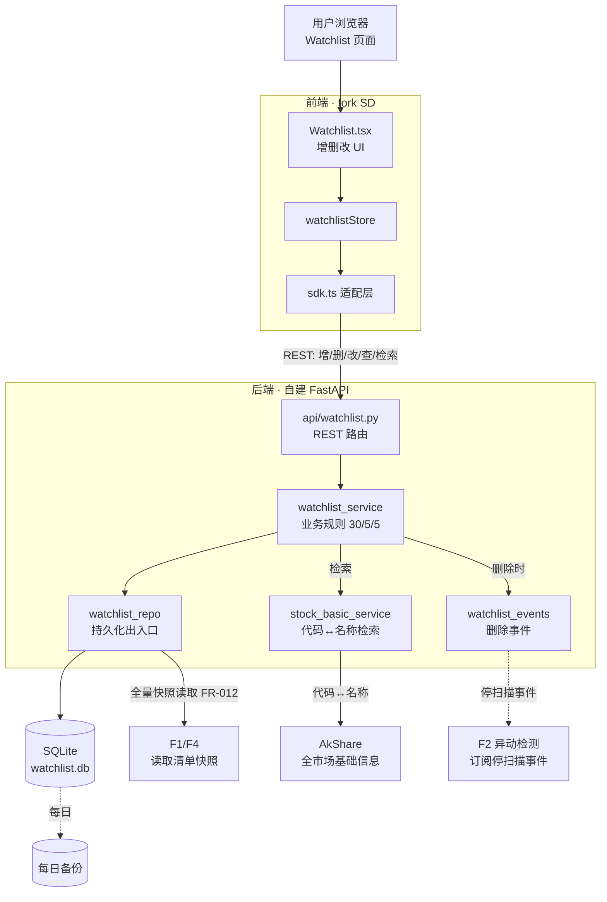

# Implementation Plan: 自选股管理 CRUD（001-watchlist-crud）

**Feature**: F5 自选股管理 CRUD
**Date**: 2026-05-20
**Spec**: `specs/001-watchlist-crud/spec.md`
**架构基线**: `specs/research/06-架构基线决策.md`（B 轨：自建 FastAPI 薄后端 + SD 前端 + TR 内核）

---

## Summary

F5 是整个产品的数据基座：提供自选股清单的增删改、分组、持仓标记、本地持久化，并对外暴露"读取清单"能力供 F1/F2/F4 消费。技术上走架构基线 06 的 **Python 单栈 + 自建 FastAPI 薄后端**，**前端基于 spec + DESIGN.md 自主构建（不 fork SD，design-reference 仅作视觉参考）**；存储层因"单用户本地"场景从 06 的 PostgreSQL 降级为 **SQLite**（见风险 R-2 决策说明）。

---

## Technical Context

| 项 | 选择 | 依据 |
|---|---|---|
| **Language/Version** | Python 3.11+ | 架构基线 06 §4 已锁定 Python 单栈 |
| **Backend 框架** | FastAPI（自建薄后端，B 轨） | 06 §5 复用矩阵；CN 商授不需要（个人非商用），走 B 轨自建 |
| **存储** | SQLite（本地单文件） | 单用户本地工具，PG 过度工程（见 R-2） |
| **前端** | **基于 spec + DESIGN.md 自主构建**（React 19 + TS + Vite + shadcn/ui 自建密集组件）；**不 fork 任何前端项目** | 用户决议：自主构建；design-reference 仅作视觉参考 |
| **设计系统** | `DESIGN.md`（视觉取值唯一真理来源）+ `precision_terminal` 基准 + `dashboard_a_ai` **仅视觉参考（不 copy 其代码）** | 宪法 FD-1~FD-8 |
| **股票基础信息源** | AkShare（代码↔名称，本地缓存） | 06 §5：akshare 免费、覆盖全 A 股 |
| **Testing** | pytest（后端）；前端测试本轮不展开（仅文档轮） | 通用 Python 测试栈 |
| **Target Platform** | 本地 macOS 常驻，Web 经 Tailscale / 内网访问 | PRD §6 / brainstorming 决议 |
| **Project Type** | Web（backend + frontend 分离） | F1 需要 Web Dashboard |
| **Performance Goals** | CRUD 操作 p95 < 500ms（PRD §7.1 / SC-002） | 本地存储，易达成 |
| **Constraints** | 单用户、无鉴权、≤30 自选 / ≤5 持仓 / ≤5 分组 | PRD 业务规则 |
| **Scale/Scope** | 自选 ≤ 30 只，单用户，无并发压力 | PRD 业务规则 |

---

## ① 项目文件结构（路径 + 核心职责）

> F5 是第一个 feature，需顺带搭建后端与前端的基础骨架。以下为本 feature 涉及/新建的文件；标 **[新建]** / **[复用]** / **[改造]**。

```text
AlphaProject/
├── backend/                              # [新建] 自建 FastAPI 薄后端（B 轨）
│   ├── app/
│   │   ├── main.py                       # [新建] FastAPI 应用入口 + 路由挂载
│   │   ├── config.py                     # [新建] 配置（数据库路径、上限常量 30/5/5）
│   │   ├── db.py                         # [新建] SQLite 连接 + 初始化 + 每日备份钩子
│   │   ├── models/
│   │   │   └── watchlist.py              # [新建] WatchlistItem / Group 领域模型
│   │   ├── repositories/
│   │   │   └── watchlist_repo.py         # [新建] 自选清单读写（CRUD + 持久化）
│   │   ├── services/
│   │   │   ├── watchlist_service.py      # [新建] 业务逻辑：上限校验、去重、撤销、停扫描通知
│   │   │   └── stock_basic_service.py    # [新建] 全市场代码↔名称检索（AkShare + 本地缓存）
│   │   ├── api/
│   │   │   └── watchlist.py              # [新建] REST 路由：增/删/改/查/撤销/检索
│   │   └── events/
│   │       └── watchlist_events.py       # [新建] 删除事件广播（供 F2 订阅停扫描，本轮仅留接口）
│   ├── data/
│   │   ├── watchlist.db                  # [运行时生成] SQLite 数据文件
│   │   └── backups/                      # [运行时生成] 每日备份目录
│   └── tests/
│       └── test_watchlist.py             # [新建] F5 CRUD + 上限 + 撤销 单测（文档轮不写，tasks 列出）
│
├── frontend/                             # [新建] 自主构建（Vite + React + TS + shadcn/ui，不 fork）
│   └── src/
│       ├── pages/Watchlist.tsx           # [新建] 自选股管理页（增删改 UI）
│       ├── components/watchlist/         # [新建] 管理抽屉/分组/持仓标记/撤销 toast 组件
│       ├── services/sdk.ts               # [新建] API client 层：fetch 本地 backend REST
│       └── store/watchlistStore.ts       # [新建] 自选清单前端状态
│
└── specs/001-watchlist-crud/             # 本 feature 文档
    ├── spec.md
    ├── plan.md                           # 本文件
    └── tasks.md
```

**核心职责说明**：
- `watchlist_repo.py`：唯一的持久化出入口，封装 SQLite 读写，CRUD 不绕过它
- `watchlist_service.py`：所有业务规则（30/5/5 上限、去重、30 秒撤销、删除通知）集中在此
- `stock_basic_service.py`：代码↔名称↔拼音首字母检索，隔离 AkShare + pypinyin 依赖，便于降级；本地缓存时预计算每只股的拼音首字母索引
- `watchlist_events.py`：删除时发"停扫描"事件，F2 后续订阅（本 feature 只定义事件契约，不实现 F2 端）

---

## ② 数据流向（Mermaid）



---

## ③ 依赖清单（语言版本 + 第三方库版本）

> 版本为 plan 阶段建议锁定值，实现时以 lockfile 为准。

**后端（Python 3.11+）**：
| 库 | 版本 | 用途 |
|---|---|---|
| fastapi | ^0.115 | REST 后端 |
| uvicorn | ^0.32 | ASGI server |
| pydantic | ^2.9 | 数据校验（WatchlistItem schema） |
| akshare | ^1.18 | 全市场股票基础信息（代码↔名称） |
| pypinyin | ^0.53 | 股票名称转拼音首字母，支持拼音检索（MVP） |
| (stdlib) sqlite3 | — | 本地持久化，无需额外库 |
| pytest | ^8.3 | 单测 |

**前端（fork SD 既有栈，不新增大依赖）**：
| 库 | 版本 | 用途 |
|---|---|---|
| react | 19.x | SD 既有 |
| typescript | 5.9 | SD 既有 |
| vite | 7.x | SD 既有 |
| zustand | ^5（SD 若用 Context 则新增） | 自选清单状态（06 提及 Context→Zustand 可选改造） |

**显式不引入**：PostgreSQL / Redis / ORM 框架（SQLite + 轻量 repo 足够，见 R-2）。

---

## ④ 与现有系统的集成点（复用 vs 新建）

**复用（绝不重造）**：
- **复用 AkShare**：股票基础信息检索直接调 akshare，不自建行情爬虫。

**自主构建（不 fork）**：
- **前端自建**：基于 spec + `DESIGN.md` 自主搭建 Vite + React + TS + shadcn/ui 工程，`design-reference/stitch-export/` 仅作**视觉参考**（看不抄代码）。不 fork `chengzuopeng/stock-dashboard` 或任何前端项目。

**新建（PRD / 06 中无现成可复用）**：
- 自建 FastAPI 薄后端（06 B 轨明确"自建 FastAPI 薄层"）—— F5 是第一个 feature，负责立起 `backend/app/` 骨架（main/config/db），后续 F1/F2/F4 复用此骨架。
- `watchlist_repo` / `watchlist_service` / `watchlist_events` 均为 F5 新建，但 `db.py`、`main.py`、`config.py` 是全项目共享基础设施。

**对后续 feature 的契约**：
- FR-012 全量读取接口 → F1 Dashboard、F4 早盘简报消费
- `watchlist_events` 停扫描事件 → F2 异动检测订阅（本 feature 只定义事件 payload 契约：`{action: "removed", code: "..."}`）

---

## 前端区（Frontend Zone · 对齐设计系统宪法 FD-1~FD-8）

> 本轮 plan 重跑新增。已先读 `DESIGN.md`（§Components/§Shapes/§Typography/§Elevation）
> 与视觉参考 `dashboard_a_ai/code.html`（含 Manage 抽屉 CRUD + 自选表 + 涨跌色 + 徽章）。

- **视觉真理来源**：`specs/design-reference/stitch-export/precision_terminal/DESIGN.md`（FD-1）
- **视觉参考样本**：`specs/design-reference/stitch-export/dashboard_a_ai/code.html`（FD-2；基准 precision_terminal）

### F5 涉及的前端组件（①组件 → ②DESIGN.md 对应节 → ③shadcn 基底 → ④视觉参考）

| 组件 | 用途（F5） | DESIGN.md 对应节 | shadcn 基底 | 视觉参考（dashboard_a_ai/code.html） |
|---|---|---|---|---|
| **ManageDrawer** 管理抽屉 | 搜索加股 / 分组 / 持仓切换 / 删除 入口 | §Elevation & Depth（Level 3 Overlays / 侧抽屉）+ §Components | `Sheet` | Drawer 段（`Manage Stock`） |
| **StockSearchInput** 检索框 | 代码/名称/拼音检索加股 | §Shapes（Inputs 4px + 1px border）+ §Typography（table-data） | `Command` + `Input` | `Search to Add` 输入框 |
| **StockCard** 股票卡片 | 抽屉内单股 + 持仓标记展示 | §Components（Stock Cards，持仓边框加粗） | `Card` | `600519 Moutai` 卡片 |
| **StatusBadge** 状态徽章 | 持仓标记 / 分组标签 | §Components（Status Badges）+ §Shapes（rounded-sm/md，禁 pill） | `Badge` | `Holding` 徽章 |
| **ActionButton** 操作按钮 | Untag / Remove / 确认 | §Shapes（Buttons 4px radius） | `Button` | `Untag` / `Remove` 按钮 |
| **UndoToast** 撤销提示 | 30 秒删除撤销 | §Shapes（Buttons）+ 密度哲学从简（原型未含，按 DESIGN.md 简化） | `Sonner`/`Toast` | —（依 DESIGN.md 从简新增） |
| **GroupSelect** 分组选择 | 分组归属切换 / 筛选 | §Components（隐含）+ §Shapes | `Select`/`DropdownMenu` | `Filter`/`Sort` 控件 |

### 设计约束落地（FD 映射）

- 颜色/字号/间距/圆角**全部引用 DESIGN.md token，禁硬编码**（FD-1）
- 涨跌色遵 A 股惯例（具体值见 DESIGN.md）；持仓行用高亮边框区分（FD-3 + §Components Stock Cards）
- token 驱动 + shadcn 自建密集组件，**不引入与 token 冲突的现成 UI 套件**（FD-4）
- 维持密集表格密度、紧凑间距、禁宽松留白（FD-5）
- UI 简体中文 + 系统 CJK 字体回退（FD-6）
- 暗色为默认主题，亮色次主题取值同源 DESIGN.md（FD-7）
- 移动端只读降级：管理抽屉移动端可用，自选表隐藏次要列（FD-8）

---

## ⑤ 风险点清单（技术风险 + 缓解）

| ID | 风险 | 严重 | 缓解方案 |
|---|---|:-:|---|
| **R-1** | 前端自主构建工作量比 fork 大（无现成骨架） | 中 | 用 shadcn/ui 现成无样式组件作基底快速搭骨架；视觉照 DESIGN.md token + `dashboard_a_ai/code.html` 参考；F5 前端仅 1 页（管理抽屉），范围可控 |
| **R-2** | 偏离 06 的 PostgreSQL 选型改用 SQLite，未来若转多用户需迁移 | 低 | 单用户本地是 PRD 永久 Non-Goal（不做多租户），SQLite 足够；`watchlist_repo` 封装持久化出入口，未来如需换 PG 只改 repo 一层。**决策：采用 SQLite，理由 = 单用户本地零运维、PG 需独立进程过度工程** |
| **R-3** | AkShare 全市场基础信息接口限流 / 不可用，导致"新增检索"失败 | 中 | FR-014：检索源不可用时仍允许已有自选股增删改；基础信息（代码↔名称变动极慢）本地缓存 1 份，每日刷新即可，不实时依赖 |
| **R-4** | 删除→停扫描的事件契约与 F2 实现不一致，导致删除后仍推送 | 中 | F5 先定义事件 payload 契约写入 `watchlist_events.py`，F2（005）实现时对齐该契约；F5 单测覆盖"删除后待推送队列清空"的本地行为 |
| **R-5** | 30 秒撤销窗口期间数据状态管理复杂（软删除 vs 硬删除） | 低 | 用"软删除标记 + 30 秒后物理清理"实现；撤销 = 清除软删除标记；超时由定时清理任务物理删除 |
| **R-6** | 持久化文件损坏导致启动失败 | 低 | FR-013：启动时校验，损坏则从每日备份恢复，备份也坏则重置空清单 + 提示，绝不崩溃 |

---

## Constitution Check

> 对照 `.specify/memory/constitution.md`（项目宪法）。

- 本 feature 为纯数据管理，无外部交易 / 下单行为，符合"不持牌不下单"红线 ✓
- 单用户本地、无 PII、无鉴权，符合个人非商用定位 ✓
- 无违反需记录的复杂度例外（SQLite 偏离 PG 已在 R-2 论证，属简化非复杂化）✓
- **前端设计系统（FD-1~FD-8）**：
  - FD-1 视觉取值全引用 DESIGN.md token、无硬编码 ✓（见前端区组件表）
  - FD-2 参考 dashboard_a_ai、基准 precision_terminal ✓
  - FD-3 涨跌色遵 A 股惯例、持仓视觉区分、AI 内容不在本 feature ✓
  - FD-4 token 驱动 + shadcn 自建密集组件，不引冲突套件 ✓
  - FD-5 维持密集表格密度 ✓
  - FD-6 简体中文 + 系统 CJK 回退 ✓
  - FD-7 暗色优先、亮色可选同源 token ✓
  - FD-8 移动端只读降级（管理抽屉可用、表格隐次要列）✓

---

## 下一步

本 plan 通过后 → `tasks.md`（④ 任务拆解，12-18 条）。本轮只产出文档，不写代码。
