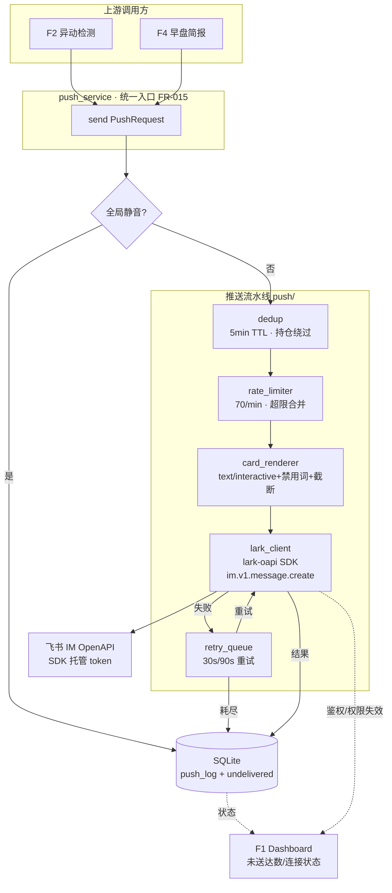

# Implementation Plan: 飞书机器人推送通道（002-feishu-push-channel）

**Feature**: F6 飞书机器人推送通道
**Date**: 2026-05-20
**Spec**: `specs/002-feishu-push-channel/spec.md`
**架构基线**: `specs/research/06-架构基线决策.md`（推送借鉴 go-stock，重写避 GPL）

---

## Summary

F6 是推送基座，把"推送"抽象为唯一出口，统一负责限频 / 去重 / 重试 / 卡片渲染 / 未送达兜底 / 全局静音。技术上复用 F5 已建的 `backend/app/` 骨架与 SQLite（未送达队列与日志持久化），新增 `push/` 子模块。

**飞书接入模型（2026-05-20 源码调研后决议）**：经 SubAgent 通读 `larksuite/cli` 源码确认其为 Go 写的"Agent 操作飞书"工具（非构建工具、强制完整 App），用户拍板改用 **完整 Lark App + 官方 Python SDK `lark-oapi`**：以 `app_id + app_secret` 构建 SDK Client（tenant_access_token 由 SDK 内部托管刷新），经 `client.im.v1.message.create` 发消息。推送的限频/去重/重试/合并/兜底逻辑 SDK 不提供，仍由 F6 应用层实现（**借鉴 go-stock `backend/alarm/` 设计但完全重写避 GPL** —— 06 §3.2）。

---

## Technical Context

| 项 | 选择 | 依据 |
|---|---|---|
| **Language/Version** | Python 3.11+ | 架构基线 06 |
| **Backend 框架** | FastAPI（复用 F5 的 `backend/app/` 骨架） | 不重建后端 |
| **飞书接入** | 官方 Python SDK `lark-oapi`（Lark App 模型，IM OpenAPI） | 源码调研后用户决议，非 Go CLI、非 webhook |
| **鉴权** | app_id + app_secret → SDK 托管 tenant_access_token | SDK 自动获取/刷新，F6 不手写 token |
| **限频** | 本地内存滑动窗口令牌桶 + SDK 频控错误退避 | 单进程单用户；阈值按 IM OpenAPI 官方口径 |
| **dedup** | 内存 TTL 字典（5 分钟）+ SDK uuid 幂等 | 单进程，无需外部 KV |
| **未送达队列 + 日志** | SQLite（复用 F5 的 `db.py`） | 跨重启回放需持久化 |
| **后台调度** | APScheduler | 重试定时（30s/90s）+ 未送达回放轮询；F2/F4 后续复用 |
| **Testing** | pytest（限频/去重/重试/合并 单测，mock `lark-oapi` Client） | 通用 |
| **Target Platform** | 本地 macOS 常驻 | PRD §6 |
| **Project Type** | Web（backend 模块） | 复用 F5 后端 |
| **Performance Goals** | 推送送达 p95 < 60s（SC-001） | 网络正常易达成 |
| **Constraints** | IM OpenAPI 频控（待核实）、5 分钟 dedup、3 次重试、200 条未送达上限 | spec §2.3 |
| **Scale/Scope** | 单用户单 App 单会话，日均 20-50 条推送 | PRD 反指标 |

---

## ① 项目文件结构（路径 + 核心职责）

```text
backend/app/
├── main.py                          # [复用] F5 已建，挂载 F6 推送状态路由
├── config.py                        # [改造] 增推送配置：webhook_url、secret、mute_flag、
│                                     #         RATE_LIMIT=70、DEDUP_TTL=300、UNDELIVERED_MAX=200
├── db.py                            # [复用] F5 已建，F6 增 push_log / undelivered 两表
├── models/
│   └── push.py                      # [新建] PushRequest / PushLog / UndeliveredItem
├── services/
│   └── push_service.py              # [新建] 统一推送入口（FR-015），编排下列 push/ 组件
├── push/                            # [新建] 推送子模块（借鉴 go-stock alarm 思路，重写）
│   ├── lark_client.py               # [新建] 封装 lark-oapi Client（app_id/secret）+ im.v1.message.create + 失效判定
│   ├── rate_limiter.py              # [新建] 令牌桶限频 + 超限合并队列
│   ├── dedup.py                     # [新建] 5 分钟 TTL 去重（持仓绕过）+ uuid 幂等键生成
│   ├── card_renderer.py             # [新建] text/interactive 卡片渲染 + 禁用词替换 + 超长截断
│   └── retry_queue.py               # [新建] 重试调度（30s/90s）+ 未送达队列 + 回放
├── api/
│   └── push_status.py               # [新建] 向 Dashboard 暴露：未送达数/webhook 状态/静音态
└── tests/
    └── test_push.py                 # [新建] 限频/去重/合并/重试/静音 单测（文档轮不写，tasks 列出）
```

**核心职责说明**：
- `push_service.send(request)`：唯一对外入口，串起 dedup → 限频/合并 → 渲染 → 发送 → 失败入重试队列 → 写日志
- `rate_limiter`：滑动窗口计数，接近阈值时把请求转入合并队列
- `dedup`：`code+signal` 键 5 分钟 TTL；`priority==持仓` 时直接放行；为每次发送生成 uuid 幂等键
- `retry_queue`：失败消息按 30s/90s 重试，耗尽入 SQLite 未送达表；连接恢复后回放
- `lark_client`：唯一接触飞书 SDK 的层，封装 `lark-oapi` Client 构建（app_id/secret）、`im.v1.message.create` 调用、鉴权/权限/频控错误的失效判定（token 刷新交给 SDK）

---

## ② 数据流向（Mermaid）



---

## ③ 依赖清单（语言版本 + 第三方库版本）

| 库 | 版本 | 用途 |
|---|---|---|
| fastapi | ^0.115 | 复用 F5 后端 |
| **lark-oapi** | ^1.4 | **飞书官方 Python SDK**：构建 App Client、IM 发消息、token 托管 |
| apscheduler | ^3.10 | 重试定时 + 未送达回放轮询 |
| pydantic | ^2.9 | PushRequest schema |
| (stdlib) uuid | — | 生成 SDK 幂等键 |
| (stdlib) sqlite3 | — | 复用 F5 持久化 |
| pytest（mock lark-oapi Client） | ^8.3 | 单测 |

**显式不引入**：
- ~~httpx 直连飞书~~ → 由 `lark-oapi` SDK 内部处理 HTTP 与 token
- ~~hmac/hashlib 自定义机器人加签~~ → Lark App 模型用 SDK 托管 token，无需手写加签
- ~~larksuite/cli (Go)~~ → 源码调研后否决（跨语言进程污染，对单向推送过度工程）
- Celery / RabbitMQ / Redis（单用户单进程，APScheduler + 内存队列足够）

---

## ④ 与现有系统的集成点（复用 vs 新建）

**复用**：
- **复用 F5 的 `backend/app/` 骨架**：`main.py`、`config.py`、`db.py` 直接扩展，不新建后端工程。
- **复用飞书官方 Python SDK `lark-oapi`**：Client 构建、IM 发消息、tenant_access_token 托管全部交给 SDK，不自造飞书 HTTP 层。
- **借鉴 `ArvinLovegood/go-stock` 的 `backend/alarm/` 推送思路**：阈值告警 → 卡片 → 推送的设计模式。**因 go-stock 是 GPLv3，仅参考设计、完全重写，不 import 任何代码**（架构基线 06 §3.2 / §3.5 红线）。

**新建**：
- `push/` 整个子模块为 F6 新建。
- SQLite 增 `push_log`、`undelivered` 两表（在 F5 的 db.py 内扩展）。

**外部前置（飞书开放平台，需用户一次性配置）**：
- 创建企业自建 Lark App → 开通机器人能力 → 申请 IM 发消息权限（如 `im:message:send_as_bot`）→ 把机器人加入目标群 / 单聊 → 拿到 app_id / app_secret / 目标会话 receive_id。

**对外契约（被下游消费）**：
- `push_service.send(PushRequest)` → F2（005）、F4（006）调用。`PushRequest.priority ∈ {持仓, 自选, 系统}`，`PushRequest.dedup_key = code + signal`（持仓时 F6 自动绕过 dedup），`PushRequest.receive_target` 默认取配置的单一会话。
- `api/push_status` → F1（003）Dashboard 顶部展示未送达数 / 连接状态 / 静音态。

---

## ⑤ 风险点清单（技术风险 + 缓解）

| ID | 风险 | 严重 | 缓解方案 |
|---|---|:-:|---|
| **R-1** | 误参考 go-stock GPLv3 代码导致 license 污染 | 高 | 只读 README/设计思路，不打开其源码 copy；`push/` 全部独立实现；代码 review 时核对无 GPL 片段 |
| **R-2** | IM OpenAPI 频控口径未核实（与自定义机器人 100/min 不同），阈值设错 | 中 | 实现时查飞书官方 IM 发消息频控文档定阈值；应用层令牌桶保留 + 对 SDK 频控错误码退避重试，双保险不丢消息 |
| **R-3** | APScheduler 在 Mac 睡眠后定时漂移，重试/回放延迟 | 中 | 配合 PRD §7.2 caffeinate 防睡眠；回放采用"启动即检查未送达队列"而非纯依赖定时 |
| **R-4** | 未送达队列持久化与 F5 的 db.py 表结构耦合，迁移冲突 | 低 | push 相关表独立命名（push_log/undelivered），与 watchlist 表零交叉 |
| **R-5** | 合并卡片逻辑在"持仓+自选混合批次"下优先级错乱 | 中 | 合并时持仓消息单独成卡或置顶；dedup/合并均以 priority 字段为一等输入 |
| **R-6** | 连接失效误判（临时网络抖动被当成凭证失效暂停） | 中 | 区分网络层失败（重试）vs 鉴权/权限错误（SDK 返回的鉴权/权限码才判失效）；连续 N 次鉴权失败才暂停 |
| **R-7** | Lark App 凭证 / scope / 机器人未入会话导致发送全失败 | 中 | 启动自检：构建 Client 后做一次轻量鉴权探测；失败则 Dashboard 明确提示缺哪一步（app_secret / scope / 机器人入群） |
| **R-8** | receive_id（会话 id）获取方式对用户不直观 | 低 | 文档化获取步骤（机器人入群后从事件或 API 取 chat_id）；MVP 配置单一 receive_id |

---

## Constitution Check

- F6 仅推送信息，不下单、不接触交易，符合红线 ✓
- 禁用买卖建议词的合规由 F3 内容侧负责，F6 兜底飞书平台禁用词 ✓
- 无复杂度例外（未引入消息队列中间件，属简化）✓

---

## 下一步

本 plan 通过后 → `tasks.md`（④ 任务拆解）。
