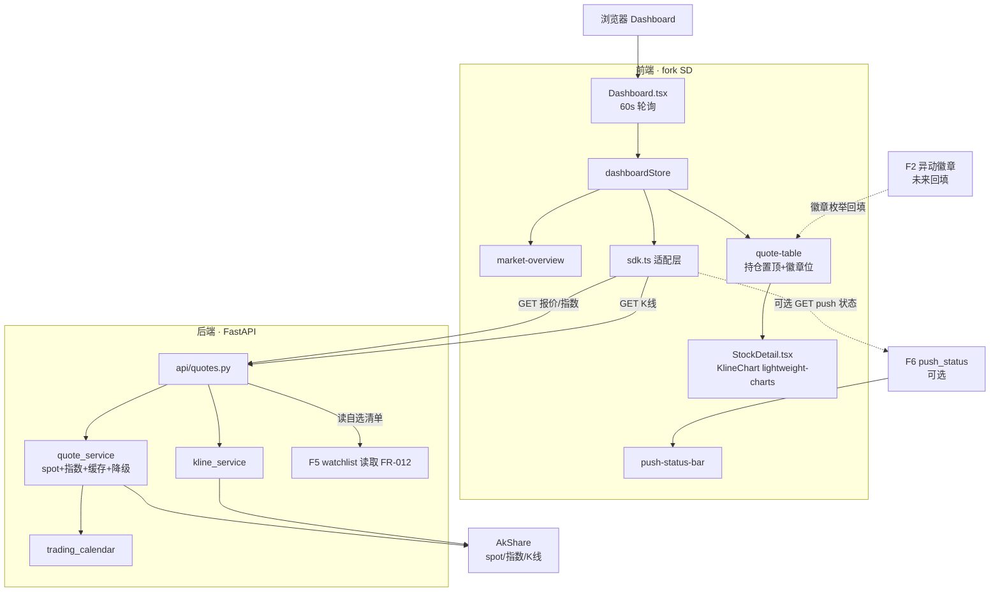

# Implementation Plan: 自选股 Dashboard（003-watchlist-dashboard · 方案 A）

**Feature**: F1 自选股 Dashboard（报价优先版）
**Date**: 2026-05-20
**Spec**: `specs/003-watchlist-dashboard/spec.md`
**架构基线**: `specs/research/06-架构基线决策.md`（**前端自主构建** + lightweight-charts + 自建 FastAPI 后端）
**依赖**: F5（001-watchlist-crud，自选清单读取）

---

## Summary

F1 是产品最早可见价值的载体：**前端基于 spec + DESIGN.md 自主构建**（Vite+React+TS+shadcn/ui，不 fork SD）做单页 Dashboard，读 F5 自选清单 + 拉行情快照（AkShare）+ 60 秒轮询刷新 + 市场概览 + 单股 K 线详情。方案 A 下**异动徽章不实现，仅预留展示位**，待 F2（005）落地后增量补充。K 线用 TradingView Lightweight Charts（06 决议）。视觉照 `design-reference/stitch-export/` 原型（`dashboard_a_ai` 主列表 + `a_ai_1` 详情，看不抄）。

---

## Technical Context

| 项 | 选择 | 依据 |
|---|---|---|
| **Language/Version** | Python 3.11+（后端）/ TypeScript 5.9（前端） | 架构基线 06 |
| **前端** | **自主构建**（Vite + React 19 + TS + shadcn/ui 自建密集组件），**不 fork SD** | 用户决议：自主构建；design-reference 仅视觉参考 |
| **设计系统** | `DESIGN.md`（视觉取值唯一真理来源）+ `precision_terminal` 基准 + `dashboard_a_ai`/`a_ai_1` 视觉参考（看不抄） | 宪法 FD-1~FD-8 |
| **K 线图表** | TradingView Lightweight Charts | 06 决议，性能 35KB；自建封装 |
| **实时刷新** | 前端 60 秒轮询（polling） | 分钟级数据，60s 足够；SSE/WS 留给 F2 高频推送场景 |
| **后端** | FastAPI（复用 F5 的 `backend/app/` 骨架），新增行情 API | 不重建后端 |
| **行情数据源** | AkShare（spot 报价 + 指数 + 历史 K 线）+ 本地短缓存 | 06 §5：免费、覆盖全 A 股 |
| **Testing** | pytest（后端行情服务降级）+ 前端测试本轮不展开 | 通用 |
| **Target Platform** | 本地 macOS 后端 + 浏览器（桌面/移动响应式） | PRD §6 |
| **Project Type** | Web（backend + frontend） | — |
| **Performance Goals** | 首屏 p95 < 2s；刷新周期 60s±5s（SC-001/002） | PRD §7.1 |
| **Constraints** | 自选 ≤ 30 只、单用户、无鉴权 | PRD 业务规则 |
| **Scale/Scope** | ≤30 只行情并发拉取，无分页 | PRD 业务规则 |

---

## ① 项目文件结构（路径 + 核心职责）

```text
backend/app/
├── main.py                          # [复用] F5 已建，挂载行情路由
├── config.py                        # [复用] 增行情配置（刷新间隔 60s、缓存 TTL、陈旧阈值 120s）
├── services/
│   ├── quote_service.py             # [新建] AkShare 拉 spot 报价 + 指数 + 缓存 + 陈旧/降级判定
│   ├── kline_service.py             # [新建] AkShare 拉历史 K 线 + 当日分时（详情页用）
│   └── trading_calendar.py          # [新建] 交易时段/交易日判定（F2/F4 复用）
├── api/
│   └── quotes.py                    # [新建] REST：自选股报价快照 / 市场指数 / 单股 K 线
└── tests/
    └── test_quotes.py               # [新建] 行情拉取 + 降级 + 陈旧判定 单测（tasks 列出）

frontend/src/                        # [新建] 自主构建（Vite + React + TS + shadcn/ui，不 fork）
├── pages/
│   ├── Dashboard.tsx                # [新建] 主列表：报价行 + 市场概览 + 排序 + 分组筛选 + 推送状态条
│   └── StockDetail.tsx              # [新建] 单股详情 + K 线
├── components/
│   ├── market-overview/             # [新建] 顶部指数概览栏
│   ├── quote-table/                 # [新建] 报价列表（持仓置顶、灰显停牌、徽章位预留）
│   ├── push-status-bar/             # [新建] 消费 F6 push_status（降级隐藏）
│   └── charts/KlineChart.tsx        # [新建] lightweight-charts 封装
├── services/
│   └── sdk.ts                       # [扩展] F5 已建（自建）API client，增行情 / 指数 / K 线端点
└── store/
    └── dashboardStore.ts            # [新建] Dashboard 状态（清单+行情合并、刷新计时）
```

**核心职责**：
- `quote_service`：唯一行情拉取出入口，封装 AkShare，含缓存（短 TTL）+ 陈旧标记 + 失败降级
- `trading_calendar`：判定当前是否交易时段/交易日，决定"实时"还是"收盘价"标记（F2 扫描、F4 简报都复用）
- `Dashboard.tsx`：把 F5 清单 + quote_service 行情合并为 DashboardRow，排序展示
- `KlineChart.tsx`：自建，用 lightweight-charts 渲染（不沿用 SD ECharts）

---

## ② 数据流向（Mermaid）



---

## ③ 依赖清单（语言版本 + 第三方库版本）

**后端**（复用 F5，新增极少）：
| 库 | 版本 | 用途 |
|---|---|---|
| fastapi | ^0.115 | 复用 F5 |
| akshare | ^1.18 | spot 报价 / 指数 / K 线（F5 已引入） |
| pydantic | ^2.9 | QuoteSnapshot / MarketIndex schema |
| (stdlib) sqlite3 | — | 行情短缓存可用内存或复用 db（按需） |
| pytest | ^8.3 | 单测 |

**前端**（自建工程，与 F5 共用同一前端工程）：
| 库 | 版本 | 用途 |
|---|---|---|
| react / typescript / vite | 19.x / 5.9 / 7.x | 自建工程基底 |
| **shadcn/ui** | 最新 | 无样式组件基底（自建密集组件，token 驱动） |
| **lightweight-charts** | ^5.2 | K 线图表 |
| zustand | ^5 | dashboardStore（F5 已引入） |

**显式不引入**：SSE/WebSocket 库（60s 轮询足够，实时推送是 F2/F6 的事）；ECharts 主图（用 lightweight-charts，ECharts 仅可能保留于 v1.1 热力图）；不 fork SD 任何代码。

---

## ④ 与现有系统的集成点（复用 vs 新建）

**复用**：
- **复用 F5 的 `backend/app/` 骨架 + watchlist 读取接口**（001 FR-012）：F1 不重写自选数据层，直接读。
- **复用 F5 自建的 `frontend/src/services/sdk.ts`**：在其上扩展行情 / 指数 / K 线端点（同一前端工程）。
- **复用 AkShare**（F5 已引入）：行情拉取无需新数据源。

**自主构建（不 fork）**：
- 前端全部页面/组件基于 spec + `DESIGN.md` 自建（Vite+React+shadcn/ui）；`design-reference/stitch-export/`（dashboard_a_ai / a_ai_1）仅作**视觉参考**（看不抄）。

**新建**：
- 后端 `quote_service` / `kline_service` / `trading_calendar` / `api/quotes.py`。
- 前端 `Dashboard` / `StockDetail` / `market-overview` / `quote-table` / `push-status-bar` / `KlineChart`（lightweight-charts 封装）/ `dashboardStore`。

**对外契约 / 预留**：
- 消费 F6（002）`api/push_status`（FR-014，降级隐藏）。
- 预留 F2（005）徽章枚举回填位（FR-015：badge ∈ 空/涨停/跌停/涵盖/突破/量能）。
- `trading_calendar` 作为公共能力供 F2/F4 复用。

---

## 前端区（Frontend Zone · 对齐设计系统宪法 FD-1~FD-8）

> 本轮 plan 重跑新增。已先读 `DESIGN.md`（§Components/§Shapes/§Typography/§Layout/§Elevation）
> 与视觉参考 `dashboard_a_ai/code.html`（主列表 + 市场指数卡 + 数据表 + 涨跌色 + 徽章）、
> `a_ai_1/code.html`（Stock Detail：display-price 大字价 + K 线 Canvas + tab）。

- **视觉真理来源**：`specs/design-reference/stitch-export/precision_terminal/DESIGN.md`（FD-1）
- **视觉参考样本**：`dashboard_a_ai/code.html`（主列表）+ `a_ai_1/code.html`（详情页）（FD-2；基准 precision_terminal；看不抄）

### F1 涉及的前端组件（①组件 → ②DESIGN.md 对应节 → ③shadcn 基底 → ④视觉参考）

| 组件 | 用途（F1） | DESIGN.md 对应节 | shadcn 基底 | 视觉参考 |
|---|---|---|---|---|
| **MarketOverviewBar** 市场概览栏 | 顶部上证/深证/创业板指数卡 | §Components（隐含 Index 卡）+ §Colors（涨跌色）+ §Typography（headline-sm/caption） | `Card`（横向滚动） | dashboard_a_ai（Top Market Bar 指数卡） |
| **QuoteTable** 报价表 | 自选股列表（代码/名/价/涨跌幅/量比/持仓/徽章位） | §Components（Data Tables：zebra/1px 底边/即时 hover）+ §Layout（密度）+ §Typography（table-data/mono-label/table-header） | `Table` + TanStack Table | dashboard_a_ai（Data Grid + 持仓行 border-l + 徽章） |
| **HoldingRow / 持仓置顶** | 持仓行高亮置顶 | §Components（Stock Cards：持仓边框加粗）+ §Colors（持仓 primary 边框） | （Table row 变体） | dashboard_a_ai（border-l-2 border-l-primary 行） |
| **AnomalyBadge** 异动徽章位 | 预留（方案 A，F2 回填） | §Components（Status Badges：高饱和小矩形，禁 pill，新异动 pulse） | `Badge` | dashboard_a_ai（突破/量能异常 徽章） |
| **StockDetailView** 详情页 | 大字价 + 基础行情 + tab | §Typography（display-price）+ §Layout | `Tabs` + `Card` | a_ai_1（NVDA display-price + tab） |
| **KlineChart** K 线图 | 实时 K 线（lightweight-charts 封装） | §Components（图表区）+ §Colors（涨跌色 K 线） | —（lightweight-charts 自封装，非 shadcn） | a_ai_1（Chart Canvas） |
| **PushStatusBar** 推送状态条 | 未送达/连接/静音（消费 F6，降级隐藏） | §Components（Budget Guard Banner 同款条幅）+ §Colors（anomaly 警示色） | `Alert`/`Banner` | ai_a_ai（告警条参考） |
| **MarketStatusTag** 时段标记 | 非交易时段"收盘价"标 | §Typography（caption）+ §Colors（on-surface-variant） | `Badge`（次要） | dashboard_a_ai（caption 文本） |

### 设计约束落地（FD 映射）

- 颜色/字号/间距/圆角**全部引用 DESIGN.md token，禁硬编码**（FD-1）
- 涨跌色遵 A 股惯例（具体值见 DESIGN.md）；持仓行高亮边框置顶；异动徽章 pulse（FD-3 + §Components）
- token 驱动 + shadcn 自建密集表格组件，**不引入与 token 冲突的现成 UI 套件**（FD-4）
- 维持密集表格密度、紧凑间距、单屏 30+ 股、禁宽松留白（FD-5）
- UI 简体中文 + 系统 CJK 字体回退（FD-6）
- 暗色为默认主题，亮色次主题取值同源 DESIGN.md（FD-7）
- 移动端只读降级：窄屏转紧凑卡片、隐藏次要列（量比/振幅），保留价/涨跌幅（FD-8 + §Layout/Breakpoints）

---

## ⑤ 风险点清单（技术风险 + 缓解）

| ID | 风险 | 严重 | 缓解方案 |
|---|---|:-:|---|
| **R-1** | 前端自建工作量比 fork 大（Dashboard + 详情 + 多组件全新写） | 中 | shadcn/ui 现成无样式组件 + DESIGN.md token 快速搭骨架；视觉照 dashboard_a_ai/a_ai_1 参考（看不抄）；F1 是产品最早可见价值，值得投入 |
| **R-2** | AkShare 实时 spot 在交易高峰返空 / 限 IP | 中 | quote_service 短缓存 + 失败降级展示上次值（FR-008）；60s 低频拉取不触发限流；预留双源切换（efinance/腾讯 qt）接口位 |
| **R-3** | 交易日历判定不准（节假日 / 临时休市）导致误标"实时/收盘" | 中 | trading_calendar 用 AkShare 交易日历接口 + 本地缓存；判定失败时保守标"数据时间戳"让用户自判 |
| **R-4** | lightweight-charts 与 React 19 集成（命令式 API vs 声明式）易内存泄漏 | 中 | KlineChart 用 useEffect 严格管理 chart 实例创建/销毁；详情页卸载时 remove() |
| **R-5** | 异动徽章位预留与 F2 实际枚举不一致，F2 落地后返工 | 低 | 本 spec §Clarifications 已定 badge 枚举；F2（005）按此契约回填，F1 先全置空 |
| **R-6** | 首屏 < 2s 在 30 只并发拉行情下达不到 | 中 | 后端并发拉取 + 短缓存；首屏先渲染 F5 清单骨架（秒出）+ 行情异步填充，不阻塞首屏 |

---

## Constitution Check

- 纯展示 + 只读行情，无下单 / 无交易，符合红线 ✓
- 单用户本地、无 PII、无鉴权 ✓
- 无复杂度例外（60s 轮询而非 SSE 是简化）✓
- **前端设计系统（FD-1~FD-8）**：
  - FD-1 视觉取值全引用 DESIGN.md token、无硬编码 ✓（见前端区组件表）
  - FD-2 参考 dashboard_a_ai + a_ai_1、基准 precision_terminal、看不抄 ✓
  - FD-3 涨跌色遵 A 股惯例、持仓视觉区分；徽章预留 F2 回填 ✓
  - FD-4 token 驱动 + shadcn 自建密集表格，不引冲突套件、不 fork SD ✓
  - FD-5 维持密集表格密度、单屏 30+ 股 ✓
  - FD-6 简体中文 + 系统 CJK 回退 ✓
  - FD-7 暗色优先、亮色可选同源 token ✓
  - FD-8 移动端只读降级（窄屏隐次要列）✓

---

## 下一步

本 plan 通过后 → `tasks.md`（④ 任务拆解）。
