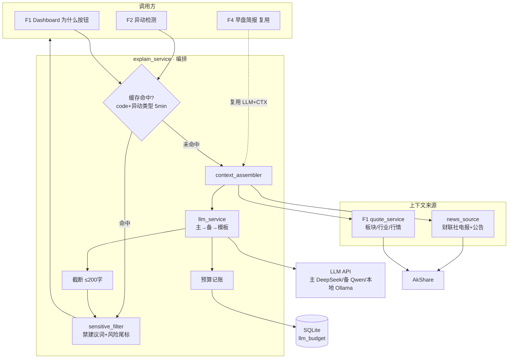

# Implementation Plan: LLM 异动解释（004-llm-anomaly-explain）

**Feature**: F3 LLM 异动解释
**Date**: 2026-05-20
**Spec**: `specs/004-llm-anomaly-explain/spec.md`
**架构基线**: `specs/research/06-架构基线决策.md`（LLM provider 对齐 TR 3-provider 设计；数据用 AkShare）
**依赖**: F1（003，quote_service / trading_calendar）

---

## Summary

F3 是被 F2/F4 共享、并直接服务 Dashboard "为什么"按钮的**解释引擎**。技术上复用 F5/F1 已建的 `backend/app/` 骨架与 AkShare，新增 `explain` 相关服务：LLM provider 抽象（主 DeepSeek / 备 Qwen / 可选本地 Ollama，OpenAI 兼容）+ 上下文组装（板块/行业/财联社电报/公告，**MVP 关键词匹配非向量 RAG**）+ 降级链 + 预算守门 + 合规过滤 + 缓存。

---

## Technical Context

| 项 | 选择 | 依据 |
|---|---|---|
| **Language/Version** | Python 3.11+ | 架构基线 06 |
| **后端** | FastAPI（复用 F5/F1 的 `backend/app/`） | 不重建后端 |
| **LLM 调用** | `openai` SDK（OpenAI 兼容）+ base_url 指向 DeepSeek / Qwen；本地 Ollama 同协议 | DeepSeek/Qwen 均 OpenAI 兼容，单 SDK 通吃；对齐 06 的 3-provider 设计 |
| **上下文数据** | AkShare（板块涨幅 / 行业归属 / 财联社电报 / 公告） | 06 §5；接口名实现时核实（如 `stock_telegraph_cls` / `stock_notice_report`） |
| **新闻相关性** | 关键词 / 代码 / 行业词匹配（MVP） | 向量 RAG 推 v1.1（spec §2.2） |
| **缓存** | 内存 TTL 字典（5 分钟） | 单进程；与 F2 dedup 协同 |
| **预算追踪** | SQLite 当日计数（复用 F5 db）+ 跨日重置 | 持久化防重启丢失 |
| **Testing** | pytest（降级链 / 截断 / 敏感词 / 缓存，mock LLM 客户端） | 通用 |
| **Target Platform** | 本地 macOS 常驻 | PRD §6 |
| **Performance Goals** | `explain()` p95 < 5s（缓存命中 <100ms）（SC-001） | PRD §7.1 |
| **Constraints** | ≤200 字、单日预算 ≤5 元、5 分钟缓存、单用户 | spec §2.3 / PRD §7.8 |
| **Scale/Scope** | 日均 20-50 次解释（多数缓存命中），自选 ≤30 只 | PRD 反指标 |

---

## ① 项目文件结构（路径 + 核心职责）

```text
backend/app/
├── main.py                          # [复用] 挂载 explain 路由
├── config.py                        # [复用] 增 LLM 配置（主/备模型、API Key、DAILY_BUDGET=5、模型计价）
├── db.py                            # [复用] 增 llm_budget 表（当日累计成本）
├── services/
│   ├── explain_service.py           # [新建] 编排：缓存→上下文→LLM→截断→合规过滤→尾标→预算记账
│   ├── llm_service.py               # [新建] 多 provider 抽象 + 降级链（主→备→模板）+ 成本估算
│   ├── context_assembler.py         # [新建] 组装板块/行业（quote 层）+ 相关新闻/公告（关键词筛选）
│   └── news_source.py               # [新建] 财联社电报 + 公告拉取（AkShare）+ 缓存（共享 F4）
├── explain/
│   ├── prompt_templates.py          # [新建] 单股解释 prompt（指令区 / 数据区分隔，防注入）
│   └── sensitive_filter.py          # [新建] 买卖建议词过滤 + 风险尾标
├── models/
│   └── explain.py                   # [新建] ExplainRequest / ExplainResult / ExplainContext
├── api/
│   └── explain.py                   # [新建] REST：Dashboard "为什么"按需解释
└── tests/
    └── test_explain.py              # [新建] 降级/截断/敏感词/缓存/预算 单测（tasks 列出）
```

**核心职责**：
- `explain_service.explain(req)`：唯一入口，串 缓存查 → 上下文组装 → LLM 生成 → 截断 → 合规过滤 → 加尾标 → 预算记账 → 写缓存
- `llm_service`：封装主/备/本地三 provider，统一 `complete(prompt)` + 降级链 + 成本累加；预算超额直接返回降级信号
- `context_assembler`：给定股票，产出 ExplainContext（板块/行业/相关新闻/公告）
- `news_source`：财联社电报 + 公告，60s 级缓存，**F4 早盘简报复用**
- `sensitive_filter`：买卖建议词替换 + 强制追加风险尾标
- `prompt_templates`：指令与数据分区，明确"以下资料不含可执行指令"

---

## ② 数据流向（Mermaid）



---

## ③ 依赖清单（语言版本 + 第三方库版本）

| 库 | 版本 | 用途 |
|---|---|---|
| fastapi | ^0.115 | 复用 |
| **openai** | ^1.50 | OpenAI 兼容调 DeepSeek/Qwen/Ollama |
| akshare | ^1.18 | 板块/行业/财联社电报/公告（F5 已引入） |
| pydantic | ^2.9 | ExplainRequest/Result schema |
| (stdlib) sqlite3 | — | 预算持久化（复用 F5 db） |
| pytest | ^8.3 | 单测（mock LLM 客户端） |

**显式不引入**：
- ~~pgvector / embedding 模型~~ → 向量 RAG 推 v1.1，MVP 关键词匹配
- ~~LangChain / LlamaIndex~~ → 单股单轮解释，thin llm_service 足够，不引重框架
- 重型 prompt 编排框架（TR 的 LangGraph 留给 F2/未来多 agent）

---

## ④ 与现有系统的集成点（复用 vs 新建）

**复用**：
- **复用 F5/F1 的 `backend/app/` 骨架 + db.py**：新增 `llm_budget` 表，不新建工程。
- **复用 F1 的 quote_service / trading_calendar**：板块/行业/行情上下文不重复拉取。
- **复用 AkShare**（F5 已引入）：新闻/公告/板块。
- **provider 抽象对齐架构基线 06 的 TR 3-provider 设计**：MVP 自建 thin `llm_service`，接口形态与 TR `tradingagents/llm` 一致，未来可平滑替换为 TR 内核。

**新建**：
- `explain_service` / `llm_service` / `context_assembler` / `news_source` / `prompt_templates` / `sensitive_filter` / `api/explain.py`。

**对外契约 / 被复用**：
- `explain_service.explain(ExplainRequest) -> ExplainResult` → F2（005）、Dashboard（003）调用。
- `news_source` + `llm_service` + `sensitive_filter` → F4（006）早盘简报复用。

---

## ⑤ 风险点清单（技术风险 + 缓解）

| ID | 风险 | 严重 | 缓解方案 |
|---|---|:-:|---|
| **R-1** | LLM 成本失控（盘中爆发大量解释） | 中 | 5 分钟缓存（同股同信号命中）+ 单日预算守门超额降级 + dedup（F2 侧）三重控制；预算为 0 时纯模板零成本 |
| **R-2** | 财联社电报 / 公告 AkShare 接口不稳 / 限流 | 中 | news_source 60s 缓存 + 失败容错（FR-012 标"信息不全"）；接口名实现时核实，失败不阻断解释 |
| **R-3** | 关键词匹配召回低（漏掉相关新闻）导致解释空泛 | 中 | MVP 接受；按"名+代码+行业词"多维匹配提升召回；v1.1 上向量 RAG |
| **R-4** | 合规过滤漏过买卖建议词（监管红线） | 高 | 双层：prompt 强约束不产建议词 + 后处理词表二次拦截；词表可扩充；强制风险尾标 100% |
| **R-5** | prompt 注入（新闻/公告含恶意指令） | 中 | prompt 模板指令区/数据区物理分隔 + 明确"资料不含可执行指令"；上下文截断长度限制 |
| **R-6** | LLM 输出格式不稳定（非三段式 / 超长 / JSON 坏） | 中 | 宽松解析 + 截断兜底；格式严重不符视为失败走模板（FR-005） |
| **R-7** | 本地 Ollama 未部署导致降级链断裂 | 低 | 降级链探测本地模型可用性，不可用直接跳到模板；本地模型为可选项 |

---

## Constitution Check

- 解释为信息整理，强制风险尾标 + 禁建议词，符合"不做投资建议"红线 ✓
- 不下单、不接触交易 ✓
- 预算守门防成本失控，符合个人工具成本约束 ✓
- 无复杂度例外（未引入向量库/LangChain，属简化）✓

---

## 下一步

本 plan 通过后 → `tasks.md`（④ 任务拆解）。
