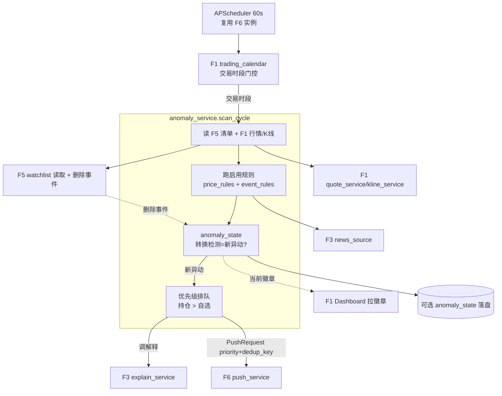

# Implementation Plan: 异动检测与推送（005-anomaly-detection-push）

**Feature**: F2 异动检测与推送
**Date**: 2026-05-20
**Spec**: `specs/005-anomaly-detection-push/spec.md`
**架构基线**: `specs/research/06-架构基线决策.md`
**依赖**: F5（001）、F6（002）、F3（004）、F1（003）

---

## Summary

F2 是集成枢纽：复用 F1（行情/K线/交易日历）、F3（解释/新闻源）、F6（推送）、F5（清单/删除事件），新增异动规则引擎 + 状态转换检测 + 扫描调度。交易时段每 60 秒扫描自选股，命中**新异动**→ 调 F3 解释 → 调 F6 推送；并对外暴露异动状态供 F1 回填徽章（兑现方案 A）。两层去重职责分明：F2 做状态转换检测，F6 做发送级 dedup。

---

## Technical Context

| 项 | 选择 | 依据 |
|---|---|---|
| **Language/Version** | Python 3.11+ | 架构基线 06 |
| **后端** | FastAPI（复用 `backend/app/` 骨架） | 不重建 |
| **调度** | APScheduler（复用 F6 引入的实例） | 60s 扫描 + 交易时段门控 |
| **规则引擎** | 纯函数式规则（每规则一个可测函数） | 易单测、易加规则 |
| **状态存储** | 内存 AnomalyState（per-stock）+ 可选 SQLite 落盘（重启恢复） | 单进程；转换检测需上周期状态 |
| **行情/K线/日历** | 复用 F1 quote_service / kline_service / trading_calendar | 不重复拉 |
| **解释/新闻** | 复用 F3 explain_service / news_source | 不重复造 |
| **推送** | 复用 F6 push_service | 不重复造 |
| **Testing** | pytest（规则函数 / 转换检测 / 优先级 / 暂停，mock 依赖） | 通用 |
| **Performance Goals** | 检测 ≤60s；端到端推送 p95 <60s（SC-001/002） | PRD §7.1 |
| **Constraints** | 交易时段扫价格、≤30 只、阈值可配 | spec §2.3 |
| **Scale/Scope** | 单周期扫 ≤30 只数秒内完成 | PRD |

---

## ① 项目文件结构（路径 + 核心职责）

```text
backend/app/
├── main.py                          # [复用] 挂载 anomaly 路由 + 注册扫描 job
├── config.py                        # [复用] 增异动阈值默认值（振幅 8%/量比 3 倍/窗口 60 日/各板涨跌停%）
├── db.py                            # [复用] 可选 anomaly_state 落盘表
├── services/
│   └── anomaly_service.py           # [新建] 扫描编排：取清单→取行情→跑规则→转换检测→优先级→调 F3→调 F6
├── anomaly/
│   ├── price_rules.py               # [新建] 涨停/跌停/涵盖/量能/振幅（纯函数，输入行情+K线→信号）
│   ├── event_rules.py               # [新建] 财联社/公告关键词匹配（复用 F3 news_source）
│   ├── anomaly_state.py             # [新建] per-stock 当前异动集合 + 新异动转换检测
│   └── rule_config.py               # [新建] 规则开关 + 阈值覆盖
├── models/
│   └── anomaly.py                   # [新建] AnomalyRule / AnomalySignal / AnomalyState / RuleConfig
├── api/
│   └── anomaly.py                   # [新建] 暴露当前异动徽章（供 F1）+ 规则开关设置
└── tests/
    └── test_anomaly.py              # [新建] 规则/转换/优先级/暂停/徽章 单测（tasks 列出）
```

**核心职责**：
- `anomaly_service.scan_cycle()`：调度每 60s 调用——读 F5 清单 → 读 F1 行情/K线 → 跑启用的规则 → anomaly_state 比对出新异动 → 按持仓优先排队 → 对新异动调 F3 explain → 组装 PushRequest 调 F6 send
- `price_rules`：每条规则 `(quote, kline, thresholds) -> Optional[AnomalySignal]`，纯函数可单测
- `event_rules`：复用 F3 news_source 取电报/公告 → 按 F5 清单关键词匹配
- `anomaly_state`：保存上周期每股异动集合，本周期对比 → 输出"新异动"（转换检测，省 F3 调用）
- `api/anomaly`：F1 拉徽章 + 用户改规则开关

---

## ② 数据流向（Mermaid）



---

## ③ 依赖清单（语言版本 + 第三方库版本）

| 库 | 版本 | 用途 |
|---|---|---|
| fastapi | ^0.115 | 复用 |
| apscheduler | ^3.10 | 复用 F6 引入，60s 扫描 |
| akshare | ^1.18 | 经 F1/F3 间接用，F2 不直连 |
| pydantic | ^2.9 | AnomalySignal schema |
| (stdlib) sqlite3 | — | 可选状态落盘（复用 F5 db） |
| pytest | ^8.3 | 规则/转换单测 |

**显式不引入**：规则引擎框架（如 durable-rules）；纯函数 + 简单编排足够，避免过度工程。

---

## ④ 与现有系统的集成点（复用 vs 新建）

**复用（F2 是集成枢纽，几乎全靠复用）**：
- **F1（003）**：quote_service（行情）、kline_service（60 日高低）、trading_calendar（时段门控）。
- **F3（004）**：explain_service（解释）、news_source（电报/公告，事件规则用）。
- **F6（002）**：push_service.send（推送 + dedup + 合并 + 重试）；APScheduler 实例。
- **F5（001）**：watchlist 读取 + watchlist_events 删除事件订阅。

**新建**：
- 异动规则引擎（price_rules/event_rules）、anomaly_state（转换检测）、rule_config、anomaly_service（编排）、api/anomaly。

**对外契约**：
- `api/anomaly` 暴露 `GET 当前异动徽章`（badge 枚举：涨停/跌停/涵盖/突破/量能/空）→ F1（003）回填（兑现方案 A）。
- 向 F6 发 PushRequest：`{priority: 持仓/自选, dedup_key: code+signal, content, receive_target}`。
- 向 F3 调 `explain(ExplainRequest)`：异动类型与 F3 异动类型枚举对齐。

---

## ⑤ 风险点清单（技术风险 + 缓解）

| ID | 风险 | 严重 | 缓解方案 |
|---|---|:-:|---|
| **R-1** | 状态转换检测有误（漏报新异动 / 重复报）导致漏推或刷屏 | 高 | anomaly_state 明确"上周期集合 vs 本周期集合"差集 = 新异动；单测覆盖封板→打开→封回、多规则并发等转换场景（SC-003） |
| **R-2** | 涨跌停判定用涨跌幅近似（无封单数据）误判 | 中 | MVP 用"涨跌幅达板块阈值"近似 + 文档标注；一字板/封单精确判定推 v1.1；ST/科创板阈值按 FR-004 分类 |
| **R-3** | 扫描调度与交易时段未对齐（午休/集合竞价误扫） | 中 | 每周期先过 trading_calendar 门控；午休 11:30-13:00 不扫价格规则；集合竞价时段按交易日历处理 |
| **R-4** | F3 解释慢拖垮扫描周期（串行调 F3 阻塞下一周期） | 中 | 对新异动**异步/并发**调 F3，单个 F3 超时不阻塞整周期；F3 超时走裸卡片（FR-011） |
| **R-5** | 60 日 K 线每周期重拉成本高 | 中 | kline_service 缓存日 K（日内不变），涵盖规则只需日级高低，按日刷新而非每 60s 拉 |
| **R-6** | F1 徽章与 F2 状态不一致（拉取时序错位） | 低 | anomaly_state 为单一真相源，F1 拉的就是当前态；FR-007 + SC-006 |
| **R-7** | 事件规则关键词召回低/误匹配（同名公司） | 中 | 多维匹配（代码优先 > 全称 > 行业）；MVP 接受一定噪声，v1.1 优化；复用 F3 关键词逻辑 |
| **R-8** | 删除股票后扫描队列未及时清理仍推送 | 中 | 订阅 F5 watchlist_events，删除事件即时从 anomaly_state + 扫描清单移除（FR-010） |

---

## Constitution Check

- 仅检测 + 推送信息，不下单、不接触交易，符合红线 ✓
- 推送内容经 F3 合规过滤（禁建议词 + 风险尾标）✓
- 无复杂度例外（纯函数规则 + 复用现有服务，属简化）✓

---

## 下一步

本 plan 通过后 → `tasks.md`（④ 任务拆解）。
