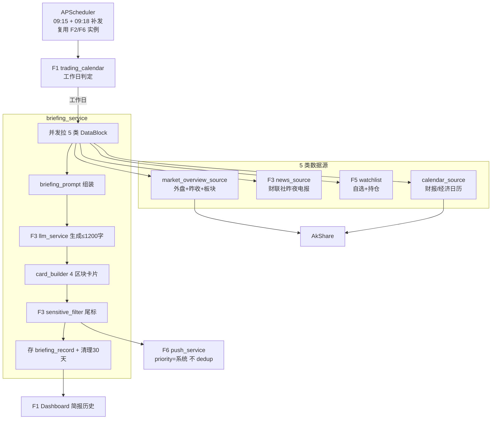

# Implementation Plan: 早盘简报（006-morning-briefing）

**Feature**: F4 早盘简报
**Date**: 2026-05-20
**Spec**: `specs/006-morning-briefing/spec.md`
**架构基线**: `specs/research/06-架构基线决策.md`
**依赖**: F3（004）、F5（001）、F6（002）、F1（003）

---

## Summary

F4 是组装型功能：复用 F3（新闻源/LLM/合规）、F5（清单）、F6（推送）、F1（指数/日历/调度器），每个工作日 9:15 并发拉 5 类数据 → LLM 生成 ≤1200 字正文 → 渲染 4 区块飞书卡片 → 推送，并存历史供回看。新增极少：外盘指数源、财报/经济日历源、简报卡片组装、简报历史存储。数据源失败逐区块降级，9:15 未就绪发预热版、9:18 补完整版。

---

## Technical Context

| 项 | 选择 | 依据 |
|---|---|---|
| **Language/Version** | Python 3.11+ | 架构基线 06 |
| **后端** | FastAPI（复用 `backend/app/` 骨架） | 不重建 |
| **调度** | APScheduler（复用 F6/F2 实例）09:15 cron + 09:18 补发 | 与 F2 共享调度器 |
| **LLM** | 复用 F3 llm_service（生成/降级/预算） | 不重复造 |
| **新闻** | 复用 F3 news_source（财联社昨夜电报） | 不重复造 |
| **合规** | 复用 F3 sensitive_filter（尾标/禁词） | 不重复造 |
| **行情** | 复用 F1 quote_service（昨收/指数）；新增外盘指数 + 日历源 | 部分复用 |
| **存储** | SQLite（briefing_record，复用 F5 db）保留 30 天 | 历史回看 |
| **Testing** | pytest（区块降级/预热补发/节假日跳过，mock 依赖） | 通用 |
| **Performance Goals** | 09:15±30s 送达（SC-001） | PRD §7.1 |
| **Constraints** | ≤1200 字、4 区块固定、历史 30 天、单用户 | spec §2.3 |
| **Scale/Scope** | 每日 1 份，自选 ≤30 只 | PRD |

---

## ① 项目文件结构（路径 + 核心职责）

```text
backend/app/
├── main.py                          # [复用] 挂载 briefing 路由 + 注册 09:15/09:18 job
├── config.py                        # [复用] 增简报配置（触发 09:15、补发 09:18、正文上限 1200、历史 30 天）
├── db.py                            # [复用] 增 briefing_record 表
├── services/
│   ├── briefing_service.py          # [新建] 编排：拉 5 类→组装 prompt→LLM→渲染卡片→推送→存历史→清理
│   ├── market_overview_source.py    # [新建] 隔夜外盘指数 + 昨收 + 板块涨跌幅（复用 quote_service + 新拉外盘）
│   └── calendar_source.py           # [新建] 今日财报披露 + 经济数据日历（AkShare，接口实现时核实）
├── briefing/
│   ├── briefing_prompt.py           # [新建] 简报级 prompt 模板（区别于 F3 单股解释 prompt）
│   └── card_builder.py              # [新建] 4 区块 Markdown 卡片组装
├── models/
│   └── briefing.py                  # [新建] BriefingContent / DataBlock / BriefingRecord
├── api/
│   └── briefing.py                  # [新建] 简报历史回看端点（供 Dashboard）
└── tests/
    └── test_briefing.py             # [新建] 降级/预热补发/节假日/全失败占位 单测（tasks 列出）
```

**核心职责**：
- `briefing_service.generate_and_push()`：9:15 触发——并发拉 5 类 DataBlock → 组装 prompt → 调 F3 llm_service 生成正文 → card_builder 渲染 → F3 sensitive_filter 加尾标 → F6 push → 存 briefing_record → 清理 30 天前
- `market_overview_source`：隔夜外盘（AkShare 全球指数）+ 昨日 A 股收盘+板块（quote_service）
- `calendar_source`：今日财报/经济数据日历（AkShare）
- `card_builder`：把 4 个 DataBlock + LLM 正文组装成飞书 interactive Markdown 卡片
- `briefing_prompt`：简报级 prompt（4 区块结构 + ≤1200 字约束）

---

## ② 数据流向（Mermaid）



---

## ③ 依赖清单（语言版本 + 第三方库版本）

| 库 | 版本 | 用途 |
|---|---|---|
| fastapi | ^0.115 | 复用 |
| apscheduler | ^3.10 | 复用 F2/F6，09:15+09:18 job |
| akshare | ^1.18 | 外盘指数 + 财报/经济日历（F5 已引入） |
| pydantic | ^2.9 | BriefingContent schema |
| (stdlib) sqlite3 | — | 简报历史（复用 F5 db） |
| pytest | ^8.3 | 单测 |

**显式不引入**：新 LLM/新闻/推送依赖（全复用 F3/F6）；模板引擎（card_builder 用字符串拼装足够）。

---

## ④ 与现有系统的集成点（复用 vs 新建）

**复用（F4 是组装型，最大化复用）**：
- **F3（004）**：llm_service（生成+降级+预算）、news_source（财联社电报）、sensitive_filter（尾标+禁词）。
- **F5（001）**：watchlist 读取（"我的自选股"区块）。
- **F6（002）**：push_service（简报推送，priority=系统，**不带 dedup_key**，不被去重）。
- **F1（003）**：trading_calendar（工作日判定）、quote_service（昨收/指数）、APScheduler 实例、（软）异动徽章接口（自选排序，F2 未就绪降级涨跌幅）。

**新建**：
- `briefing_service`（编排）、`market_overview_source`（外盘）、`calendar_source`（日历）、`briefing_prompt`、`card_builder`、`api/briefing`、`briefing_record` 表。

**对外契约**：
- `api/briefing` 暴露简报历史 → F1（003）Dashboard"简报历史"页消费。

---

## ⑤ 风险点清单（技术风险 + 缓解）

| ID | 风险 | 严重 | 缓解方案 |
|---|---|:-:|---|
| **R-1** | 9:15 准时性受 Mac 睡眠/调度漂移影响 | 高 | caffeinate 防睡眠（PRD §7.2）；APScheduler misfire_grace_time 容忍小漂移；未开机则错过不补发（spec Edge）；±30s 容差（SC-001） |
| **R-2** | 外盘指数 / 财报日历 AkShare 接口不可用或名不符 | 中 | 接口名实现时核实；不可用→区块降级"暂无数据"（FR-006），不阻塞整报；外盘可后续换源 |
| **R-3** | 5 类数据并发拉取慢，9:15 集不齐 | 中 | 9:14:59 前未齐发预热版 + 9:18 补完整版（FR-007）；各源独立超时，慢源不拖整体 |
| **R-4** | LLM 生成简报慢（正文长）超 60s | 中 | 超时发裸数据版（FR-008）；正文 ≤1200 字约束控制生成时长；复用 F3 预算守门 |
| **R-5** | 预热版与 9:18 完整版让用户困惑 / 重复打扰 | 低 | 完整版明确标注"完整版"；预热版标"预热版（数据补全中）"；同日两条可接受（spec Edge） |
| **R-6** | 全数据源失败导致静默不发 | 中 | 发"今日数据获取异常"占位简报（FR-012），让用户知道系统活着 |
| **R-7** | 简报质量差（LLM 罗列无重点） | 中 | briefing_prompt 明确每区块要点 + 控制字数；MVP 接受，按使用反馈迭代 prompt |
| **R-8** | 自选排序软依赖 F2 徽章，F2 未就绪时退化 | 低 | F2 就绪读徽章排序；未就绪按涨跌幅排序（spec §6 软依赖）|

---

## Constitution Check

- 简报为信息聚合 + AI 提炼，强制风险尾标 + 禁建议词（复用 F3），符合"不做投资建议"红线 ✓
- 不下单、不接触交易 ✓
- 无复杂度例外（全复用 + 字符串拼卡片，属简化）✓

---

## 下一步

本 plan 通过后 → `tasks.md`（④ 任务拆解）。本 feature 完成后，6 个 Must-have 功能 4 步文档全部就绪。
