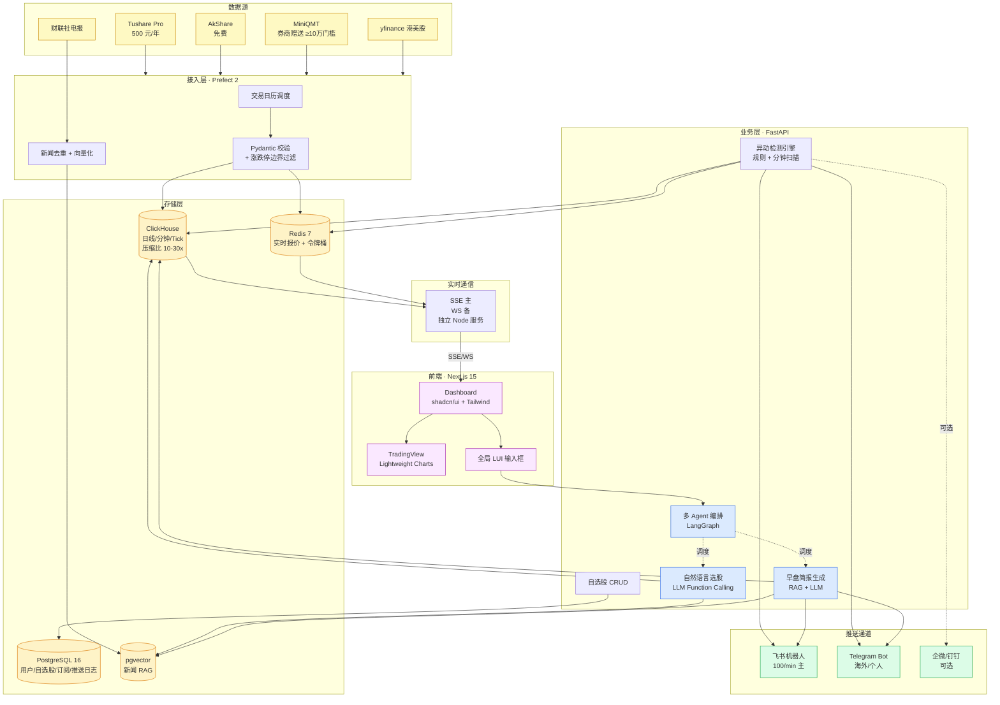

# 05 · 决策汇总（A 股自动盯盘 AI 助手 · 立项决议）· v3

> 综合来源：`01-产品形态.md` / `02-数据来源.md` / `03-开源项目.md` / `04-实现方案.md` / **`06-架构基线决策.md`（Phase 3 终审）**
> 决议日期：v1 2026-05-20；**v2 2026-05-20**
> v2 更新原因：法庭式对抗调研（5 paper × 20 条质疑/挑战）浮现 2 项关键事实修正：
> 1. **TradingAgents-CN 闭源范围实为整个 `app/` + `frontend/`**（非"<15% 边角"），需商授
> 2. **stock-sdk 实测为 ISC 公开包**（非私有），SD 作为开源前端运行时基线工程价值上调
> 综合方式：v1 = 4 sub-agent 双路调研；v2 = 5 teammate 对抗辩论 Phase 3 终审

---

## 0 · 一句话方案（电梯演讲版 · v2 调整）

> **v3 修订（2026-05-26）：前端不 fork SD，改为自主构建。** 凡本文提及"fork SD /
> stock-dashboard 作开源前端运行时 / 替换 SD ECharts / 问 SD 作者 LICENSE"，**一律以
> 本修订为准**：前端 = 基于 spec + `DESIGN.md` 自主构建（Vite+React+TS+shadcn/ui），SD
> 及其原型降为 `design-reference/` 视觉参考（看不抄），后端决策不变。

**后端 fork + 前端自建** = `TauricResearch/TradingAgents`（上游内核同步）+ `hsliuping/TradingAgents-CN`（A 股中文化 + 后端 app/ 需商授）+ **前端自主构建（不 fork SD）**→ **Tushare Pro 500 元/年 + AkShare 免费 + MiniQMT** 数据 → **ClickHouse + Redis + PostgreSQL** 存储 → **TradingView Lightweight Charts**（K 线）→ **飞书机器人**（重写借鉴 go-stock 告警思路，避 GPL）→ **腾讯云轻量 4C8G**。**A 轨（商授通过）MVP ~30 人日 / B 轨（商授失败）~40 人日，月成本 ~355 元**。

---

## 1 · 产品形态决策

### 1.1 信息架构（抄 **AI 涨乐 + 富途** 混合）
- **开屏即 Dashboard / 自选页**（富途模式）：用户打开 App 直接看到关心的股票，不再翻 Tab
- **底部全局 LUI 输入框**（AI 涨乐模式）：自然语言指令永远 1 tap 可达 —— 这是 AI 产品 vs 传统盯盘 App 的根本差异化
- **顶部卡片化 GUI**：行情 / 持仓 / 自选 / 简报 可拖拽配置
- **不抄**：同花顺/东方财富的"5 Tab + 几十个二级入口"工具堆叠路线

### 1.2 功能形态（MVP 范围）
| 功能 | 形态 | 数据/技术 |
|---|---|---|
| 自选股 Dashboard | 分组列表 + K 线 + 实时报价 + 异动徽章 | AkShare 实时快照 + TradingView Lightweight Charts |
| 自然语言选股 | 对话式（抄问财）+ 一键加入自选 | LLM Function Calling + Tushare 因子 |
| 早盘简报 | 飞书卡片（盘前 9:15）+ App 内时间轴 | RAG（财联社+昨日数据）+ DeepSeek/Qwen |
| 异动预警 | 实时 push 卡片 + "为什么"解释（AI 涨乐式） | 规则引擎 + AkShare + 知识图谱标注 |

### 1.3 三档推送节奏
- **盘前 09:15**：早盘简报（音频/卡片）
- **盘中 <1min**：实时异动（push + 飞书卡片）
- **盘后 15:30**：盘后小结 + 次日观察清单

### 1.4 必须避免的坑
- 不做"AI 套壳"（易淘金反例：在老 App 顶部加对话框）
- 不做"工具堆叠"（30 个智能工具列表，用户记不住）
- 不持牌不下单：最多到"加入自选 + 推送 + 跳转券商 App"

---

## 2 · 数据源决策

### 2.1 主方案 · 三件套
| 数据维度 | 选型 | 成本 | 角色 |
|---|---|---|---|
| 历史日线 / 财务三表 / 因子 / 龙虎榜 | **Tushare Pro 5000 积分** | **500 元/年** | 骨干冷数据 |
| 实时快照 / 板块异动 / 龙虎榜补充 / 资金流 | **AkShare** | **0 元** | 广度数据 |
| 实时五档/Tick/逐笔 + 下单 | **MiniQMT**（10 万门槛券商） | **0 元**（券商赠送） | 重度用户专属 |
| 港美股日线（仅信息卡） | **yfinance** | **0 元**（仅个人测试） | 全市场视图 |

**总成本：500 元/年 + 一个支持 MiniQMT 的券商账户**（国金/国信/华西/国盛 ≥10 万门槛）

### 2.2 备用切换方案
| 触发条件 | 切到 |
|---|---|
| Tushare 限频不够（用户起来后） | 10000 积分（1,000 元/年）+ 实时分钟订阅（1,000 元/月） |
| AkShare 上游被东财封 / 不稳定 | efinance / 腾讯 qt.gtimg.cn 做秒级快照备份 |
| 要做云端策略托管 + 多用户共享 | JoinQuant SVIP 2,799 元/年 |
| 要做对外 SaaS / 商用 | **Choice 标准版 5,800-18,000 元/年**（合规硬门槛） |
| 用户要 Level-2 深度 | 用户自开 QMT 拿券商 L2，**无便宜路径** |
| 港股要实时 | 富途 OpenD（L2 ≈ 60 HKD/月，最便宜） |

### 2.3 为什么不选 X
- **Wind/iFinD 个人版**：4 万/年个人付不起且不需要
- **新浪/腾讯/东财爬虫**：2026 反爬升级，商用违反《反不正当竞争法》
- **PTrade**：30-50 万门槛太高，被 MiniQMT 完爆
- **Choice 个人版**：MVP 阶段灰度可行的更便宜路径已够用，等收费再上

---

## 3 · 开源复用决策（v2 · 来自 Phase 3 终审）

### 3.1 架构基线 = 三件套复合（含 A/B 双轨）

不是单 fork，而是 **3 个项目 fork + 2 个项目借鉴 + 多个库引入** 的复合方案：

- **fork 1**：`TauricResearch/TradingAgents`（上游内核 Apache-2.0，作 remote + 月度 cherry-pick）
- **fork 2**：`hsliuping/TradingAgents-CN`（中文化内核 Apache-2.0 部分；后端 `app/` 商授使用）
- **前端**：**自主构建**（Vite+React+TS+shadcn/ui，不 fork）；`chengzuopeng/stock-dashboard` 降为 `design-reference/` 视觉参考

### 3.2 A/B 双轨决议

| 触发 | A 轨（首选） | B 轨（兜底） |
|---|---|---|
| **CN 商授** | 通过（费率合理 + SLA 可接受） | 失败 / 无回复 / 费率过高 |
| **后端来源** | CN `app/`（fork 商用） | 自建 FastAPI 薄层（10-12 人日新写） |
| **前端来源** | 自主构建（不 fork SD） | 自主构建（同 A 轨） |
| **改造工作量** | **~30 人日** | **~40 人日** |

**A/B 决策门**：立项后 Day 7-14 内根据邮件 hsliup@163.com 商授询价回复做判定。

### 3.3 复用矩阵

| 模块 | 来源 | 处理方式 | License |
|---|---|---|---|
| **AI Agent 编排骨架** | `TauricResearch/TradingAgents` `tradingagents/` 内核 | 上游 remote + 月度 cherry-pick | Apache-2.0 |
| **A 股中文 prompt + dataflows** | `hsliuping/TradingAgents-CN` `tradingagents/` 内核 | 直接 fork（与 TR 同源） | Apache-2.0 |
| **后端 API** | CN `app/`（A 轨）/ 自建 FastAPI（B 轨） | 商授 fork / 自写 | 双协议 / 自有 |
| **前端 Dashboard** | **自主构建**（Vite+React+TS+shadcn/ui） | 基于 spec + DESIGN.md 新建；design-reference 仅视觉参考 | 自有代码（无 SD license 牵连） |
| **K 线组件** | `tradingview/lightweight-charts` | npm 安装，替换 SD 的 ECharts | Apache-2.0 |
| **数据接入** | `akshare` + `tushare` Pro + MiniQMT | pip 库引入 | MIT / BSD-3 / 券商许可 |
| **推送通道** | 借鉴 `ArvinLovegood/go-stock` `backend/alarm/` 思路 | **重写**（避 GPLv3 传染） | 自有代码 |
| **LLM provider 抽象** | TR `tradingagents/llm/`（限 3 个：DeepSeek/Qwen/Ollama） | 直接使用 | Apache-2.0 |
| **checkpoint 多租户** | `langgraph-checkpoint-postgres` + 适配层 | pip 装 + 6-8 人日适配 | MIT |
| **投资大师 prompt（v2 可选）** | `virattt/ai-hedge-fund` `src/agents/` 11 人格 | port + 美股语义清洗 | MIT |
| **回测引擎（v2 可选）** | `microsoft/qlib` Alpha158 | pip 装 | MIT |

### 3.4 被否方案（每条引用 Phase 2 证据，详见 `06-架构基线决策.md` §2）

- **go-stock 单 fork** ❌：owner 自承"商业闭源路线下不应 fork，只应借鉴"（responses-advocate-fullstack §E-Q1）
- **ai-hedge-fund 单 fork** ❌：owner 自承总改造 30 → 46 人日，fork 仅便宜 7 人日（responses-advocate-fullstack §A-Q3）
- **stock-dashboard 单 fork** ❌（owner 从未主张）：澄清 SD 是"全家桶里的前端"，非全栈
- **TauricResearch 单 fork** ❌（Plan B）：45-47 人日，等同放弃 CN 已完成的 A 股 dataflows + 中文 prompt
- **全自建** ❌：62 人日 vs CN-based 30-40 人日（integration-assessment.md 数据）
- **Dify/Coze 低代码** ❌作 MVP，✅作 Plan C：保留为立项前 1 周 PMF 验证用途

### 3.5 License 红线
- ✅ **直接 fork**：TauricResearch/TradingAgents、TradingAgents-CN 内核、akshare、tushare、qlib、lightweight-charts
- ⚠️ **需商授**：CN `app/` + `frontend/`（必须邮件 hsliup@163.com 取书面授权）
- ✅ **SD license 不再是风险**：前端自建，不使用 SD 代码；design-reference 仅本地视觉参考
- 🚫 **只能借鉴重写**：go-stock（GPLv3）、freqtrade（GPLv3）、OpenBB（AGPLv3）

---

## 4 · 技术栈决策（6 模块）

| 模块 | 选型 | 为什么 | 不选的原因 |
|---|---|---|---|
| **数据接入** | Python + **Prefect 2**（生产）/ APScheduler（MVP） | 现代仪表盘 + 动态任务 + 内置 retry，500MB 内存 | Airflow 三件套过度工程；自研 daemon 全是技术债 |
| **存储层** | **ClickHouse**（历史）+ **Redis**（实时缓存）+ **PostgreSQL**（用户/自选股）+ pgvector（RAG） | CH 压缩比 10-30x、写入 100-300 万行/秒；三类数据分开存 | InfluxDB 在高基数（5400 股票）短板；TimescaleDB 写入仅 CH 的 1/3；MongoDB 反模式；纯 Parquet+S3 无更新能力 |
| **业务逻辑** | **规则引擎**（异动检测）+ **LLM Function Calling**（选股）+ **RAG**（早盘简报） | 三类任务三种解法 | 不一把梭丢给 LLM：异动检测用 LLM 太贵太慢；选股纯 RAG 在结构化因子上误差大 |
| **前端 UI** | **自主构建**（Vite + React 19 + TS + **shadcn/ui** 自建密集组件）+ **TradingView Lightweight Charts**（K 线）+ **SSE 主/WS 备** | v3 调整：前端不 fork SD，基于 spec + `DESIGN.md` 自建；视觉照 `design-reference/` 原型（看不抄）；shadcn 无样式组件加速搭骨架；K 线用 TV charts（35KB） | 不 fork SD（license 不明 + 受制于他人结构）；不用 Next.js（本地单用户 SPA 够用）；ECharts 高频掉帧 |
| **推送通道** | **飞书自定义机器人**（主）+ **Telegram Bot**（海外/个人） | 飞书 100 次/分钟最高 + 卡片能力最强 | 企微/钉钉 20 次/分钟太低；微信公众号模板需预审 + follower 限制；App Push 自建 iOS/Android 适配成本高 |
| **部署运维** | **腾讯云轻量 4C8G 12M ≈ 60 元/月** + Docker Compose + **Vercel 前端免费** + Cloudflare CDN | 自营 WS 必须、国内延迟低、Vercel 跑无状态前端最便宜 | 纯 Vercel 全栈：**不支持原生 WebSocket**；CF Workers 跑不了 ClickHouse 业务；AWS 海外延迟 80-200ms 还贵 5x |

---

## 5 · 端到端架构图

---

## 6 · 成本估算（每月）

### 6.1 MVP 阶段（用户 < 100）
| 项 | 月成本 |
|---|---|
| 数据：Tushare Pro 5000 积分（500/年） | **42 元/月** |
| 数据：AkShare / MiniQMT / yfinance | 0 元 |
| 主机：腾讯云轻量 4C8G 12M | **59 元/月** |
| 域名 + DNSPod（50/年） | 4 元/月 |
| 前端：Vercel Hobby | 0 元 |
| CDN：Cloudflare 免费 | 0 元 |
| LLM 推理：DeepSeek V3（每篇简报 0.05 元 × 30 天 + 问答约 200 元） | **~250 元/月** |
| **合计** | **~355 元/月** |

> 如不上 LLM 简报功能、只做自选股 + 规则异动，月成本可压到 **105 元**。

### 6.2 中等规模（用户 100-1000）
| 项 | 月成本 |
|---|---|
| Tushare Pro 10000 积分 + 实时分钟订阅 | **1,083 元/月**（1000/年 + 1000/月） |
| 主机：8C16G + 独立 Redis 实例 | **200-400 元/月** |
| LLM 推理（用户量摊薄） | **500-1500 元/月** |
| **合计** | **~1,800-3,000 元/月** |

### 6.3 商用临界（用户 > 1000 / 对外收费）
- **必须**采购 **Choice 标准版 5,800-18,000 元/年**（合规硬门槛）
- ClickHouse 云数据库 + 多机部署：**800-2000 元/月**
- **合计** **6,000-15,000 元/月**

---

## 7 · 风险（最该警惕的坑）

### 7.1 合规风险（最高优先级）
- **Tushare Pro 协议"非商业化"**：个人 App 自用 = 灰度可行；**对外卖订阅 = 违约**
- **AkShare 数据继承上游 ToS**：东财 2026-03 已合规整改；**对外商用必须替换 Choice**
- **efinance / 雪球 / 新浪爬虫**：明确禁商，2026 反爬升级 + 法律案例已多，**任何对外商用 = 高风险**
- **不持牌不能下单**：MVP 最多到"加入自选 + 推送 + 跳转券商 App"
- **MiniQMT 二次分发禁止**：不能把 QMT 拿到的实时数据对外输出/转售，券商可关停

> 红线动作：早期就在项目根部建一份 `LEGAL.md` 标清每个数据源用途边界，避免误用

### 7.2 稳定性风险
- **AkShare 上游已多次封 IP**：架构必须做降级 `AkShare → efinance → Tushare 实时分钟`
- **MiniQMT 依赖券商客户端**：券商升级/熔断会让策略停摆，需要 **心跳监控 + 自动重连**
- **AkShare 实时 spot 交易高峰偶发返空**：双数据源校验（与 Tushare 实时 / 腾讯 qt 交叉）

### 7.3 门槛风险
- **MiniQMT 10 万门槛会过滤 60%+ 潜在用户**：产品定位明确分级 —— 轻度用户用 Tushare+AkShare；重度用户接 MiniQMT 实盘
- **学生/校友通道**（Tushare 高校免费、Choice 高校版）是冷启动入口，建议早期做"学生认证"

### 7.4 License 风险（v2 重写）
- ⚠️ `go-stock`/`freqtrade`/`OpenBB`：GPLv3/AGPLv3 **只能借鉴重写**
- ⚠️ **CN `app/` + `frontend/` 整个目录闭源**：A 轨须商授 hsliup@163.com，B 轨绕开自建后端
- ✅ **前端自建，SD license 不明不再牵连**（不使用其代码）；视觉照 design-reference 原型（看不抄）
- ⚠️ **CN bus-factor=1**：单人维护，准备 TR 单 fork 作长期回退方案
- ✅ stock-sdk 实测 ISC 公开包（同人维护），数据层依赖风险 = 0

### 7.5 成本拐点
- 用户 < 1000：~350 元/月可控
- **1000 用户是分水岭**：必须升级 Tushare 实时分钟 + 多 IP 抓 AkShare
- **1 万用户 / 对外收费 = 必须采购 Choice**，年成本陡升到 6-30 万

### 7.6 LLM 成本失控
- 自然语言选股每次约 0.02-0.1 元（DeepSeek），**必须做 query 缓存** + Function Calling 限制工具集
- 早盘简报每篇 0.05 元 × 30 天 = 1.5 元/月（极便宜）；但 **AI 解释型推送**如果每次异动都过 LLM，500 异动 × 0.01 元 × 30 天 = 150 元/月，可接受但需 dedup

### 7.7 隐藏的"AI 套壳"陷阱
- 不要在老 App 上加对话框就叫 AI 助手 —— 易淘金反例
- 不要堆 30 个智能工具 —— 用户记不住，反而降低 NPS
- **AI 真正的差异化**：开屏即 Dashboard + 底部 LUI + "为什么涨"的解释型推送

---

## 8 · 立项后下一步（v2）

| Step | 内容 | 时点 |
|---|---|---|
| 1 | 邮件 hsliup@163.com 询 **CN 商授费率 + license 边界**（含 `dataflows/` 灰区） | **Day 1** |
| 2 | ~~邮件 chengzuopeng 询 LICENSE~~ **取消**（前端自建不用 SD 代码） | — |
| 3 | 注册 Tushare Pro + 捐 500 元 + 选支持 MiniQMT 的券商开户 | Week 1 |
| 4 | 前端工程脚手架自建（Vite+React+TS+shadcn/ui）+ 接 DESIGN.md token + 跑通本地 demo | Week 1 |
| 5 | TR 上游 remote + cherry-pick `tradingagents/` 内核到工作分支 | Week 1 |
| 6 | **A/B 轨决策门**：根据 CN 商授回复决定路径 | Day 7-14 |
| 7 | 按 `06-架构基线决策.md` §5.1 表执行 MVP sprint | Week 2-5 |
| 8 | （可选）立项前用 Dify/Coze + Tushare 跑通 PMF 验证（1-2 周） | Week 0 |

**预计 MVP**：A 轨 ~30 人日 / B 轨 ~40 人日，单人 1.5-2 个月可上线。

---

## 9 · 辩论卷宗索引

| 卷宗 | 路径 |
|---|---|
| **架构基线终审** | `specs/research/06-架构基线决策.md`（v2 直接来源） |
| 任务分配 | `specs/research/debate/00-任务分配.md` |
| 立场书 ×5 | `specs/research/debate/position-paper-{TradingAgents-CN, TauricResearch-TradingAgents, go-stock, ai-hedge-fund, stock-dashboard}.md` |
| 红队立场 | `specs/research/debate/red-team-position.md` |
| 集成评估 | `specs/research/debate/integration-assessment.md` |
| Round 1 攻击 | `specs/research/debate/red-team-round1-attacks.md`（15 条） |
| Round 1 挑战 | `specs/research/debate/integration-eval-round1-challenges.md`（5 条 + 2 项事实修正） |
| Round 1 回应 | `specs/research/debate/responses-advocate-{langgraph, fullstack, frontend}.md`（20 条） |

---

> 文档版本：**v3.0 · 2026-05-26**（v3：前端改自主构建、不 fork SD；v2 2026-05-20 对抗辩论修订）
> v1 输入依据：4 份 sub-agent 双路调研产物（`01-04.md`）
> **v2 输入依据**：v1 + 5 teammate 法庭式对抗辩论 Phase 3 终审（`06-架构基线决策.md`）
